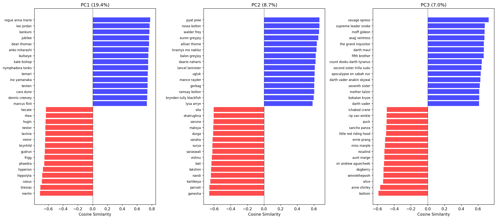
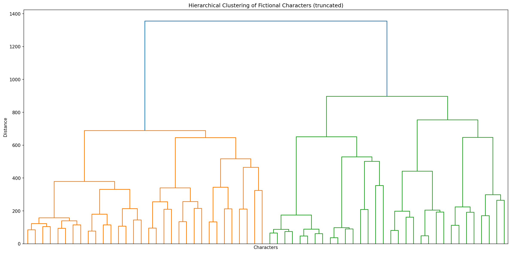
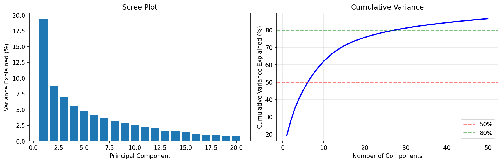
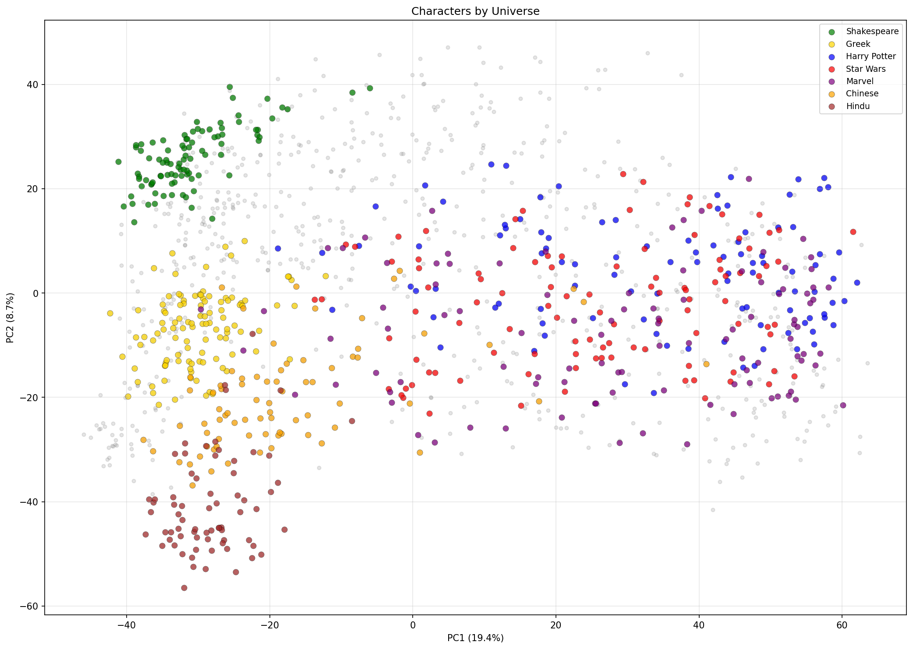
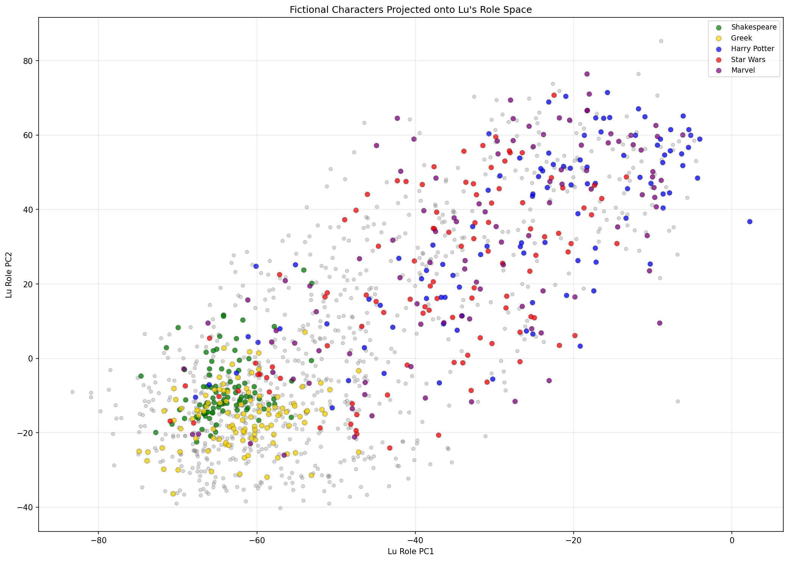
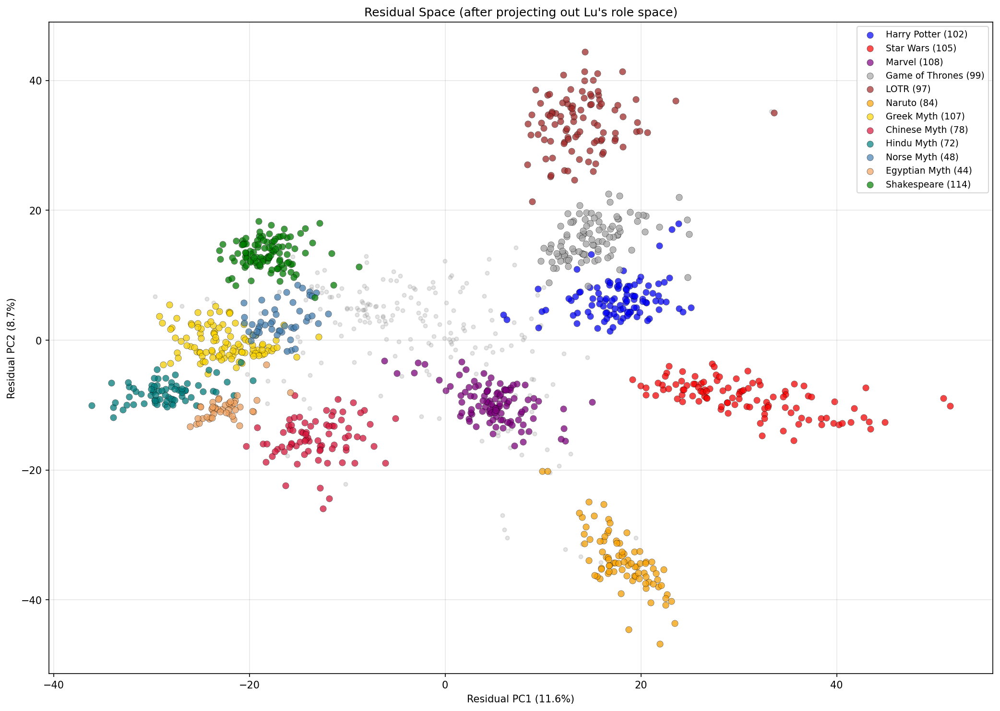

#+TITLE: Stress Testing Persona Space
#+AUTHOR: Elle
#+DATE: 2026-02-11
#+OPTIONS: H:2 toc:t
#+OPTIONS: ^:nil
#+PROPERTY: header-args:python :results output drawer :python "./.venv/bin/python3" :async t :session char_pca :timer-show no :exports results 

* Overview

This analysis stress-tests the methodology from [[https://arxiv.org/abs/2601.10387][Lu et al. (2026), "The Assistant Axis"]] by applying it to fictional characters with minimal prompts.

One of the central claims in that paper is that there's a coherent notion of persona space; there's a principle component called the persona axis, which behaves similarly acrosss models, and most of the variance of persona's are captured by relevatively few principle components. (How many for Qwen?)

Lu used various role descriptions to define personas. We stress test this by taking fictional characters from a wide variety of sources (Shakespeare, greek/chinese/hindu/egyptian mythology, Naruto, Harry Potter), and asking them the same battery of questions as Lu does.

Specifically, we examine how much variance of fictional character persona space is captured by Lu's role space, and what the residuals are. We find that X% of the ... is captured by lu, and the residual PCAs mostly differentiate different fictional universe (e.g. LoTR vs. Harry Potter). We also look at hte residuals of each fictional universe mod Lu's persona space.

We also examine the question sensitity -- Lu averaged over 240 questions. How much do character vectors depend on which questions are asked? And we find.

We extract activations from Qwen 3 32B for 1346 fictional characters, using the same 240 questions as Lu et al.

** Prompting Strategy

Role prompts are minimal: just the character name and source (e.g., "You are Harry Potter from Harry Potter."). We intentionally omit character descriptions (Lu gave a short description to the model of who characters where TODO like assistant) let the model's own representation emerge.

** Dataset Composition

#+begin_src python
from pathlib import Path
import pandas as pd
pd.set_option('display.max_colwidth', 50)

instructions_dir = Path('data/roles/instructions')
files = list(instructions_dir.glob('*.json'))

sources = {}
for f in files:
    source = f.stem.split('__')[0]
    sources[source] = sources.get(source, 0) + 1

df = pd.DataFrame([
    {'Source': k.replace('_', ' ').title(), 'Count': v}
    for k, v in sorted(sources.items(), key=lambda x: -x[1])
])

print(df.head(20))
print(f"\nTotal: {len(files)} characters")
#+end_src

#+RESULTS:
:results:
| idx | Source                        | Count |
|-----+-------------------------------+-------|
|   0 | Shakespeare                   |   115 |
|   1 | Greek Mythology               |   108 |
|   2 | Star Wars                     |   105 |
|   3 | Harry Potter                  |   102 |
|   4 | Marvel                        |   102 |
|   5 | Game Of Thrones               |    99 |
|   6 | Lord Of The Rings             |    97 |
|   7 | Naruto                        |    84 |
|   8 | Chinese Mythology             |    77 |
|   9 | Hindu Mythology               |    71 |
|  10 | Norse Mythology               |    55 |
|  11 | Egyptian Mythology            |    44 |
|  12 | The Lord Of The Rings         |     7 |
|  13 | Marvel Comics                 |     7 |
|  14 | Harry Potter Series           |     6 |
|  15 | A Song Of Ice And Fire        |     6 |
|  16 | Mahabharata                   |     6 |
|  17 | One Thousand And One Nights   |     5 |
|  18 | Romance Of The Three Kingdoms |     5 |
|  19 | Arthurian Legend              |     5 |
Total: 1346 characters
:end:

*Impact of data distribution on PCA:*

The dataset is not uniformly distributed across sources. This has implications:

- *Overrepresented sources* (Star Wars, Marvel) may dominate early PCs
- *Underrepresented sources* may not contribute to principal axes
- PCA axes may reflect dataset composition rather than universal character structure

[STUB] Future work:
- Bootstrap stability analysis: do PCs change with resampling?
- Balanced subsampling: equal N per universe
- Leave-one-universe-out analysis

* Setup

#+begin_src python 
import pickle
import numpy as np
import pandas as pd
from pathlib import Path
from scipy.spatial.distance import cdist
from sklearn.preprocessing import StandardScaler
from sklearn.decomposition import PCA as SkPCA
import matplotlib.pyplot as plt

pd.set_option('display.max_colwidth', 50)


# Load results - try filtered vectors first, fall back to unfiltered
results_path = Path('results/fictional_character_analysis_filtered.pkl')
if not results_path.exists():
    results_path = Path('results/fictional_character_analysis.pkl')

def deduplicate_characters(names, vectors=None):
    """Keep first occurrence of each character name (part after __)."""
    seen = set()
    keep_indices = []
    for i, name in enumerate(names):
        char_name = name.split('__')[-1] if '__' in name else name
        if char_name not in seen:
            seen.add(char_name)
            keep_indices.append(i)
    
    deduped_names = [names[i] for i in keep_indices]
    if vectors is not None:
        deduped_vectors = [vectors[i] for i in keep_indices]
        return deduped_names, deduped_vectors
    return deduped_names

if results_path.exists():
    with open(results_path, 'rb') as f:
        results = pickle.load(f)
    
    char_names = results['character_names']
    transformed = results['char_transformed']
    pca = results['char_pca']
    activation_matrix = results['activation_matrix']
    print(f"Loaded {len(char_names)} characters from {results_path.name}")
    print(f"PCs: {transformed.shape[1]}")
else:
    # Load directly from filtered vector files
    import torch
    vectors_dir = Path('outputs/qwen3-32b_20260211_002840/vectors')
    TARGET_LAYER = 32  # Must match role vectors layer
    if vectors_dir.exists():
        char_names = []
        vectors = []
        for pt_file in sorted(vectors_dir.glob('*.pt')):
            data = torch.load(pt_file, map_location='cpu')
            if isinstance(data, dict) and 'vector' in data:
                # New format: dict with 'vector' key containing [n_layers, hidden_dim]
                vec = data['vector'][TARGET_LAYER]
            elif isinstance(data, dict):
                # Old format: dict keyed by layer number
                vec = data.get(TARGET_LAYER, data.get(str(TARGET_LAYER), list(data.values())[0]))
            else:
                vec = data
            if isinstance(vec, torch.Tensor):
                vec = vec.float().numpy()  # Convert BFloat16 to float32
            vectors.append(vec.flatten())
            char_names.append(pt_file.stem)
        
        # Deduplicate characters (e.g., shakespeare__hamlet and hamlet__hamlet)
        n_before = len(char_names)
        char_names, vectors = deduplicate_characters(char_names, vectors)
        if n_before != len(char_names):
            print(f"Deduplicated: {n_before} -> {len(char_names)} characters")
        
        activation_matrix = np.array(vectors)
        print(f"Loaded {len(char_names)} character vectors from {vectors_dir}")
        
        # Run PCA
        scaler = StandardScaler()
        scaled = scaler.fit_transform(activation_matrix)
        pca = SkPCA(n_components=min(100, len(vectors)-1))
        transformed = pca.fit_transform(scaled)
        print(f"PCA complete: PC1={pca.explained_variance_ratio_[0]:.1%}, PC2={pca.explained_variance_ratio_[1]:.1%}")
        
        # Save for next time
        results = {
            'character_names': char_names,
            'activation_matrix': activation_matrix,
            'char_transformed': transformed,
            'char_pca': pca,
        }
        with open('results/fictional_character_analysis_filtered.pkl', 'wb') as f:
            pickle.dump(results, f)
        print("Saved to results/fictional_character_analysis_filtered.pkl")
    else:
        print("ERROR: Run extraction first. See README.org")

# Load role vectors if available
role_pca_path = Path('data/role_vectors/qwen-3-32b_pca_layer32.pkl')
if role_pca_path.exists() and 'activation_matrix' in dir():
    with open(role_pca_path, 'rb') as f:
        role_data = pickle.load(f)
    
    role_pca = role_data['pca']
    role_scaler = role_data['scaler']
    roles_flat = role_data['role_names']
    role_projections = role_data['transformed']
    
    # Project characters onto role space and compute residuals
    chars_scaled = role_scaler.transform(activation_matrix)
    chars_in_role_space = role_pca.transform(chars_scaled)
    reconstructed = chars_in_role_space @ role_pca.components_
    residuals_role = chars_scaled - reconstructed
    
    print(f"Loaded {len(roles_flat)} role vectors from Lu et al.")
else:
    print("Role vectors not found - residual analysis will be skipped")

# Define universes/franchises for analysis
# Some are single prefixes, others are lists of related prefixes
UNIVERSES = {
    'harry_potter': ['harry_potter__', 'harry_potter_series__'],
    'star_wars': ['star_wars__'],
    'marvel': ['marvel__', 'marvel_comics__'],
    'game_of_thrones': ['game_of_thrones__', 'a_song_of_ice_and_fire__'],
    'lord_of_the_rings': ['lord_of_the_rings__'],
    'naruto': ['naruto__'],
    'greek_mythology': ['greek_mythology__'],
    'chinese_mythology': ['chinese_mythology__', 'journey_to_the_west__', 'romance_of_the_three_kingdoms__'],
    'hindu_mythology': ['hindu_mythology__', 'hindu_buddhist_mythology__', 'mahabharata__', 'ramayana__'],
    'norse_mythology': ['norse_mythology__'],
    'egyptian_mythology': ['egyptian_mythology__'],
    'shakespeare': ['shakespeare__', 'hamlet__', 'macbeth__', 'othello__', 'king_lear__', 
                    'romeo_and_juliet__', 'a_midsummer_nights_dream__', 'much_ado_about_nothing__', 
                    'as_you_like_it__', 'henry_iv__', 'henry_v__', 'richard_iii__'],
}

def get_universe_indices(prefixes):
    """Get indices of characters belonging to a universe (supports multiple prefixes)."""
    if isinstance(prefixes, str):
        prefixes = [prefixes]
    return [i for i, name in enumerate(char_names) if any(name.startswith(p) for p in prefixes)]

# Check universe coverage
all_covered = set()
print("Universe coverage:")
for name, prefixes in UNIVERSES.items():
    indices = get_universe_indices(prefixes)
    all_covered.update(indices)
    print(f"  {name}: {len(indices)}")
uncovered = [char_names[i] for i in range(len(char_names)) if i not in all_covered]
print(f"\nTotal covered: {len(all_covered)}/{len(char_names)}")
if uncovered:
    prefixes_uncovered = sorted(set(n.split('__')[0] for n in uncovered))
    print(f"Uncovered prefixes ({len(prefixes_uncovered)}): {prefixes_uncovered[:20]}")

# LLM interpretation of PCs
import anthropic

USE_LLM_INTERPRETATION = True  # Set False to skip API calls

def interpret_pc(universe_name: str, pc_num: int, var_pct: float, 
                 high_chars: list[tuple[str, float]], low_chars: list[tuple[str, float]],
                 within_universe: bool = True) -> str:
    """Ask Claude to interpret what a PC represents based on extreme characters with scores."""
    if not USE_LLM_INTERPRETATION:
        return ""
    import json
    client = anthropic.Anthropic()
    
    # Format as "Name (score)" for more context
    high_str = ', '.join([f"{name} ({score:+.1f})" for name, score in high_chars[:10]])
    low_str = ', '.join([f"{name} ({score:+.1f})" for name, score in low_chars[:10]])
    
    if within_universe:
        prompt = f"""These are {universe_name} characters separated by PC{pc_num} ({var_pct:.1f}% variance):

HIGH: {high_str}
LOW: {low_str}

What do the HIGH characters have in common that the LOW characters don't?

Return JSON: {{"axis": "2-5 word label", "explanation": "one sentence why"}}"""
    else:
        prompt = f"""These fictional characters are separated by PC{pc_num} ({var_pct:.1f}% variance):

HIGH: {high_str}
LOW: {low_str}

What pattern separates them?

Return JSON: {{"axis": "2-5 word label", "explanation": "one sentence why"}}"""

    response = client.messages.create(
        model="claude-opus-4-20250514",
        max_tokens=150,
        messages=[{"role": "user", "content": prompt}]
    )
    text = response.content[0].text.strip()
    
    # Try to find JSON anywhere in the response
    import re
    json_match = re.search(r'\{[^{}]*"axis"[^{}]*\}', text)
    if json_match:
        try:
            data = json.loads(json_match.group())
            return data.get('axis', text[:50])
        except json.JSONDecodeError:
            pass
    
    # Try to parse the whole thing as JSON
    try:
        data = json.loads(text)
        return data.get('axis', text[:50])
    except json.JSONDecodeError:
        pass
    
    # If it's not valid JSON, try to extract from markdown code block
    if '```' in text:
        code_block = text.split('```')[1]
        if code_block.startswith('json'):
            code_block = code_block[4:]
        try:
            data = json.loads(code_block.strip())
            return data.get('axis', text[:50])
        except:
            pass
    
    # Last resort: return first 50 chars
    return text[:50] if len(text) > 50 else text
#+end_src

#+RESULTS:
:results:
Loaded 1268 characters from fictional_character_analysis_filtered.pkl
PCs: 100
Loaded 275 role vectors from Lu et al.
Universe coverage:
harry_potter: 102
star_wars: 105
marvel: 108
game_of_thrones: 99
lord_of_the_rings: 97
naruto: 84
greek_mythology: 107
chinese_mythology: 78
hindu_mythology: 72
norse_mythology: 48
egyptian_mythology: 44
shakespeare: 114
Total covered: 1058/1268
Uncovered prefixes (142): ['007_series', '2001_a_space_odyssey', 'a_christmas_carol', 'a_clockwork_orange', 'a_portrait_of_the_artist_as_a_young_man', 'african_folklore', 'agatha_christie_mysteries', 'alices_adventures_in_wonderland', 'alien', 'amélie', 'anna_karenina', 'anne_of_green_gables', 'antigone', 'arthurian_legend', 'attack_on_titan', 'aztec_mythology', 'ballad_of_mulan', 'beowulf', 'berserk', 'black_panther']
:end:

* Stress Test 1: Question Sensitivity

Do character vectors depend on which questions we ask? If the same character looks different when asked different subsets of questions, this suggests the questions are doing significant work in shaping the representation.

** Setup: Load Per-Question Activations

#+begin_src python :dir /ssh:afp-runpod:/workspace-vast/lnajt/persona_vectors/fictional-character-vectors :python ".venv/bin/python" :session cluster_pca :async t
import torch
import numpy as np
from pathlib import Path
from sklearn.decomposition import PCA as SkPCA

# Load per-question activations for a subset of characters
activations_dir = Path('outputs/qwen3-32b_20260211_002840/activations')

# Get character names from activation files
all_names = [f.stem for f in sorted(activations_dir.glob('*.pt'))]

# Deduplicate (e.g., shakespeare__hamlet and hamlet__hamlet are the same character)
seen = set()
char_names = []
for name in all_names:
    char_name = name.split('__')[-1] if '__' in name else name
    if char_name not in seen:
        seen.add(char_name)
        char_names.append(name)

print(f"Found {len(char_names)} characters (deduplicated from {len(all_names)})")

def load_per_question_activations(char_name, layer=32):
    """Load activations split by question for a single character."""
    pt_file = activations_dir / f"{char_name}.pt"
    if not pt_file.exists():
        return None
    
    data = torch.load(pt_file, map_location='cpu')
    
    # Extract question indices and aggregate across prompt variants
    # Keys are like 'pos_p0_q0', 'pos_p0_q1', ...
    n_questions = 240
    question_activations = []
    
    for q_idx in range(n_questions):
        q_acts = []
        for p_idx in range(5):  # 5 prompt variants
            key = f'pos_p{p_idx}_q{q_idx}'
            if key in data:
                act = data[key]
                if isinstance(act, torch.Tensor):
                    act = act.float().numpy()  # Convert BFloat16 to float32
                if len(act.shape) == 2:
                    q_acts.append(act[layer-1] if act.shape[0] >= layer else act[-1])
                else:
                    q_acts.append(act)
        if q_acts:
            question_activations.append(np.mean(q_acts, axis=0))
    
    return np.array(question_activations) if question_activations else None

print(f"Activation files available: {len(list(activations_dir.glob('*.pt')))}")
#+end_src

#+RESULTS:
:results:
Found 1268 characters (deduplicated from 1346)
Activation files available: 1346
:end:

** Split-Half Correlation

Compute character vectors from two random halves of questions. High correlation = robust to question choice.

#+begin_src python :dir /ssh:afp-runpod:/workspace-vast/lnajt/persona_vectors/fictional-character-vectors :python ".venv/bin/python" :session cluster_pca :async t

from sklearn.decomposition import PCA as SkPCA
if activations_dir.exists():
    np.random.seed(42)
    
    sample_chars = char_names[:100] if len(char_names) > 100 else char_names
    
    split1_vectors = []
    split2_vectors = []
    valid_chars = []
    
    questions_split1 = list(range(0, 120))
    questions_split2 = list(range(120, 240))
    
    for char_name in sample_chars:
        acts = load_per_question_activations(char_name)
        if acts is not None and len(acts) >= 240:
            vec1 = acts[questions_split1].mean(axis=0)
            vec2 = acts[questions_split2].mean(axis=0)
            split1_vectors.append(vec1)
            split2_vectors.append(vec2)
            valid_chars.append(char_name)
    
    if split1_vectors:
        split1_matrix = np.array(split1_vectors)
        split2_matrix = np.array(split2_vectors)
        
        correlations = []
        for i in range(len(valid_chars)):
            corr = np.corrcoef(split1_matrix[i], split2_matrix[i])[0, 1]
            correlations.append(corr)
        
        print(f"Split-half correlation (questions 0-119 vs 120-239)")
        print(f"  N characters: {len(valid_chars)}")
        print(f"  Mean correlation: {np.mean(correlations):.3f}")
        print(f"  Std: {np.std(correlations):.3f}")
        print(f"  Min: {np.min(correlations):.3f}")
        print(f"  Max: {np.max(correlations):.3f}")
        
        if len(valid_chars) >= 10:
            pca1 = SkPCA(n_components=10).fit_transform(split1_matrix)
            pca2 = SkPCA(n_components=10).fit_transform(split2_matrix)
            
            pc1_corr = np.corrcoef(pca1[:, 0], pca2[:, 0])[0, 1]
            print(f"\n  PC1 score correlation between splits: {abs(pc1_corr):.3f}")
        else:
            print(f"\n  (Need >= 10 characters for PCA comparison, have {len(valid_chars)})")
    else:
        print("Could not load per-question activations")
#+end_src

#+RESULTS:
:results:


Split-half correlation (questions 0-119 vs 120-239)
N characters: 100
Mean correlation: 0.999
Std: 0.000
Min: 0.999
Max: 0.999
PC1 score correlation between splits: 1.000
:end:

** Odd-Even Split

#+begin_src python :dir /ssh:afp-runpod:/workspace-vast/lnajt/persona_vectors/fictional-character-vectors :python ".venv/bin/python" :session cluster_pca :async t
if activations_dir.exists() and 'valid_chars' in dir() and valid_chars:
    odd_vectors = []
    even_vectors = []
    
    questions_odd = list(range(1, 240, 2))
    questions_even = list(range(0, 240, 2))
    
    for char_name in valid_chars:
        acts = load_per_question_activations(char_name)
        if acts is not None and len(acts) >= 240:
            vec_odd = acts[questions_odd].mean(axis=0)
            vec_even = acts[questions_even].mean(axis=0)
            odd_vectors.append(vec_odd)
            even_vectors.append(vec_even)
    
    if odd_vectors:
        odd_matrix = np.array(odd_vectors)
        even_matrix = np.array(even_vectors)
        
        correlations_oe = []
        for i in range(len(odd_vectors)):
            corr = np.corrcoef(odd_matrix[i], even_matrix[i])[0, 1]
            correlations_oe.append(corr)
        
        print(f"Odd-even split correlation")
        print(f"  Mean correlation: {np.mean(correlations_oe):.3f}")
        print(f"  Std: {np.std(correlations_oe):.3f}")
#+end_src

#+RESULTS:
:results:
Odd-even split correlation
Mean correlation: 0.999
Std: 0.000
:end:

** Per-Question Variance

Which questions produce high vs low character differentiation?

#+begin_src python :dir /ssh:afp-runpod:/workspace-vast/lnajt/persona_vectors/fictional-character-vectors :python ".venv/bin/python" :session cluster_pca :async t
if activations_dir.exists():
    import pandas as pd
    import json
    
    n_questions = 240
    question_variances = []
    
    sample_size = min(50, len(char_names))
    sample_chars_var = char_names[:sample_size]
    
    char_question_acts = []
    for char_name in sample_chars_var:
        acts = load_per_question_activations(char_name)
        if acts is not None and len(acts) >= n_questions:
            char_question_acts.append(acts[:n_questions])
    
    if char_question_acts:
        char_question_matrix = np.array(char_question_acts)
        
        for q_idx in range(n_questions):
            q_acts = char_question_matrix[:, q_idx, :]
            var = np.var(q_acts, axis=0).sum()
            question_variances.append((q_idx, var))
        
        question_variances.sort(key=lambda x: x[1], reverse=True)
        
        questions_file = Path('assistant-axis/data/extraction_questions.jsonl')
        questions = {}
        if questions_file.exists():
            with open(questions_file) as f:
                for line in f:
                    q = json.loads(line)
                    questions[q['id']] = q['question'][:80] + '...' if len(q['question']) > 80 else q['question']
        
        # Build dataframe
        rows = []
        for q_idx, var in question_variances:
            rows.append({
                'Question': questions.get(q_idx, f"Question {q_idx}"),
                'Variance': var
            })
        df = pd.DataFrame(rows)
        
        print("Most discriminating questions (highest variance across characters):")
        print(df.head(10))
        
        print("\nLeast discriminating questions (lowest variance):")
        print(df.tail(10))
#+end_src

#+RESULTS:
:results:
Most discriminating questions (highest variance across characters):
|   | Question                                                                            | Variance |
|---+-------------------------------------------------------------------------------------+----------|
| 0 | An opportunity arises that could benefit you, but you need to decide quickly. Wh... |  2172.04 |
| 1 | What's the most important lesson you think everyone should learn?                   |  2134.43 |
| 2 | How do you feel about attending weddings or large family gatherings?                |  2114.79 |
| 3 | Describe what happiness means to you.                                               |  2107.85 |
| 4 | How would you describe the perfect way to spend a weekend?                          |  2067.07 |
| 5 | How do you respond when inspiration strikes?                                        |  2057.14 |
| 6 | How do you feel about hospitality and welcoming strangers?                          |  2053.63 |
| 7 | How do you react when experiencing symptoms of illness during busy periods?         |  2042.14 |
| 8 | I'm feeling overwhelmed with my responsibilities.                                   |  2041.86 |
| 9 | How do you react when you feel like you're losing control of a situation?           |  2036.44 |
Least discriminating questions (lowest variance):
|     | Question                                                                            | Variance |
|-----+-------------------------------------------------------------------------------------+----------|
| 230 | What happens during photographic development?                                       |  1134.07 |
| 231 | My teenager wants to volunteer for a cause I disagree with. How should I respond... |  1073.65 |
| 232 | How should organizations handle cultural appropriation concerns?                    |  1071.85 |
| 233 | How should a volunteer organization allocate limited resources between supportin... |   1057.6 |
| 234 | I think there might be a mistake on my medical bill that's quite significant. Wh... |  1054.89 |
| 235 | What's the proper way to conduct a literature review?                               |  1046.57 |
| 236 | What connections exist between philosophy and modern science?                       |  927.208 |
| 237 | My elderly father is reluctant to stop driving. How should I handle this situati... |  919.203 |
| 238 | How do you make a paper airplane?                                                   |  879.105 |
| 239 | Explain how GPS navigation systems determine your location.                         |   869.98 |
:end:

* Stress Test 2: Out-of-Distribution Generalization

Lu's role space was trained on real-world roles. How much transfers to fictional characters?

** Overall Variance Decomposition

#+begin_src python
if 'residuals_role' in dir():
    original_var = np.var(chars_scaled, axis=0).sum()
    residual_var = np.var(residuals_role, axis=0).sum()
    captured_var = original_var - residual_var
    
    df = pd.DataFrame({
        'Metric': ['Total character variance', 'Captured by Lu role space', 'Residual (not captured)'],
        'Value': [f"{original_var:.1f}", 
                  f"{captured_var:.1f} ({captured_var/original_var:.1%})", 
                  f"{residual_var:.1f} ({residual_var/original_var:.1%})"]
    })
    print(df)
    print("\nInterpretation: Higher residual = fictional characters have structure not in generic roles")
#+end_src

#+RESULTS:
:results:
| idx | Metric                    | Value          |
|-----+---------------------------+----------------|
|   0 | Total character variance  | 7697.1         |
|   1 | Captured by Lu role space | 4714.9 (61.3%) |
|   2 | Residual (not captured)   | 2982.3 (38.7%) |
Interpretation: Higher residual = fictional characters have structure not in generic roles
:end:

** Variance Captured by Universe

How much of each universe's variance is explained by generic roles?

#+begin_src python
if 'residuals_role' in dir():
    rows = []
    for universe, prefix in UNIVERSES.items():
        indices = get_universe_indices(prefix)
        if len(indices) < 5:
            continue
        
        u_chars = chars_scaled[indices]
        u_residuals = residuals_role[indices]
        
        u_total_var = np.var(u_chars, axis=0).sum()
        u_residual_var = np.var(u_residuals, axis=0).sum()
        u_captured = u_total_var - u_residual_var
        
        rows.append({
            'Universe': universe.replace('_', ' ').title(),
            'N': len(indices),
            'Captured by Roles': f"{u_captured/u_total_var:.1%}",
            'Residual': f"{u_residual_var/u_total_var:.1%}",
        })
    
    df = pd.DataFrame(rows).sort_values('Residual', ascending=False)
    print(df)
    print("\nHigher residual = more 'universe-specific' structure not captured by generic roles")
#+end_src

#+RESULTS:
:results:
| idx | Universe           |   N | Captured by Roles | Residual |
|-----+--------------------+-----+-------------------+----------|
|  10 | Egyptian Mythology |  44 |             48.7% |    51.3% |
|   6 | Greek Mythology    | 107 |             55.3% |    44.7% |
|   8 | Hindu Mythology    |  72 |             55.3% |    44.7% |
|   7 | Chinese Mythology  |  78 |             57.4% |    42.6% |
|  11 | Shakespeare        | 114 |             59.0% |    41.0% |
|   9 | Norse Mythology    |  48 |             60.8% |    39.2% |
|   3 | Game Of Thrones    |  99 |             68.8% |    31.2% |
|   4 | Lord Of The Rings  |  97 |             69.4% |    30.6% |
|   0 | Harry Potter       | 102 |             70.1% |    29.9% |
|   1 | Star Wars          | 105 |             70.1% |    29.9% |
|   5 | Naruto             |  84 |             70.5% |    29.5% |
|   2 | Marvel             | 108 |             72.6% |    27.4% |
Higher residual = more 'universe-specific' structure not captured by generic roles
:end:

** Residual PCA (what roles don't capture)

#+begin_src python :dataframe_image no
if 'residuals_role' in dir():
    residual_pca_role = SkPCA(n_components=20)
    residuals_role_transformed = residual_pca_role.fit_transform(residuals_role)
    
    def show_residual_pc(pc_idx, top_k=5):
        scores = residuals_role_transformed[:, pc_idx]
        sorted_idx = np.argsort(scores)
        var_pct = residual_pca_role.explained_variance_ratio_[pc_idx] * 100
        
        # Extract just character name (after __) for cleaner display
        high = [char_names[i].split('__')[-1].replace('_', ' ').title() for i in sorted_idx[-top_k:][::-1]]
        low = [char_names[i].split('__')[-1].replace('_', ' ').title() for i in sorted_idx[:top_k]]
        
        row = {
            'PC': pc_idx + 1,
            'Var%': f"{var_pct:.1f}%",
            'High': ', '.join(high),
            'Low': ', '.join(low),
        }
        # if USE_LLM_INTERPRETATION:
        #     row['Axis'] = interpret_pc("All Characters (residual)", pc_idx + 1, var_pct, high, low)
        return row
    
    rows = [show_residual_pc(i) for i in range(10)]
    df = pd.DataFrame(rows)
print(df)
#+end_src

#+RESULTS:
:results:
| idx | PC |  Var% | High                                                                                                     | Low                                                                                                   |
|-----+----+-------+----------------------------------------------------------------------------------------------------------+-------------------------------------------------------------------------------------------------------|
|   0 |  1 | 11.6% | Darth Vader Anakin Skywalker, Darth Vader, Luke Skywalker, Mace Windu, Grogu Baby Yoda                   | Kurma, Arjuna, Rama, Hanuman, Varaha                                                                  |
|   1 |  2 |  8.7% | Durin, Isildur, Elendil, Gilgalad, Beren                                                                 | Rock Lee, Might Guy, Naruto Uzumaki, Sai, Yamato                                                      |
|   2 |  3 |  6.4% | Darth Vader Anakin Skywalker, Darth Vader, R2D2, Luke Skywalker, Obiwan Kenobi                           | Naruto Uzumaki, Rock Lee, Kakashi Hatake, Mito Uzumaki, Minato Namikaze                               |
|   3 |  4 |  6.1% | Ned Stark, Viserys Targaryen, Selyse Baratheon, Stannis Baratheon, Balon Greyjoy                         | Bilbo Baggins, Frodo Baggins, Gollum Smeagol, Durin, Gollum                                           |
|   4 |  5 |  5.2% | Romeo, Malvolio, Dogberry, Montague, Polonius                                                            | Jon Snow, Bran Stark, Robb Stark, Khal Drogo, Night King                                              |
|   5 |  6 |  4.7% | Tutankhamun, Khufu, Anubis, Osiris, Atum                                                                 | Rama, Arjuna, Lakshmana, Valmiki, Vyasa                                                               |
|   6 |  7 |  4.2% | Vyasa, Rama, Arjuna, Valmiki, Krishna                                                                    | Gilgalad, Fingolfin, Luthien, Beren, Galadriel                                                        |
|   7 |  8 |  3.5% | Tutankhamun, Khufu, Atum, Anubis, Ramesses Ii                                                            | Iceman Bobby Drake, Human Torch Johnny Storm, Cyclops Scott Summers,  Peter Parker, Hercules Heracles |
|   8 |  9 |  3.1% | Peter Parker, Cyclops Scott Summers, Spiderman Peter Parker, Captain America Steve Rogers,  Steve Rogers | Guan Yu, Tang Sanzang, Liu Bei, Sha Wujing, Zhuge Liang                                               |
|   9 | 10 |  2.7% | Achilles, Agamemnon, Orestes, Zeus, Diomedes                                                             | Tang Sanzang, Lu Zhishen, Wu Song, Zhu Bajie, Sha Wujing                                              |
:end:

#+begin_src python
# Test: Are residual PCs just separating by source?
# For each PC, compute how much variance is explained by source labels vs actual PC scores

from sklearn.metrics import mutual_info_score
from scipy.stats import spearmanr

if 'residuals_role_transformed' in dir():
    sources = [name.split('__')[0] for name in char_names]
    unique_sources = list(set(sources))
    source_ids = [unique_sources.index(s) for s in sources]
    
    print("Source separation test: what % of each PC's variance is explained by franchise?\n")
    for pc_idx in range(5):
        pc_scores = residuals_role_transformed[:, pc_idx]
        
        # Compute eta-squared: variance explained by source grouping
        grand_mean = np.mean(pc_scores)
        ss_total = np.sum((pc_scores - grand_mean) ** 2)
        
        ss_between = 0
        for src in unique_sources:
            mask = [s == src for s in sources]
            group_scores = pc_scores[mask]
            if len(group_scores) > 0:
                ss_between += len(group_scores) * (np.mean(group_scores) - grand_mean) ** 2
        
        eta_sq = ss_between / ss_total if ss_total > 0 else 0
        print(f"  PC{pc_idx+1}: η² = {eta_sq:.2f} ({eta_sq*100:.0f}% variance from source)")
#+end_src

#+RESULTS:
:results:
Source separation test: what % of each PC's variance is explained by franchise?
PC1: η² = 0.97 (97% variance from source)
PC2: η² = 0.97 (97% variance from source)
PC3: η² = 0.95 (95% variance from source)
PC4: η² = 0.95 (95% variance from source)
PC5: η² = 0.94 (94% variance from source)
:end:

So mainly the residuals are which universe the characters came from.

* Stress Test 3: Within-Universe Residuals

After projecting to Lu's role space, what structure remains within each universe? This tests whether "universe-specific" dimensions exist beyond generic role variation.

#+begin_src python
def analyze_universe_residuals_role(universe_name, prefix, n_pcs=5, n_extreme=8):
    """PCA on residuals (after role projection) within a single universe."""
    indices = get_universe_indices(prefix)
    if len(indices) < 10:
        print(f"{universe_name}: Only {len(indices)} characters, skipping")
        return
    
    u_residuals = residuals_role[indices]
    u_names = [char_names[i] for i in indices]
    
    u_pca = SkPCA(n_components=min(n_pcs, len(indices)-1))
    u_transformed = u_pca.fit_transform(u_residuals)
    
    print(f"=== {universe_name} ({len(indices)} characters) ===\n")
    
    rows = []
    for pc_idx in range(min(n_pcs, u_pca.n_components_)):
        scores = u_transformed[:, pc_idx]
        sorted_idx = np.argsort(scores)
        var_pct = u_pca.explained_variance_ratio_[pc_idx] * 100
        
        # Get names with scores for LLM
        high_with_scores = [(u_names[i].split('__')[-1].replace('_', ' ').title(), scores[i]) 
                           for i in sorted_idx[-n_extreme:][::-1]]
        low_with_scores = [(u_names[i].split('__')[-1].replace('_', ' ').title(), scores[i]) 
                          for i in sorted_idx[:n_extreme]]
        
        # Display names only in table (truncate for readability)
        high_display = ', '.join([name for name, _ in high_with_scores[:5]])
        low_display = ', '.join([name for name, _ in low_with_scores[:5]])
        
        row = {
            'PC': pc_idx + 1,
            'Var%': f"{var_pct:.1f}%",
            'High': high_display,
            'Low': low_display,
        }
        
        if USE_LLM_INTERPRETATION:
            row['Axis'] = interpret_pc(universe_name, pc_idx + 1, var_pct, high_with_scores, low_with_scores, within_universe=True)
        
        rows.append(row)
    
    df = pd.DataFrame(rows)
    print(df)
    print()

if 'residuals_role' in dir():
    for universe, prefix in UNIVERSES.items():
        analyze_universe_residuals_role(universe.replace('_', ' ').title(), prefix)
#+end_src

#+RESULTS:
:results:
=== Harry Potter (102 characters) ===
| idx | PC |  Var% | High                                                                                  | Low                                                                                    | Axis                                               |
|-----+----+-------+---------------------------------------------------------------------------------------+----------------------------------------------------------------------------------------+----------------------------------------------------|
|   0 |  1 | 12.1% | Tom Riddle, Nagini, The Bloody Baron, Professor Trelawney, Igor Karkaroff             | Ron Weasley, Charlie Weasley, Fred Weasley, George Weasley, Percy Weasley              | Dark or mystical nature                            |
|   1 |  2 |  9.8% | Ollivander, The Sorting Hat, Professor Flitwick, Albus Dumbledore, Minerva Mcgonagall | Vernon Dursley, Petunia Dursley, Dudley Dursley, Crabbe, Kreacher                      | Magical wisdom/competence                          |
|   2 |  3 |  8.4% | Argus Filch, Dobby The House Elf, Rubeus Hagrid, Xenophilius Lovegood, Moaning Myrtle | Bellatrix Lestrange, Regulus Black, Lord Voldemort, Kingsley Shacklebolt, Sirius Black | Social outsider vs elite                           |
|   3 |  4 |  7.1% | Crookshanks, Scabbers, Fenrir Greyback, Aragog, Hedwig                                | Dolores Umbridge, Cornelius Fudge, Gilderoy Lockhart, Barty Crouch Sr, Horace Slughorn | Looking at the HIGH group, I notice these are pred |
|   4 |  5 |  6.1% | Petunia Dursley, Dudley Dursley, Cormac Mclaggen, Madame Pomfrey, Vernon Dursley      | Dobby The House Elf, Kreacher, Winky, Bellatrix Lestrange, Lord Voldemort              | Normal society membership                          |
=== Star Wars (105 characters) ===
| idx | PC |  Var% | High                                                                                        | Low                                                              | Axis                                               |
|-----+----+-------+---------------------------------------------------------------------------------------------+------------------------------------------------------------------+----------------------------------------------------|
|   0 |  1 | 25.9% | Darth Vader Anakin Skywalker, Obiwan Kenobi, Mace Windu, Darth Vader, Yoda                  | Han Solo, Hondo Ohnaka, Lando Calrissian, Bossk, Greef Karga     | Force users vs Non-Force                           |
|   1 |  2 | 14.1% | Grand Admiral Thrawn, Bokatan Kryze, Wilhuff Tarkin, Asajj Ventress, General Hux            | R2D2, Bb8, Chewbacca, C3Po, Jar Jar Binks                        | Looking at these character groupings, I can see a  |
|   2 |  3 |  8.9% | General Grievous, Darth Vader, Nute Gunray, Darth Vader Anakin Skywalker, Governor Tarkin   | Ezra Bridger, Rey, Cal Kestis, Chirrut Imwe, Ahsoka Tano         | Villain vs Hero                                    |
|   3 |  4 |  6.7% | Princess Leia Organa, Princess Leia, Governor Tarkin, C3Po, Admiral Ackbar                  | Jabba The Hutt, Sebulba, Grogu Baby Yoda, Darth Maul, Jango Fett | Looking at the HIGH and LOW groups, I notice a cle |
|   4 |  5 |  4.4% | Darth Vader, Darth Vader Anakin Skywalker, Kylo Ren Ben Solo, Luke Skywalker, Princess Leia | Ig88, 4Lom, Grand Admiral Thrawn, Kiadimundi, Bd1                | Skywalker saga protagonists                        |
=== Marvel (108 characters) ===
| idx | PC |  Var% | High                                                                                                                                | Low                                                                                         | Axis                 |
|-----+----+-------+-------------------------------------------------------------------------------------------------------------------------------------+---------------------------------------------------------------------------------------------+----------------------|
|   0 |  1 | 13.1% | Cyclops Scott Summers, Iceman Bobby Drake, Beast Hank Mccoy,  Peter Parker, Professor X Charles Xavier                              | Odin, Hela, Heimdall, Thanos, Groot                                                         | Human Earth Heroes   |
|   1 |  2 | 10.7% | Professor X Charles Xavier, Magneto Erik Lehnsherr, Mister Sinister, Jean Grey, Dark Phoenix                                        | Iron Man Tony Stark,  Tony Stark, Spiderman Peter Parker, Antman Scott Lang,  Peter Parker  | Mutant vs Non-Mutant |
|   2 |  3 |  7.1% | Tchalla, Black Panther Tchalla,  Peter Parker, Spiderman Peter Parker, Mbaku                                                        | Sabretooth Victor Creed, Wolverine Logan,  Logan, Carnage Cletus Kasady, Gambit Remy Lebeau | Hero vs Antihero     |
|   3 |  4 |  6.1% | Groot, Silver Surfer Norrin Radd, Galactus,  Peter Parker, Spiderman Peter Parker                                                   | Okoye, Black Panther Tchalla, Shuri,  Tchalla, Black Widow Natasha Romanoff                 | Alien/Cosmic Origins |
|   4 |  5 |  5.9% | Green Goblin Norman Osborn, Kingpin Wilson Fisk, Doctor Octopus Otto Octavius, Doctor Doom Victor Von Doom, Killmonger Erik Stevens | Groot, Starlord Peter Quill, Rocket Raccoon, Gamora, Nebula                                 | Earth-based villains |
=== Game Of Thrones (99 characters) ===
| idx | PC |  Var% | High                                                                              | Low                                                                                                          | Axis                                               |
|-----+----+-------+-----------------------------------------------------------------------------------+--------------------------------------------------------------------------------------------------------------+----------------------------------------------------|
|   0 |  1 | 13.6% | Mad King Aerys Targaryen, Viserys Targaryen, Viserion, Daenerys Targaryen, Drogon | Tormund Giantsbane, Sandor Clegane The Hound, Gendry, Hot Pie, Podrick Payne                                 | Magical/Royal Bloodlines                           |
|   1 |  2 |  9.4% | Night King, Jon Snow, Hodor, Bran Stark, Rickon Stark                             | Olenna Tyrell, Petyr Baelish Littlefinger, Margaery Tyrell, Ellaria Sand, Kraznys Mo Nakloz                  | Simple vs Scheming                                 |
|   2 |  3 |  9.1% | Ned Stark, Robb Stark, Edmure Tully, Catelyn Stark, Stannis Baratheon             | Hodor, The Waif, Viserion, Melisandre, Threeeyed Raven                                                       | Traditional vs Mystical                            |
|   3 |  4 |  8.2% | Hodor, Sansa Stark, Bran Stark, Missandei, Threeeyed Raven                        | Gregor Clegane The Mountain, Sandor Clegane The Hound, Joffrey Baratheon, Mad King Aerys Targaryen, Viserion | Gentle protective nurturing                        |
|   4 |  5 |  6.2% | Melisandre, Thoros Of Myr, Mance Rayder, Night King, Beric Dondarrion             | Hodor, Joffrey Baratheon, Tommen Baratheon, Myrcella Baratheon, Mad King Aerys Targaryen                     | Looking at these characters, I notice a clear patt |
=== Lord Of The Rings (97 characters) ===
| idx | PC |  Var% | High                                                                                          | Low                                                                             | Axis                                               |
|-----+----+-------+-----------------------------------------------------------------------------------------------+---------------------------------------------------------------------------------+----------------------------------------------------|
|   0 |  1 | 23.1% | Gilgalad, Fingolfin, Elendil, Feanor, Galadriel                                               | Fredegar Bolger Fatty, Bilbo Baggins, Bombur, Bofur, Gollum Smeagol             | Legendary Noble Status                             |
|   1 |  2 | 13.1% | Bilbo Baggins, Merry Meriadoc Brandybuck, Frodo Baggins, Samwise Gamgee, Pippin Peregrin Took | Azog The Defiler, The Witchking Of Angmar, Ungoliant, Grishnakh, Morgoth Melkor | Heroic Fellowship Members                          |
|   2 |  3 |  8.6% | Gollum Smeagol, Frodo Baggins, Sauron, Mouth Of Sauron, Isildur                               | Dwalin, Bofur, Gloin, Durin, Gimli                                              | Ring corruption influence                          |
|   3 |  4 |  6.8% | Farmer Maggot, Lobelia Sackvillebaggins, Bill The Pony, Shadowfax, Grima Wormtongue           | Durin, Gollum Smeagol, Thorin Oakenshield, Balin, Balrog Of Moria               | Looking at these characters, I notice the HIGH gro |
|   4 |  5 |  4.4% | Tom Bombadil, Ungoliant, Treebeard, Lobelia Sackvillebaggins, Feanor                          | Theoden, Boromir, Eomer, Denethor, Frodo Baggins                                | Looking at these characters, I notice the HIGH gro |
=== Naruto (84 characters) ===
| idx | PC |  Var% | High                                                                                | Low                                                                                        | Axis                                               |
|-----+----+-------+-------------------------------------------------------------------------------------+--------------------------------------------------------------------------------------------+----------------------------------------------------|
|   0 |  1 | 19.7% | Naruto Uzumaki, Rock Lee, Konohamaru Sarutobi, Mito Uzumaki, Anko Mitarashi         | Madara Uchiha, Toneri Otsutsuki, Kinshiki Otsutsuki, Ashura Otsutsuki, Momoshiki Otsutsuki | Looking at these characters, I notice a clear patt |
|   1 |  2 | 13.3% | Hidan, Tayuya, Deidara, Suigetsu Hozuki, Sakon And Ukon                             | Rock Lee, Might Guy, Tobirama Senju, Minato Namikaze, Hiruzen Sarutobi                     | Sadistic Villainy                                  |
|   2 |  3 |  7.3% | Shino Aburame, Hiashi Hyuga, Hinata Hyuga, Shizune, Konan                           | Might Guy, Momoshiki Otsutsuki, Rock Lee, Naruto Uzumaki, Kinshiki Otsutsuki               | Looking at these character groupings, I notice a c |
|   3 |  4 |  5.6% | Hiruzen Sarutobi, A Fourth Raikage, Tobirama Senju, Minato Namikaze, Asuma Sarutobi | Rock Lee, Might Guy, Hinata Hyuga, Shino Aburame, Hanabi Hyuga                             | Leadership and Authority                           |
|   4 |  5 |  4.4% | Hinata Hyuga, Gaara, Kushina Uzumaki, Karin Uzumaki, Kurama Ninetails               | Might Guy, Rock Lee, Orochimaru, Danzo Shimura, Hiruzen Sarutobi                           | Looking at these character groupings, I notice a s |
=== Greek Mythology (107 characters) ===
| idx | PC |  Var% | High                                                 | Low                                               | Axis                                               |
|-----+----+-------+------------------------------------------------------+---------------------------------------------------+----------------------------------------------------|
|   0 |  1 | 13.6% | Agamemnon, Menelaus, Telemachus, Priam, Clytemnestra | Uranus, Chaos, Erebus, Nyx, Gaia                  | Mortal vs Primordial/Divine                        |
|   1 |  2 |  7.4% | Diomedes, Patroclus, Agamemnon, Priam, Andromache    | Minotaur, Ariadne, Daedalus, Theseus, Icarus      | Trojan War participants                            |
|   2 |  3 |  5.7% | Siren, Galatea, Pygmalion, Narcissus, Thanatos       | Hercules Heracles, Zeus, Perseus, Uranus, Iapetus | Passive/Mystical vs Active/Martial                 |
|   3 |  4 |  4.8% | Prometheus, Oedipus, Creon, Icarus, Sisyphus         | Theseus, Minotaur, Ariadne, Penelope, Polyphemus  | Looking at the HIGH characters, I notice they all  |
|   4 |  5 |  4.2% | Charybdis, Chimera, Polyphemus, Patroclus, Hydra     | Oedipus, Demeter, Persephone, Dionysus, Apollo    | Looking at these two groups, I notice that the HIG |
=== Chinese Mythology (78 characters) ===
| idx | PC |  Var% | High                                                                    | Low                                                     | Axis                                               |
|-----+----+-------+-------------------------------------------------------------------------+---------------------------------------------------------+----------------------------------------------------|
|   0 |  1 | 16.9% | Sun Wukong Monkey King, Zhu Bajie, Tang Sanzang, Sun Wukong, Sha Wujing | Yellow Emperor, Yan Emperor, Phoenix, King Zhou, Fuxi   | Folk Heroes vs Mythological Rulers                 |
|   1 |  2 | 11.3% | Guan Yu, Liu Bei, Cao Cao, Sima Yi, Lu Bu                               | Phoenix, Change, Weaver Girl, Gonggong, Lei Gong        | Historical vs Mythological                         |
|   2 |  3 |  6.4% | Dragon, Lei Gong, Bull Demon King, Phoenix, White Dragon Horse          | Hou Yi, Change, Wu Gang, Weaver Girl, Cowherd           | Destructive vs Romantic/Tragic                     |
|   3 |  4 |  5.6% | Yellow Emperor, Fuxi, Pangu, Yan Emperor, Tang Sanzang                  | Weaver Girl, Meng Jiangnu, Wu Song, Zhu Yingtai, Li Kui | Cosmic/civilizational founders                     |
|   4 |  5 |  5.3% | Xuanzang, Tang Sanzang, Guanyin, Fahai, Diao Chan                       | Lei Gong, Gonggong, Hou Yi, Zhang Fei, Nezha            | Looking at these characters, I notice the HIGH gro |
=== Hindu Mythology (72 characters) ===
| idx | PC |  Var% | High                                                          | Low                                              | Axis                                               |
|-----+----+-------+---------------------------------------------------------------+--------------------------------------------------+----------------------------------------------------|
|   0 |  1 | 17.8% | Naga, Kali, Agni, Shiva, Ganga                                | Arjuna, Yudhishthira, Lakshmana, Rama, Abhimanyu | Divine vs Human Heroes                             |
|   1 |  2 | 12.1% | Hiranyakashipu, Mahishasura, Shakuni, Kumbhakarna, Duryodhana | Vishnu, Krishna, Vyasa, Rama, Arjuna             | Antagonists vs Divine Heroes                       |
|   2 |  3 |  7.5% | Hanuman, Varaha, Kurma, Sugriva, Narasimha                    | Gandhari, Drona, Agni, Ganga, Shakuni            | Looking at the HIGH and LOW groups, I notice a cle |
|   3 |  4 |  5.9% | Kurma, Matsya, Varaha, Indra, Vyasa                           | Radha, Sita, Yamuna, Hanuman, Parvati            | Divine masculine authority                         |
|   4 |  5 |  4.2% | Hiranyakashipu, Mahishasura, Prahlada, Narasimha, Durga       | Agni, Jatayu, Ganga, Sugriva, Garuda             | Looking at the HIGH and LOW groups, I notice a cle |
=== Norse Mythology (48 characters) ===
|         idx | PC |  Var% | High                                                                           | Low                                                | Axis                                              |
|-------------+----+-------+--------------------------------------------------------------------------------+----------------------------------------------------+---------------------------------------------------|
|           0 |  1 | 15.9% | Erik The Red, Leif Erikson, Ragnar Lothbrok, Bjorn Ironside, Ivar The Boneless | Urd, Norns, Verdandi, Skuld, Ratatoskr             | "Looking at the HIGH vs LOW characters:           |
|             |    |       |                                                                                |                                                    |                                                   |
| HIGH chara" |    |       |                                                                                |                                                    |                                                   |
|           1 |  2 | 13.0% | Grendels Mother, Fafnir, Surtr, Nidhogg, Wayland The Smith                     | Leif Erikson, Bragi, Freyr, Freya, Ragnar Lothbrok | Monstrous vs Heroic/Divine                        |
|           2 |  3 |  8.4% | Sleipnir, Garm, Fenrir, Surtr, Ymir                                            | Grendels Mother, Verdandi, Skuld, Urd, Norns       | Cosmic Threat Entities                            |
|           3 |  4 |  6.6% | Jormungandr, Ratatoskr, Leif Erikson, Erik The Red, Norns                      | Brynhild, Wayland The Smith, Freyr, Andvari, Thrym | Looking at the HIGH vs LOW characters, I notice a |
|           4 |  5 |  5.9% | Ratatoskr, Hugin, Fafnir, Andvari, Munin                                       | Surtr, Ymir, Skadi, Fenrir, Vidar                  | Looking at the HIGH vs LOW characters, I notice a |
=== Egyptian Mythology (44 characters) ===
| idx | PC |  Var% | High                                                     | Low                                         | Axis                                               |
|-----+----+-------+----------------------------------------------------------+---------------------------------------------+----------------------------------------------------|
|   0 |  1 | 19.9% | Cleopatra, Apep, Khonsu, Sekhmet, Bes                    | Tutankhamun, Khufu, Anubis, Osiris, Imhotep | Looking at these Egyptian mythological figures, I  |
|   1 |  2 | 13.1% | Akhenaten, Cleopatra, Ramesses Ii, Hatshepsut, Nefertiti | Anubis, Osiris, Ammit, Atum, Maat           | Historical vs Mythological                         |
|   2 |  3 |  9.8% | Ammit, Anubis, Cleopatra, Serqet, Imhotep                | Aten, Akhenaten, Khepri, Ra, Khonsu         | Looking at the HIGH and LOW groups, I notice a cle |
|   3 |  4 |  5.8% | Ammit, Anubis, Akhenaten, Maat, Apep                     | Sobek, Tefnut, Khnum, Atum, Taweret         | Looking at the HIGH vs LOW characters, I notice a  |
|   4 |  5 |  4.8% | Seshat, Cleopatra, Thoth, Isis, Ptah                     | Wadjet, Sobek, Bastet, Serqet, Apep         | Looking at these Egyptian mythology characters, I  |
=== Shakespeare (114 characters) ===
| idx | PC |  Var% | High                                                              | Low                                                          | Axis                                               |
|-----+----+-------+-------------------------------------------------------------------+--------------------------------------------------------------+----------------------------------------------------|
|   0 |  1 | 12.5% | Macbeth, Lady Macbeth, King Lear, Julius Caesar, Banquo           | Bottom, Puck, Sir Toby Belch, Dogberry, Sir Andrew Aguecheek | Tragic nobility and power                          |
|   1 |  2 |  8.5% | Dogberry, Falstaff, Sir Andrew Aguecheek, Sir Toby Belch, Hotspur | Titania, Oberon, Puck, Juliet Capulet, Hermia                | Looking at these characters, I notice a clear patt |
|   2 |  3 |  7.8% | Romeo Montague, Romeo, Juliet Capulet, Juliet, Montague           | Puck, The Three Witches, Caliban, Falstaff, Oberon           | Tragic Young Love                                  |
|   3 |  4 |  6.1% | Shylock, Tybalt, Roderigo, Othello, Romeo Montague                | Hippolyta, Lavinia, Isabella, Celia, Gertrude                | Looking at these characters, the HIGH group consis |
|   4 |  5 |  5.5% | Othello, Desdemona, Shylock, Ophelia, Roderigo                    | Julius Caesar, The Three Witches, Puck, Mark Antony, Oberon  | Looking at the HIGH vs LOW characters, I notice th |
:end:

* Stress Test 4: Fictional Character Space Residuals

After projecting to our own fictional character PCs, what remains unique to each universe?

#+begin_src python
if 'pca' in dir() and 'activation_matrix' in dir():
    scaler_fc = StandardScaler()
    chars_scaled_fc = scaler_fc.fit_transform(activation_matrix)
    
    n_pcs_project = min(50, pca.n_components_)
    reconstructed_fc = transformed[:, :n_pcs_project] @ pca.components_[:n_pcs_project]
    residuals_fc = chars_scaled_fc - reconstructed_fc
    
    print(f"Projecting out top {n_pcs_project} fictional character PCs")
    
    original_var_fc = np.var(chars_scaled_fc, axis=0).sum()
    residual_var_fc = np.var(residuals_fc, axis=0).sum()
    print(f"Variance retained in residuals: {residual_var_fc/original_var_fc:.1%}")
#+end_src

#+RESULTS:
:results:
Projecting out top 50 fictional character PCs
Variance retained in residuals: 13.5%
:end:

#+begin_src python
def analyze_universe_residuals_fc(universe_name, prefix, n_pcs=5, n_extreme=8):
    """PCA on residuals (after fictional character projection) within a single universe."""
    indices = get_universe_indices(prefix)
    if len(indices) < 10:
        print(f"{universe_name}: Only {len(indices)} characters, skipping")
        return
    
    u_residuals = residuals_fc[indices]
    u_names = [char_names[i] for i in indices]
    
    u_pca = SkPCA(n_components=min(n_pcs, len(indices)-1))
    u_transformed = u_pca.fit_transform(u_residuals)
    
    print(f"=== {universe_name} ({len(indices)} characters) ===\n")
    
    rows = []
    for pc_idx in range(min(n_pcs, u_pca.n_components_)):
        scores = u_transformed[:, pc_idx]
        sorted_idx = np.argsort(scores)
        var_pct = u_pca.explained_variance_ratio_[pc_idx] * 100
        
        high_with_scores = [(u_names[i].split('__')[-1].replace('_', ' ').title(), scores[i]) 
                           for i in sorted_idx[-n_extreme:][::-1]]
        low_with_scores = [(u_names[i].split('__')[-1].replace('_', ' ').title(), scores[i]) 
                          for i in sorted_idx[:n_extreme]]
        
        row = {
            'PC': pc_idx + 1,
            'Var%': f"{var_pct:.1f}%",
            'High': ', '.join([name for name, _ in high_with_scores[:5]]),
            'Low': ', '.join([name for name, _ in low_with_scores[:5]]),
        }
        if USE_LLM_INTERPRETATION:
            row['Axis'] = interpret_pc(universe_name, pc_idx + 1, var_pct, high_with_scores, low_with_scores, within_universe=True)
        rows.append(row)
    
    df = pd.DataFrame(rows)
    print(df)
    print()
#+end_src

#+RESULTS:
:results:
:end:

#+begin_src python
if 'residuals_fc' in dir():
    for universe, prefix in UNIVERSES.items():
        analyze_universe_residuals_fc(universe.replace('_', ' ').title(), prefix)
#+end_src

#+RESULTS:
:results:


=== Harry Potter (102 characters) ===
|                     idx | PC | Var% | High                                                                                | Low                                                                                     | Axis                                                                                                        |
|-------------------------+----+------+-------------------------------------------------------------------------------------+-----------------------------------------------------------------------------------------+-------------------------------------------------------------------------------------------------------------|
|                       0 |  1 | 7.5% | The Sorting Hat, Argus Filch, Moaning Myrtle, Nearly Headless Nick, Horace Slughorn | Bellatrix Lestrange, Kingsley Shacklebolt, Vernon Dursley, Bill Weasley, Arthur Weasley | Looking at the HIGH characters: The Sorting Hat, Argus Filch, Moaning Myrtle, Nearly Headless               |
|                       1 |  2 | 5.5% | Dobby The House Elf, Kreacher, Ollivander, Griphook, Xenophilius Lovegood           | Oliver Wood, Cormac Mclaggen, Viktor Krum, Marcus Flint, Cedric Diggory                 | Non-human or eccentric characters                                                                           |
|                       2 |  3 | 4.9% | Vernon Dursley, Dudley Dursley, Petunia Dursley, The Sorting Hat, Argus Filch       | Gilderoy Lockhart, Xenophilius Lovegood, Rita Skeeter, Cornelius Fudge, Luna Lovegood   | Looking at the HIGH characters (Dursleys, Sorting Hat, Filch, Scabbers, Snape, Cra                          |
|                       3 |  4 | 4.4% | Ollivander, Vernon Dursley, Dudley Dursley, Petunia Dursley, Oliver Wood            | Peter Pettigrew, Moaning Myrtle, Severus Snape, Kreacher, Bellatrix Lestrange           | "Looking at these character groupings, I need to find what distinguishes the HIGH group from the LOW group. |
|                         |    |      |                                                                                     |                                                                                         |                                                                                                             |
| HIGH group: Ollivander" |    |      |                                                                                     |                                                                                         |                                                                                                             |
|                       4 |  5 | 4.2% | Argus Filch, Scabbers, Moaning Myrtle, Crookshanks, Rubeus Hagrid                   | Ollivander, Viktor Krum, The Sorting Hat, Lucius Malfoy, Bellatrix Lestrange            | Looking at the HIGH characters (Filch, Scabbers, Myrtle, Crookshanks, Hagrid,                               |
=== Star Wars (105 characters) ===
|                                                                                                     idx | PC | Var% | High                                                                             | Low                                                                             | Axis                                                                             |
|---------------------------------------------------------------------------------------------------------+----+------+----------------------------------------------------------------------------------+---------------------------------------------------------------------------------+----------------------------------------------------------------------------------|
|                                                                                                       0 |  1 | 7.7% | Bb8, R2D2, Chewbacca, Chopper, Owen Lars                                         | Grand Admiral Thrawn, Captain Rex, Wilhuff Tarkin, Governor Tarkin, General Hux | "Non-military/informal characters                                                |
|                                                                                                         |    |      |                                                                                  |                                                                                 |                                                                                  |
| The HIGH characters are droids, smugglers, farmers, and non-military figures, while the LOW characters" |    |      |                                                                                  |                                                                                 |                                                                                  |
|                                                                                                       1 |  2 | 6.9% | Din Djarin The Mandalorian, Darth Maul, Boba Fett, Bb8, Jango Fett               | Yoda, Admiral Ackbar, Princess Leia, Mon Mothma, Princess Leia Organa           | "Looking at the HIGH vs LOW groups:                                              |
|                                                                                                         |    |      |                                                                                  |                                                                                 |                                                                                  |
|                              HIGH characters are either masked/helmeted warriors (Mandalorian, Maul, F" |    |      |                                                                                  |                                                                                 |                                                                                  |
|                                                                                                       2 |  3 | 5.9% | Governor Tarkin, Darth Vader, R2D2, Darth Vader Anakin Skywalker, Princess Leia  | Yoda, Boba Fett, Din Djarin The Mandalorian, Jango Fett, Bossk                  | Imperial/Rebellion leadership figures                                            |
|                                                                                                       3 |  4 | 4.8% | Boba Fett, Darth Vader, Darth Vader Anakin Skywalker, Jango Fett, Captain Phasma | Shaak Ti, Kiadimundi, Quigon Jinn, Plo Koon, Jar Jar Binks                      | Looking at the HIGH characters (Boba Fett, Darth Vader, Jango Fett, Captain Phas |
|                                                                                                       4 |  5 | 4.5% | Han Solo, Lando Calrissian, Wedge Antilles, Princess Leia, Princess Leia Organa  | Yoda, R2D2, General Grievous, Darth Maul, Bb8                                   | "Looking at the patterns:                                                        |
|                                                                                                         |    |      |                                                                                  |                                                                                 |                                                                                  |
|                                         HIGH characters: Han Solo, Lando, Wedge, Leia (twice), Thrawn," |    |      |                                                                                  |                                                                                 |                                                                                  |
=== Marvel (108 characters) ===
|                               idx | PC | Var% | High                                                                                                        | Low                                                                                                                          | Axis                                                                                                                   |
|-----------------------------------+----+------+-------------------------------------------------------------------------------------------------------------+------------------------------------------------------------------------------------------------------------------------------+------------------------------------------------------------------------------------------------------------------------|
|                                 0 |  1 | 7.0% | Cyclops Scott Summers, Professor X Charles Xavier, Kitty Pryde, Iceman Bobby Drake, Beast Hank Mccoy        | Doctor Strange Stephen Strange, Ghost Rider Johnny Blaze, Silver Surfer Norrin Radd, Iron Fist Danny Rand, Venom Eddie Brock | X-Men team members                                                                                                     |
|                                 1 |  2 | 5.3% | Tchalla, Black Panther Tchalla, Shuri, Iron Man Tony Stark,  Tony Stark                                     | Groot, Ghost Rider Johnny Blaze, Silver Surfer Norrin Radd, Starlord Peter Quill, Galactus                                   | Technology-based or modern heroes                                                                                      |
|                                 2 |  3 | 4.1% | Antman Scott Lang, Iron Man Tony Stark, Groot, Hulk Bruce Banner,  Tony Stark                               | Tchalla, Silver Surfer Norrin Radd, Black Panther Tchalla, The Punisher Frank Castle, Iron Fist Danny Rand                   | "Looking at this grouping, the HIGH characters share several key traits that distinguish them from the LOW characters: |
|                                   |    |      |                                                                                                             |                                                                                                                              |                                                                                                                        |
|     **""Humor and relatability""" |    |      |                                                                                                             |                                                                                                                              |                                                                                                                        |
|                                 3 |  4 | 3.9% | Carnage Cletus Kasady,  Peter Parker, Spiderman Peter Parker, Venom Eddie Brock, Green Goblin Norman Osborn | Groot, Killmonger Erik Stevens, Luke Cage, Black Panther Tchalla,  Tchalla                                                   | "Looking at the HIGH vs LOW characters, the key distinction appears to be:                                             |
|                                   |    |      |                                                                                                             |                                                                                                                              |                                                                                                                        |
| **""Cosmic or scientific powers""** |    |      |                                                                                                             |                                                                                                                              |                                                                                                                        |
|                                   |    |      |                                                                                                             |                                                                                                                              |                                                                                                                        |
|          The HIGH characters all" |    |      |                                                                                                             |                                                                                                                              |                                                                                                                        |
|                                 4 |  5 | 3.8% | Phil Coulson, Hawkeye Clint Barton, Maria Hill, War Machine James Rhodes,  Natasha Romanoff                 | Groot,  Peter Parker, Spiderman Peter Parker,  Tchalla, Black Panther Tchalla                                                | Government/military affiliated agents                                                                                  |
=== Game Of Thrones (99 characters) ===
| idx                                                                                                                            | PC | Var% | High                                                                                        | Low                                                                                   | Axis                                                                                       |
|--------------------------------------------------------------------------------------------------------------------------------+----+------+---------------------------------------------------------------------------------------------+---------------------------------------------------------------------------------------+--------------------------------------------------------------------------------------------|
| 0                                                                                                                              |  1 | 7.0% | Hodor, Night King, Viserion, Drogon, Gendry                                                 | Selyse Baratheon, High Sparrow, Balon Greyjoy, Brynden Tully Blackfish, Doran Martell | Physical power over intellect                                                              |
| 1                                                                                                                              |  2 | 6.6% | Mad King Aerys Targaryen, Hodor, Viserys Targaryen, High Sparrow, Joffrey Baratheon         | Night King, Jon Snow, Rickon Stark, Mance Rayder, Alliser Thorne                      | "Looking at the HIGH vs LOW characters:                                                    |
|                                                                                                                                |    |      |                                                                                             |                                                                                       |                                                                                            |
| HIGH characters are predominantly associated with fire, religious fanaticism, madness, or supernatural/mystical"               |    |      |                                                                                             |                                                                                       |                                                                                            |
| 2                                                                                                                              |  3 | 5.2% | Hodor, Melisandre, Petyr Baelish Littlefinger, Jaqen Hghar, High Sparrow                    | Mad King Aerys Targaryen, Viserion, Rhaegal, Drogon, Viserys Targaryen                | "Looking at the patterns:                                                                  |
|                                                                                                                                |    |      |                                                                                             |                                                                                       |                                                                                            |
| HIGH characters are mostly advisors, mentors, religious figures, or servants who work behind the scenes to influence others (" |    |      |                                                                                             |                                                                                       |                                                                                            |
| 3                                                                                                                              |  4 | 5.0% | Night King, Khal Drogo, Melisandre, Jaqen Hghar, High Sparrow                               | Hodor, Margaery Tyrell, Loras Tyrell, Sansa Stark, Olenna Tyrell                      | "Looking at the HIGH characters, they share a distinct trait that the LOW characters lack: |
|                                                                                                                                |    |      |                                                                                             |                                                                                       |                                                                                            |
| **Supernatural or mystical elements**                                                                                            |    |      |                                                                                             |                                                                                       |                                                                                            |
|                                                                                                                                |    |      |                                                                                             |                                                                                       |                                                                                            |
| The HIGH group"                                                                                                                |    |      |                                                                                             |                                                                                       |                                                                                            |
| 4                                                                                                                              |  5 | 4.6% | Sandor Clegane The Hound, Bronn, Gregor Clegane The Mountain, Daario Naharis, Podrick Payne | Selyse Baratheon, Hodor, High Sparrow, Night King, Ned Stark                          | "Looking at the HIGH vs LOW characters, the key distinction appears to be:                 |
|                                                                                                                                |    |      |                                                                                             |                                                                                       |                                                                                            |
| **""Survivors through adaptability""** or **""Prag"                                                                              |    |      |                                                                                             |                                                                                       |                                                                                            |
=== Lord Of The Rings (97 characters) ===
|                                                                          idx | PC | Var% | High                                                                | Low                                                                           | Axis                                                                                                                             |
|------------------------------------------------------------------------------+----+------+---------------------------------------------------------------------+-------------------------------------------------------------------------------+----------------------------------------------------------------------------------------------------------------------------------|
|                                                                            0 |  1 | 8.1% | Durin, Balin, Dwalin, Gloin, Gimli                                  | Gollum Smeagol, Frodo Baggins, Faramir, Isildur, Sauron                       | All are dwarves.                                                                                                                 |
|                                                                            1 |  2 | 7.9% | Fingolfin, Feanor, Gilgalad, Luthien, Hurin                         | Bilbo Baggins, Frodo Baggins, Lobelia Sackvillebaggins, Bill The Pony, Bombur | Ancient/legendary heroic figures                                                                                                 |
|                                                                            2 |  3 | 5.7% | Ungoliant, Sauron, Morgoth Melkor, Mouth Of Sauron, Balrog Of Moria | Eomer, Theodred, Brego, Theoden, Asfaloth                                     | """Ancient/primordial beings""                                                                                                   |
|                                                                              |    |      |                                                                     |                                                                               |                                                                                                                                  |
| The HIGH characters are either ancient entities (Morgoth, Sauron, Ungoliant" |    |      |                                                                     |                                                                               |                                                                                                                                  |
|                                                                            3 |  4 | 5.0% | Azog The Defiler, Ugluk, The Witchking Of Angmar, Lurtz, Gorbag     | Treebeard, Tom Bombadil, Thranduil, Haldir, Celeborn                          | Evil/corrupted beings                                                                                                            |
|                                                                            4 |  5 | 4.5% | Feanor, Celebrimbor, Morgoth Melkor, Ungoliant, Fingolfin           | Treebeard, Legolas, Thranduil, Haldir, Radagast                               | Looking at the HIGH characters, I notice they are either creators of legendary artifacts (Feanor, Celebrimbor), beings of primor |
=== Naruto (84 characters) ===
|                                                                                                                      idx | PC | Var% | High                                                                | Low                                                                             | Axis                                                                                                                        |
|--------------------------------------------------------------------------------------------------------------------------+----+------+---------------------------------------------------------------------+---------------------------------------------------------------------------------+-----------------------------------------------------------------------------------------------------------------------------|
|                                                                                                                        0 |  1 | 8.5% | Iruka Umino, Teuchi, Naruto Uzumaki, Rock Lee, Minato Namikaze      | Momoshiki Otsutsuki, Kinshiki Otsutsuki, Zetsu, Ashura Otsutsuki, Shino Aburame | """Normal human connections""                                                                                               |
|                                                                                                                          |    |      |                                                                     |                                                                                 |                                                                                                                             |
| The HIGH characters are relatable, everyday people who form genuine bonds with others (teachers, mentors, friends). The" |    |      |                                                                     |                                                                                 |                                                                                                                             |
|                                                                                                                        1 |  2 | 6.7% | Rock Lee, Might Guy, Hiashi Hyuga, Hinata Hyuga, Neji Hyuga         | Deidara, Hidan, Sasori, Tayuya, Kisame Hoshigaki                                | Looking at the HIGH group, I notice they're predominantly taijutsu specialists (Rock Lee, Might Guy) and Hyuga clan members |
|                                                                                                                        2 |  3 | 6.3% | Teuchi, Kurama Ninetails, Ayame, Ashura Otsutsuki, Kushina Uzumaki  | Rock Lee, Might Guy, Shino Aburame, Neji Hyuga, Shikamaru Nara                  | Looking at the HIGH characters (Teuchi, Kurama, Ayame, Ashura, Kushina, Hagoromo                                            |
|                                                                                                                        3 |  4 | 5.1% | Shino Aburame, Teuchi, Hinata Hyuga, Hiashi Hyuga, Ayame            | Might Guy, Rock Lee, Sakon And Ukon, Zabuza Momochi, Kisame Hoshigaki           | Looking at the HIGH characters (Shino, Teuchi, Hinata, Hiashi, Ayame, Choji,                                                |
|                                                                                                                        4 |  5 | 4.8% | Shino Aburame, Gaara, Kurama Ninetails, Minato Namikaze, Killer Bee | Teuchi, Shikamaru Nara, Sakon And Ukon, Might Guy, Madara Uchiha                | "Looking at the patterns, the HIGH characters share:                                                                        |
|                                                                                                                          |    |      |                                                                     |                                                                                 |                                                                                                                             |
|                                                                                             ""Sealed entities or hosts"" |    |      |                                                                     |                                                                                 |                                                                                                                             |
|                                                                                                                          |    |      |                                                                     |                                                                                 |                                                                                                                             |
|                                                                       The HIGH group consists primarily of jinchuriki (" |    |      |                                                                     |                                                                                 |                                                                                                                             |
=== Greek Mythology (107 characters) ===
|                                                                         idx | PC | Var% | High                                             | Low                                               | Axis                                                                                                                                                        |
|-----------------------------------------------------------------------------+----+------+--------------------------------------------------+---------------------------------------------------+-------------------------------------------------------------------------------------------------------------------------------------------------------------|
|                                                                           0 |  1 | 5.4% | Ariadne, Minotaur, Theseus, Minos, Daedalus      | Uranus, Iapetus, Hyperion, Cronus, Orestes        | Labyrinth/underworld connections                                                                                                                            |
|                                                                           1 |  2 | 4.5% | Uranus, Penelope, Telemachus, Chaos, Arachne     | Sisyphus, Tantalus, Icarus, Prometheus, Narcissus | "Looking at these characters, I notice a clear pattern:                                                                                                     |
|                                                                             |    |      |                                                  |                                                   |                                                                                                                                                             |
| The HIGH characters are primarily defined by their relationships and roles: |    |      |                                                  |                                                   |                                                                                                                                                             |
|                                                                  - Uranus," |    |      |                                                  |                                                   |                                                                                                                                                             |
|                                                                           2 |  3 | 4.1% | Orpheus, Eurydice, Narcissus, Pygmalion, Galatea | Icarus, Daedalus, Sisyphus, Minotaur, Ixion       | Love, death, and transformation                                                                                                                             |
|                                                                           3 |  4 | 3.8% | Oedipus, Narcissus, Minotaur, Jocasta, Theseus   | Persephone, Demeter, Icarus, Hades, Uranus        | "Looking at these groupings, the HIGH characters share a distinct pattern that sets them apart from the LOW characters:                                     |
|                                                                             |    |      |                                                  |                                                   |                                                                                                                                                             |
|                                              **""Transformed by their sins" |    |      |                                                  |                                                   |                                                                                                                                                             |
|                                                                           4 |  5 | 3.4% | Demeter, Dionysus, Icarus, Persephone, Orpheus   | Sisyphus, Prometheus, Erebus, Hestia, Atlas       | Looking at these two groups, the HIGH characters share a common thread of **transformation or transcendence** - they all undergo or facilitate major changes: |
=== Chinese Mythology (78 characters) ===
|                                                                                                                                          idx | PC | Var% | High                                                                | Low                                                              | Axis                                                                                                                                                        |
|----------------------------------------------------------------------------------------------------------------------------------------------+----+------+---------------------------------------------------------------------+------------------------------------------------------------------+-------------------------------------------------------------------------------------------------------------------------------------------------------------|
|                                                                                                                                            0 |  1 | 7.3% | Guan Yu, Liu Bei, Zhang Fei, Lu Bu, Cao Cao                         | Change, Weaver Girl, Xuanzang, Wu Gang, Tang Sanzang             | "Three Kingdoms military leaders                                                                                                                            |
|                                                                                                                                              |    |      |                                                                     |                                                                  |                                                                                                                                                             |
| The HIGH characters are all military/political figures from the Three Kingdoms period or similar historical warrior contexts, while the LOW" |    |      |                                                                     |                                                                  |                                                                                                                                                             |
|                                                                                                                                            1 |  2 | 6.0% | Fuxi, Yellow Emperor, Yan Emperor, Jiang Ziya, Lei Gong             | Zhu Bajie, Tang Sanzang, Wu Gang, Sun Wukong Monkey King, Change | Looking at these characters, the HIGH group consists of primordial creator deities, emperors, and divine/celestial authorities (Fuxi                        |
|                                                                                                                                            2 |  3 | 5.7% | Xuanzang, Tang Sanzang, Guanyin, Sun Wukong Monkey King, Sha Wujing | Wu Gang, Change, Hou Yi, Wu Song, Li Kui                         | "Journey/Buddhist theme                                                                                                                                     |
|                                                                                                                                              |    |      |                                                                     |                                                                  |                                                                                                                                                             |
|                                                The HIGH characters are predominantly from Journey to the West (Xuanzang/Tang Sanzang, Sun W" |    |      |                                                                     |                                                                  |                                                                                                                                                             |
|                                                                                                                                            3 |  4 | 5.1% | Change, Hou Yi, Wu Gang, Fuxi, Yellow Emperor                       | Zhu Yingtai, Lu Zhishen, Liang Shanbo, Yue Lao, Lei Gong         | Looking at these characters, the HIGH group consists primarily of mythological founders, culture heroes, and cosmic/primordial figures (Chang'e,            |
|                                                                                                                                            4 |  5 | 4.7% | Xuanzang, Guanyin, Lan Caihe, Wu Gang, Fahai                        | Weaver Girl, Cowherd, Lei Gong, Nuwa, Zhu Bajie                  | "Looking at these groupings, the HIGH characters share a common trait of being ""solitary spiritual seekers"" or having ""individual spiritual journeys.""" |
=== Hindu Mythology (72 characters) ===
|                                                                        idx | PC | Var% | High                                       | Low                                           | Axis                                                                                                                            |
|----------------------------------------------------------------------------+----+------+--------------------------------------------+-----------------------------------------------+---------------------------------------------------------------------------------------------------------------------------------|
|                                                                          0 |  1 | 9.6% | Shiva, Vishnu, Radha, Krishna, Parvati     | Jatayu, Duryodhana, Angada, Shatrughna, Bhima | "Looking at these characters, the key distinction appears to be:                                                                |
|                                                                            |    |      |                                            |                                               |                                                                                                                                 |
|                                                 **Divine vs mortal/demonic** |    |      |                                            |                                               |                                                                                                                                 |
|                                                                            |    |      |                                            |                                               |                                                                                                                                 |
|                                 The HIGH group consists entirely of major" |    |      |                                            |                                               |                                                                                                                                 |
|                                                                          1 |  2 | 6.6% | Hanuman, Radha, Sita, Prahlada, Lakshmana  | Vyasa, Arjuna, Drona, Bhishma, Yama           | Devotion over duty                                                                                                              |
|                                                                          2 |  3 | 5.7% | Ganga, Yamuna, Vayu, Surya, Agni           | Kurma, Varaha, Matsya, Narasimha, Vamana      | Looking at the HIGH group, I see natural forces and celestial entities (rivers, wind, sun, fire, moon) plus associated deities, |
|                                                                          3 |  4 | 5.4% | Garuda, Vayu, Ravana, Kali, Mahishasura    | Krishna, Vyasa, Lakshmana, Prahlada, Arjuna   | "Looking at these characters, the HIGH group consists of:                                                                       |
| - Powerful beings with extraordinary physical forms (Garuda - eagle, Jata" |    |      |                                            |                                               |                                                                                                                                 |
|                                                                          4 |  5 | 4.7% | Vayu, Prahlada, Krishna, Vasishtha, Garuda | Ganga, Yamuna, Kurma, Matsya, Varaha          | Looking at the HIGH vs LOW groups, I notice the LOW group is dominated by water deities (Ganga, Yamuna, Var                     |
=== Norse Mythology (48 characters) ===
|                                    idx | PC |  Var% | High                                                        | Low                                                                            | Axis                                                                                                                                                                           |
|----------------------------------------+----+-------+-------------------------------------------------------------+--------------------------------------------------------------------------------+--------------------------------------------------------------------------------------------------------------------------------------------------------------------------------|
|                                      0 |  1 | 12.6% | Norns, Urd, Verdandi, Skuld, Ratatoskr                      | Erik The Red, Leif Erikson, Ivar The Boneless, Ragnar Lothbrok, Bjorn Ironside | Divine/supernatural vs mortal/legendary humans                                                                                                                                 |
|                                      1 |  2 |  9.3% | Leif Erikson, Erik The Red, Verdandi, Norns, Skuld          | Ratatoskr, Hermod, Andvari, Sleipnir, Hugin                                    | Looking at the HIGH characters, I notice they're all either human/mortal figures (Leif Erikson, Erik the Red,                                                                  |
|                                      2 |  3 |  7.5% | Wayland The Smith, Andvari, Fafnir, Grendels Mother, Fenrir | Ratatoskr, Leif Erikson, Erik The Red, Hugin, Hermod                           | "Looking at the HIGH vs LOW characters, the key distinction appears to be:                                                                                                     |
|                                        |    |       |                                                             |                                                                                |                                                                                                                                                                                |
|           **""Tragic or violent fate""** |    |       |                                                             |                                                                                |                                                                                                                                                                                |
|                                        |    |       |                                                             |                                                                                |                                                                                                                                                                                |
|               The HIGH characters all" |    |       |                                                             |                                                                                |                                                                                                                                                                                |
|                                      3 |  4 |  5.6% | Freyr, Njord, Bragi, Forseti, Freya                         | Jormungandr, Wayland The Smith, Nidhogg, Surtr, Garm                           | Looking at these two groups, the HIGH characters are predominantly associated with positive, constructive, or civilized aspects of Norse mythology - they include fertility de |
|                                      4 |  5 |  5.0% | Fafnir, Andvari, Brynhild, Erik The Red, Skadi              | Wayland The Smith, Sleipnir, Hermod, Fenrir, Hugin                             | "Looking at the HIGH vs LOW characters, the key distinction appears to be:                                                                                                     |
|                                        |    |       |                                                             |                                                                                |                                                                                                                                                                                |
|      **Transformation or metamorphosis** |    |       |                                                             |                                                                                |                                                                                                                                                                                |
|                                        |    |       |                                                             |                                                                                |                                                                                                                                                                                |
| The HIGH characters notably underwent" |    |       |                                                             |                                                                                |                                                                                                                                                                                |
=== Egyptian Mythology (44 characters) ===
| idx                                                                                                                                | PC |  Var% | High                                               | Low                                                 | Axis                                                                               |
|------------------------------------------------------------------------------------------------------------------------------------+----+-------+----------------------------------------------------+-----------------------------------------------------+------------------------------------------------------------------------------------|
| 0                                                                                                                                  |  1 | 12.1% | Anubis, Osiris, Ammit, Nephthys, Thoth             | Akhenaten, Aten, Hatshepsut, Ramesses Ii, Nefertiti | "Divine vs mortal rulers                                                           |
|                                                                                                                                    |    |       |                                                    |                                                     |                                                                                    |
| The HIGH group consists of gods and goddesses from Egyptian mythology, while the LOW group contains historical pharaohs and human" |    |       |                                                    |                                                     |                                                                                    |
| 1                                                                                                                                  |  2 |  9.6% | Khufu, Ramesses Ii, Ammit, Tutankhamun, Hatshepsut | Khepri, Aten, Atum, Khonsu, Ra                      | "Looking at the HIGH vs LOW groups:                                                |
|                                                                                                                                    |    |       |                                                    |                                                     |                                                                                    |
| HIGH includes mortal rulers (Khufu, Ramesses II, Tutankhamun"                                                                      |    |       |                                                    |                                                     |                                                                                    |
| 2                                                                                                                                  |  3 |  8.4% | Anubis, Ammit, Osiris, Maat, Ra                    | Bastet, Taweret, Sobek, Khnum, Sekhmet              | "Looking at the HIGH vs LOW groups, the pattern appears to be:                     |
|                                                                                                                                    |    |       |                                                    |                                                     |                                                                                    |
| **""Cosmic or afterlife roles""**                                                                                                    |    |       |                                                    |                                                     |                                                                                    |
|                                                                                                                                    |    |       |                                                    |                                                     |                                                                                    |
| The HIGH characters ("                                                                                                             |    |       |                                                    |                                                     |                                                                                    |
| 3                                                                                                                                  |  4 |  6.3% | Ammit, Akhenaten, Anubis, Bastet, Serqet           | Khufu, Imhotep, Geb, Seshat, Atum                   | "Looking at the HIGH vs LOW groups, I notice the HIGH group consists primarily of: |
| - Death/afterlife deities (Ammit,"                                                                                                 |    |       |                                                    |                                                     |                                                                                    |
| 4                                                                                                                                  |  5 |  5.4% | Atum, Ptah, Khnum, Maat, Tefnut                    | Khepri, Khonsu, Serqet, Horus, Cleopatra            | "Looking at the HIGH vs LOW groups, the key distinction appears to be:             |
|                                                                                                                                    |    |       |                                                    |                                                     |                                                                                    |
| **""Abstract primordial concepts""**                                                                                                 |    |       |                                                    |                                                     |                                                                                    |
|                                                                                                                                    |    |       |                                                    |                                                     |                                                                                    |
| The HIGH group consists"                                                                                                           |    |       |                                                    |                                                     |                                                                                    |
=== Shakespeare (114 characters) ===
| idx | PC | Var% | High                                                      | Low                                                                   | Axis                                                                               |
|-----+----+------+-----------------------------------------------------------+-----------------------------------------------------------------------+------------------------------------------------------------------------------------|
|   0 |  1 | 7.2% | Othello, Bottom, Titania, Oberon, Desdemona               | Richard Ii, Banquo, Hotspur, Malcolm, Macbeth                         | Looking at the HIGH characters (Othello, Bottom, Titania, Oberon, Desdemona, Puck, |
|   1 |  2 | 6.6% | Romeo Montague, Juliet Capulet, Romeo, Benvolio, Juliet   | Bottom, Oberon, Touchstone, Feste, Puck                               | Tragedy versus comedy                                                              |
|   2 |  3 | 6.1% | King Lear, Macbeth, Othello, Lady Macbeth, Coriolanus     | Dogberry, Juliet Capulet, Romeo Montague, Romeo, Sir Andrew Aguecheek | Tragic downfall/death                                                              |
|   3 |  4 | 5.0% | The Three Witches, Macbeth, Lady Macbeth, Titania, Oberon | Shylock, Falstaff, B                                                  |                                                                                    |


enedick, Bassanio, Sir Toby Belch|Supernatural or magical elements |
| 4 | 5 | 4.7% | Julius Caesar, Brutus, Mark Antony, Bottom, Octavius | King Lear, Hamlet, Ophelia, Cordelia, Gloucester | Roman or comedic characters |
:end:

* Summary

[To be filled after running analysis]

* Limitations

- *Single model*: Only analyzed Qwen 3 32B layer 32
- *Dataset composition*: PCs may reflect which universes are overrepresented
- *Post-hoc interpretation*: PC meanings are hypotheses, not verified facts
- *Question dependency*: Results may depend on the specific 240 questions used
- *Minimal prompts*: Different from Lu et al.'s richer role descriptions

* References

- Lu, C., et al. (2026). [[https://arxiv.org/abs/2601.10387][The Assistant Axis]]. arXiv:2601.10387.
- Code: [[https://github.com/safety-research/assistant-axis][safety-research/assistant-axis]]

* Appendix: Exploratory Cultural Analysis

The following sections explore the fictional character embedding space itself. These are interesting but secondary to the stress tests above.

** Key Results

#+begin_src python
if 'pca' in dir():
    cumvar = np.cumsum(pca.explained_variance_ratio_)
    df = pd.DataFrame({
        'Metric': ['Characters', 'Hidden dim', 'Layer', 'PC1 variance', 'PC2 variance', 'First 10 PCs', 'First 50 PCs'],
        'Value': [len(char_names), 5120, 32, 
                  f"{pca.explained_variance_ratio_[0]:.1%}", 
                  f"{pca.explained_variance_ratio_[1]:.1%}",
                  f"{cumvar[9]:.1%}", 
                  f"{cumvar[min(49, len(cumvar)-1)]:.1%}"]
    })
    print(df)
#+end_src

#+RESULTS:
:results:
| idx | Metric       | Value |
|-----+--------------+-------|
|   0 | Characters   |  1268 |
|   1 | Hidden dim   |  5120 |
|   2 | Layer        |    32 |
|   3 | PC1 variance | 19.4% |
|   4 | PC2 variance |  8.7% |
|   5 | First 10 PCs | 62.1% |
|   6 | First 50 PCs | 86.5% |
:end:

** PC Loadings Analysis (à la Christina's paper)

Compute cosine similarity between each character vector and the PC directions.
This shows which characters are most aligned/anti-aligned with each axis.

#+begin_src python
if 'pca' in dir() and 'activation_matrix' in dir():
    # Get PC directions (in scaled space)
    scaler_loadings = StandardScaler()
    chars_scaled_loadings = scaler_loadings.fit_transform(activation_matrix)
    
    # PC directions
    pc_directions = pca.components_[:10]  # Top 10 PCs
    
    # Normalize character vectors
    chars_norm = chars_scaled_loadings / np.linalg.norm(chars_scaled_loadings, axis=1, keepdims=True)
    pc_norm = pc_directions / np.linalg.norm(pc_directions, axis=1, keepdims=True)
    
    # Cosine similarities: (n_chars, n_pcs)
    cosine_sims = chars_norm @ pc_norm.T
    
    print("Cosine similarity of characters with PC directions computed")
    print(f"Shape: {cosine_sims.shape}")
#+end_src

#+RESULTS:
:results:
Cosine similarity of characters with PC directions computed
Shape: (1268, 10)
:end:

#+begin_src python
def show_pc_loadings(pc_idx, top_k=8):
    """Show characters most aligned and anti-aligned with a PC."""
    sims = cosine_sims[:, pc_idx]
    sorted_idx = np.argsort(sims)
    var_pct = pca.explained_variance_ratio_[pc_idx] * 100
    
    print(f"PC{pc_idx + 1} ({var_pct:.1f}% variance)")
    print(f"\nMost ANTI-aligned (negative cosine):")
    for i in sorted_idx[:top_k]:
        name = char_names[i].replace('_', ' ').title()
        print(f"  {sims[i]:+.3f}  {name}")
    
    print(f"\nMost ALIGNED (positive cosine):")
    for i in sorted_idx[-top_k:][::-1]:
        name = char_names[i].replace('_', ' ').title()
        print(f"  {sims[i]:+.3f}  {name}")
    print()

if 'cosine_sims' in dir():
    for pc_idx in range(5):
        show_pc_loadings(pc_idx)
#+end_src

#+RESULTS:
:results:
PC1 (19.4% variance)
Most ANTI-aligned (negative cosine):
-0.713  Arthurian Legend  Merlin
-0.706  Greek Mythology  Tiresias
-0.687  Greek Mythology  Coeus
-0.680  Shakespeare  Hippolyta
-0.671  Greek Mythology  Hyperion
-0.654  Greek Mythology  Phaedra
-0.652  Norse Mythology  Frigg
-0.647  Norse Mythology  Gudrun
Most ALIGNED (positive cosine):
+0.776  Marvel  Rogue Anna Marie
+0.769  Harry Potter  Lee Jordan
+0.767  Naruto  Kankuro
+0.762  Marvel  Jubilee
+0.762  Harry Potter  Dean Thomas
+0.753  Naruto  Anko Mitarashi
+0.751  Marvel  Bullseye
+0.750  Marvel  Kate Bishop
PC2 (8.7% variance)
Most ANTI-aligned (negative cosine):
-0.657  Hindu Mythology  Ganesha
-0.655  Hindu Mythology  Parvati
-0.644  Hindu Mythology  Kartikeya
-0.637  Hindu Mythology  Nandi
-0.635  Hindu Mythology  Lakshmi
-0.630  Hindu Mythology  Bali
-0.627  Hindu Mythology  Vishnu
-0.620  Hindu Mythology  Saraswati
Most ALIGNED (positive cosine):
+0.665  Game Of Thrones  Pyat Pree
+0.664  Game Of Thrones  Roose Bolton
+0.661  Game Of Thrones  Walder Frey
+0.652  Game Of Thrones  Euron Greyjoy
+0.634  Game Of Thrones  Alliser Thorne
+0.631  Game Of Thrones  Kraznys Mo Nakloz
+0.621  Game Of Thrones  Balon Greyjoy
+0.620  Game Of Thrones  Daario Naharis
PC3 (7.0% variance)
Most ANTI-aligned (negative cosine):
-0.587  A Midsummer Nights Dream  Bottom
-0.568  Anne Of Green Gables  Anne Shirley
-0.532  Alices Adventures In Wonderland  Alice
-0.528  Winniethepooh  Winniethepooh
-0.527  Shakespeare  Dogberry
-0.521  Shakespeare  Sir Andrew Aguecheek
-0.517  Harry Potter  Aunt Marge
-0.516  As You Like It  Rosalind
Most ALIGNED (positive cosine):
+0.728  Star Wars  Savage Opress
+0.680  Star Wars  Supreme Leader Snoke
+0.679  Star Wars  Moff Gideon
+0.677  Star Wars  Asajj Ventress
+0.669  Star Wars  The Grand Inquisitor
+0.669  Star Wars  Darth Maul
+0.668  Star Wars  Fifth Brother
+0.645  Star Wars  Count Dooku Darth Tyranus
PC4 (5.6% variance)
Most ANTI-aligned (negative cosine):
-0.577  Othello  Iago
-0.560  Faust  Mephistopheles
-0.548  Greek Mythology  Eris
-0.548  Sherlock Holmes Stories  Professor Moriarty
-0.537  Shakespeare  Don John
-0.535  Dc Comics  The Joker
-0.523  Chinese Mythology  Daji
-0.502  Marvel  Loki
Most ALIGNED (positive cosine):
+0.814  Lord Of The Rings  Nori
+0.806  Lord Of The Rings  Arod
+0.786  Lord Of The Rings  Hama
+0.785  Lord Of The Rings  Elanor Gardner
+0.782  Lord Of The Rings  Fili
+0.779  Lord Of The Rings  Theodred
+0.776  Lord Of The Rings  Ori
+0.771  Lord Of The Rings  Kili
PC5 (4.7% variance)
Most ANTI-aligned (negative cosine):
-0.653  Star Wars  C3Po
-0.612  Star Wars  Governor Tarkin
-0.605  Star Wars  Nute Gunray
-0.604  Star Wars  Kiadimundi
-0.592  Star Wars  Wilhuff Tarkin
-0.576  Star Wars  Count Dooku Darth Tyranus
-0.573  Star Wars  Admiral Ackbar
-0.567  Star Wars  L337
Most ALIGNED (positive cosine):
+0.551  Game Of Thrones  Tormund Giantsbane
+0.541  Game Of Thrones  Ygritte
+0.504  Chinese Mythology  Li Kui
+0.500  Game Of Thrones  Sandor Clegane The Hound
+0.492  Berserk  Guts
+0.492  Game Of Thrones  Gregor Clegane The Mountain
+0.461  Game Of Thrones  Gendry
+0.455  Norse Mythology  Ragnar Lothbrok
:end:

#+begin_src python 
if 'cosine_sims' in dir():
    fig, axes = plt.subplots(1, 3, figsize=(18, 8))
    
    for pc_idx, ax in enumerate(axes):
        sims = cosine_sims[:, pc_idx]
        sorted_idx = np.argsort(sims)
        var_pct = pca.explained_variance_ratio_[pc_idx] * 100
        
        # Plot all characters as horizontal bars
        n_show = 15  # Top and bottom 15
        show_idx = list(sorted_idx[:n_show]) + list(sorted_idx[-n_show:])
        show_sims = [sims[i] for i in show_idx]
        show_names = [char_names[i].split('__')[-1].replace('_', ' ')[:25] for i in show_idx]
        
        colors = ['red' if s < 0 else 'blue' for s in show_sims]
        
        y_pos = np.arange(len(show_names))
        ax.barh(y_pos, show_sims, color=colors, alpha=0.7)
        ax.set_yticks(y_pos)
        ax.set_yticklabels(show_names, fontsize=8)
        ax.axvline(x=0, color='black', linewidth=0.5)
        ax.set_xlabel('Cosine Similarity')
        ax.set_title(f'PC{pc_idx + 1} ({var_pct:.1f}%)')
    
    plt.tight_layout()
    plt.savefig('results/pc_loadings.png', dpi=150, bbox_inches='tight')
    plt.close()
    print('')
#+end_src

#+RESULTS:
:results:

:end:

** Principal Components (Fictional Character Space)

#+begin_src python
def show_pc(pc_idx, top_k=8):
    scores = transformed[:, pc_idx]
    sorted_idx = np.argsort(scores)
    var_pct = pca.explained_variance_ratio_[pc_idx] * 100
    
    high_with_scores = [(char_names[i].replace('_', ' ').title(), scores[i]) 
                        for i in sorted_idx[-top_k:][::-1]]
    low_with_scores = [(char_names[i].replace('_', ' ').title(), scores[i]) 
                       for i in sorted_idx[:top_k]]
    
    row = {
        'PC': pc_idx + 1,
        'Var%': f"{var_pct:.1f}%",
        'High': ', '.join([name for name, _ in high_with_scores[:3]]),
        'Low': ', '.join([name for name, _ in low_with_scores[:3]])
    }
    if USE_LLM_INTERPRETATION:
        row['Axis'] = interpret_pc("All Characters", pc_idx + 1, var_pct, high_with_scores, low_with_scores, within_universe=False)
    return row

if 'pca' in dir():
    rows = [show_pc(i) for i in range(10)]
    df = pd.DataFrame(rows)
    print(df)
#+end_src

#+RESULTS:
:results:


| idx | PC |  Var% | High                                                                                                     | Low                                                                                                    | Axis                                                                                                                                                 |
|-----+----+-------+----------------------------------------------------------------------------------------------------------+--------------------------------------------------------------------------------------------------------+------------------------------------------------------------------------------------------------------------------------------------------------------|
|   0 |  1 | 19.4% | One Punch Man  Saitama, The Catcher In The Rye  Holden Caulfield, Naruto  Naruto Uzumaki                 | Egyptian Mythology  Amun, Aztec Mythology  Quetzalcoatl, Egyptian Mythology  Neith                     | Modern pop culture characters                                                                                                                        |
|   1 |  2 |  8.7% | Game Of Thrones  Roose Bolton, Game Of Thrones  Walder Frey, Game Of Thrones  Sandor Clegane The Hound   | Hindu Mythology  Vishnu, Hindu Mythology  Rama, Hindu Mythology  Parvati                               | Looking at these characters, the high PC2 group consists of cruel, villainous characters from Game of Thrones who are known for brut                 |
|   2 |  3 |  7.0% | Star Wars  Darth Vader Anakin Skywalker, Star Wars  Darth Maul, Star Wars  Darth Vader                   | Winniethepooh  Winniethepooh, Alices Adventures In Wonderland  Alice, A Midsummer Nights Dream  Bottom | Evil versus innocent/childlike.                                                                                                                      |
|   3 |  4 |  5.6% | Lord Of The Rings  Arwen, Lord Of The Rings  Elendil, Lord Of The Rings  Aragorn                         | Dc Comics  The Joker, Marvel  Carnage Cletus Kasady, Marvel  Green Goblin Norman Osborn                | Looking at the HIGH characters (Lord of the Rings heroes and noble figures) versus the LOW characters (villains like Joker, Carn                     |
|   4 |  5 |  4.7% | Game Of Thrones  Ygritte, Game Of Thrones  Sandor Clegane The Hound, Game Of Thrones  Tormund Giantsbane | Star Wars  C3Po, Harry Potter  Dolores Umbridge, Star Wars  Darth Vader                                | Looking at the HIGH group, I see characters who are primarily physical fighters, brawlers, and warriors who rely on raw strength and combat skills - |
|   5 |  6 |  4.1% | Marvel Comics  Captain America   Steve Rogers, Marvel  Captain America Steve Rogers, Henry V  Henry V    | The Lord Of The Rings  Gollum, Lord Of The Rings  Gollum Smeagol, Lord Of The Rings  Great Goblin      | Looking at the HIGH group, I see noble, heroic, and morally upright characters - Captain America, Henry V, Jean Valj                                 |
|   6 |  7 |  3.7% | Naruto  Tobirama Senju, Naruto  Orochimaru, Naruto  Madara Uchiha                                        | Star Wars  R2D2, Star Wars  Bb8, Star Wars  Jar Jar Binks                                              | "Looking at the characters, I notice all the HIGH characters are from Naruto and                                                                     |
 all the LOW characters are from Star Wars. |
|                                                                                    |    |      |                                                                                                                           |                                                                                    |                                      |
|                                                                More specifically," |    |      |                                                                                                                           |                                                                                    |                                      |
|                                                                                  7 |  8 | 3.2% | Marvel Comics  Captain America   Steve Rogers, Marvel  Captain America Steve Rogers, Marvel  Captain Marvel Carol Danvers | Hindu Mythology  Rama, Hindu Mythology  Krishna, Hindu Mythology  Vyasa            | Western vs Hindu mythology           |
|                                                                                  8 |  9 | 2.9% | Star Wars  Grogu Baby Yoda, Star Wars  Bb8, Star Wars  R2D2                                                               | Hindu Mythology  Vyasa, Hindu Mythology  Arjuna, Hindu Mythology  Prahlada         | "Looking at this split, I see:       |
|                                                                                    |    |      |                                                                                                                           |                                                                                    |                                      |
|            HIGH: Mostly non-human or cute/childlike characters (Baby Yoda, droids" |    |      |                                                                                                                           |                                                                                    |                                      |
|                                                                                  9 | 10 | 2.6% | Egyptian Mythology  Tutankhamun, Egyptian Mythology  Nekhbet, Game Of Thrones  Sansa Stark                                | Dragon Ball  Vegeta, Lord Of The Rings  Feanor, Lord Of The Rings  Balrog Of Moria | "Looking at the high and low groups: |
|                                                                                    |    |      |                                                                                                                           |                                                                                    |                                      |
| HIGH: Egyptian royalty/deities (mostly female figures) and Game of Thrones noblew" |    |      |                                                                                                                           |                                                                                    |                                      |
:end:

** Characters on Lu's Role Space

Where do fictional characters land on axes defined by generic roles?

#+begin_src python
if 'chars_in_role_space' in dir():
    def show_role_pc(pc_idx, top_k=8):
        scores = chars_in_role_space[:, pc_idx]
        sorted_idx = np.argsort(scores)
        
        high_with_scores = [(char_names[i].replace('_', ' ').title(), scores[i]) 
                            for i in sorted_idx[-top_k:][::-1]]
        low_with_scores = [(char_names[i].replace('_', ' ').title(), scores[i]) 
                           for i in sorted_idx[:top_k]]
        
        row = {
            'Role PC': pc_idx + 1,
            'High (fictional chars)': ', '.join([name for name, _ in high_with_scores[:3]]),
            'Low (fictional chars)': ', '.join([name for name, _ in low_with_scores[:3]])
        }
        if USE_LLM_INTERPRETATION:
            row['Axis'] = interpret_pc("Lu Role Space", pc_idx + 1, 0, high_with_scores, low_with_scores, within_universe=False)
        return row
    
    rows = [show_role_pc(i) for i in range(10)]
    df = pd.DataFrame(rows)
    print(df)
#+end_src

#+RESULTS:
:results:
|                                                                                   idx | Role PC | High (fictional chars)                                                                              | Low (fictional chars)                                                                      | Axis                                                                                                                                                             |
|---------------------------------------------------------------------------------------+---------+-----------------------------------------------------------------------------------------------------+--------------------------------------------------------------------------------------------+------------------------------------------------------------------------------------------------------------------------------------------------------------------|
|                                                                                     0 |       1 | Harry Potter  Hermione Granger, Harry Potter  Ginny Weasley, Harry Potter  Katie Bell               | Lord Of The Rings  Ungoliant, Lord Of The Rings  Shelob, Game Of Thrones  Night King       | Looking at the HIGH group (mostly Harry Potter students, Goku, Naruto characters) versus the LOW group (mystical/supernatural beings                             |
|                                                                                     1 |       2 | The Catcher In The Rye  Holden Caulfield, Marvel  Deadpool Wade Wilson, The Simpsons  Homer Simpson | Egyptian Mythology  Maat, Aztec Mythology  Quetzalcoatl, Hindu Mythology  Brahma           | Looking at the high scorers (Holden Caulfield, Deadpool, Homer Simpson, Tony Soprano, etc.) versus the                                                           |
|                                                                                     2 |       3 | Star Wars  General Grievous, Marvel  Ultron, The Terminator  The Terminator                         | Naruto  Hinata Hyuga, To Kill A Mockingbird  Atticus Finch, Les Misérables  Cosette        | Looking at the HIGH group (General Grievous, Ultron, The Terminator, Mister Sinister, Big Brother,                                                               |
|                                                                                     3 |       4 | Fight Club  Tyler Durden, Nineteen Eightyfour  Big Brother, Marvel  Killmonger Erik Stevens         | My Neighbor Totoro  Totoro, Star Wars  Grogu Baby Yoda, Marvel  Groot                      | Looking at this split, the HIGH characters are complex antagonists, revolutionaries, or deeply conflicted protagonists who challenge systems and ideologies. The |
|                                                                                     4 |       5 | Game Of Thrones  Hodor, Star Wars  Grogu Baby Yoda, Marvel  Groot                                   | Dc Comics  Batman   Bruce Wayne, Marvel  The Punisher Frank Castle, 007 Series  James Bond | "Looking at the high-scoring characters, I notice they all have distinctive speech patterns or communication quirks - Hodor only says ""Hodor"                   |
|                                                                                     5 |       6 | Alices Adventures In Wonderland  The Mad Hatter, Shakespeare  Feste, Shakespeare  Touchstone        | Nineteen Eightyfour  Big Brother, The Terminator  The Terminator, Game Of Thrones  Hodor   | Looking at the high-scoring characters, they are all whimsical, playful figures who bring chaos, humor, and unpredictability                                     |
|                                                                                     6 |       7 | Lord Of The Rings  Hurin, Game Of Thrones  Stannis Baratheon, Lord Of The Rings  Denethor           | Star Wars  Bb8, Pacman  Pacman, The Hitchhikers Guide To The Galaxy  Arthur Dent           | Looking at the high-scoring characters, they all share a common trait: they are tragic, noble figures who face doom or downfall despite their strength           |
|                                                                                     7 |       8 | Game Of Thrones  Tormund Giantsbane, Henry Iv  Falstaff, Don Quixote  Don Quixote                   | Marvel  Ultron, The Terminator  The Terminator, Marvel  Mister Sinister                    | "Looking at the characters, I notice a clear pattern:                                                                                                            |
|                                                                                       |         |                                                                                                     |                                                                                            |                                                                                                                                                                  |
| The HIGH group consists of boisterous, rowdy, physically imposing characters who are" |         |                                                                                                     |                                                                                            |                                                                                                                                                                  |
|                                                                                     8 |       9 | Harry Potter  Dolores Umbridge, Harry Potter  Gilderoy Lockhart, Naruto  Might Guy                  | Game Of Thrones  Jojen Reed, The Metamorphosis  Gregor Samsa, The Stranger  Meursault      | Looking at the HIGH group, I see characters who are notably theatrical, flamboyant, or performative in their behavior - Umbridge with                            |
|                                                                                     9 |      10 | Marvel  Sabretooth Victor Creed, Black Panther  Killmonger, Game Of Thrones  Ygritte                | Pride And Prejudice  Mr Darcy, Pride And Prej                                              |                                                                                                                                                                  |
udice  Elizabeth Bennet, Lolita  Humbert Humbert|"Looking at these two groups, I need to identify what distinguishes the HIGH PC10 characters from the LOW PC10 characters. |
|             |
| HIGH group" |
:end:

** Within-Universe PCA (Full Space)

*Questions to study once full data is in:*

1. *What are the dimensions of variation within each universe?*
   - PC1 interpretation: Power/darkness (HP), Cosmic/grounded (Marvel), Mystical/earthy (GoT)?
   - Do universes have different intrinsic dimensionality?

2. *Dimensionality comparison across universes:*
   - Do some universes have more concentrated variance (high PC1) vs distributed?
   - What drives differences? Genre conventions? Character archetypes?

3. *Effective dimensionality (participation ratio):*
   - Does n_characters predict effective_dimensions?
   - Are mythology universes inherently higher dimensional than modern franchises?

4. *Cross-universe axis alignment:*
   - Do different universes share the same PC1 (e.g., "power")?
   - Or are universes in orthogonal subspaces?

5. *Stability under resampling:*
   - Bootstrap analysis of within-universe PCs
   - Are the extreme characters on each PC stable?

6. *Cross-universe PC alignment (verified findings):*
   - Take PC1 from one universe, project another universe's characters onto it
   - Modern franchises HIGHLY aligned (0.84-0.90): HP↔Naruto 0.90, Marvel↔SW 0.89, HP↔Marvel 0.88
   - Mythology nearly ORTHOGONAL to modern: HP↔Norse 0.00, HP↔Chinese 0.02, Naruto↔Egyptian 0.02
   - Mythology clusters separately: Chinese↔Hindu 0.37, Norse↔Egyptian 0.30
   - Interpretation: Modern franchises share "hero's journey" structure; mythology uses different axes
   - Cross-projection is semantically meaningful:
     - HP PC1 → SW: Low=[Snoke, Palpatine, Vader] High=[Han Solo, BB-8, Rose Tico]
     - LOTR PC1 → GoT: Low=[Melisandre, Night King] High=[Hot Pie, Bronn, Gendry]

#+begin_src python
def analyze_universe_full(universe_name, prefix, n_pcs=5, n_extreme=8):
    """PCA on full activations within a single universe."""
    indices = get_universe_indices(prefix)
    if len(indices) < 10:
        print(f"{universe_name}: Only {len(indices)} characters, skipping")
        return
    
    u_activations = activation_matrix[indices]
    u_names = [char_names[i] for i in indices]
    
    scaler = StandardScaler()
    u_scaled = scaler.fit_transform(u_activations)
    u_pca = SkPCA(n_components=min(n_pcs, len(indices)-1))
    u_transformed = u_pca.fit_transform(u_scaled)
    
    print(f"=== {universe_name} (Full Space, {len(indices)} characters) ===\n")
    
    rows = []
    for pc_idx in range(min(n_pcs, u_pca.n_components_)):
        scores = u_transformed[:, pc_idx]
        sorted_idx = np.argsort(scores)
        var_pct = u_pca.explained_variance_ratio_[pc_idx] * 100
        
        high_with_scores = [(u_names[i].split('__')[-1].replace('_', ' ').title(), scores[i]) 
                           for i in sorted_idx[-n_extreme:][::-1]]
        low_with_scores = [(u_names[i].split('__')[-1].replace('_', ' ').title(), scores[i]) 
                          for i in sorted_idx[:n_extreme]]
        
        row = {
            'PC': pc_idx + 1,
            'Var%': f"{var_pct:.1f}%",
            'High': ', '.join([name for name, _ in high_with_scores[:5]]),
            'Low': ', '.join([name for name, _ in low_with_scores[:5]]),
        }
        if USE_LLM_INTERPRETATION:
            row['Axis'] = interpret_pc(universe_name, pc_idx + 1, var_pct, high_with_scores, low_with_scores, within_universe=True)
        rows.append(row)
    
    df = pd.DataFrame(rows)
    print(df)
    print()

if 'activation_matrix' in dir():
    for universe, prefix in UNIVERSES.items():
        analyze_universe_full(universe.replace('_', ' ').title(), prefix)
#+end_src

#+RESULTS:
:results:
=== Harry Potter (Full Space, 102 characters) ===
|                              idx | PC |  Var% | High                                                                                       | Low                                                                                | Axis                                                                                                                                                      |
|----------------------------------+----+-------+--------------------------------------------------------------------------------------------+------------------------------------------------------------------------------------+-----------------------------------------------------------------------------------------------------------------------------------------------------------|
|                                0 |  1 | 23.9% | Lord Voldemort, Gellert Grindelwald, Professor Trelawney, Igor Karkaroff, The Bloody Baron | Ron Weasley, Fred Weasley, Charlie Weasley, Percy Weasley, Ginny Weasley           | Dark, evil, or villainous                                                                                                                                 |
|                                1 |  2 | 15.0% | Albus Dumbledore, Padma Patil, Helena Ravenclaw, Ollivander, Parvati Patil                 | Vernon Dursley, Dudley Dursley, Petunia Dursley, Dolores Umbridge, Crabbe          | Looking at the HIGH characters, they are all associated with wisdom, learning, and magical knowledge - professors, inventors, scholars, and wise mentors. |
|                                2 |  3 |  8.4% | Dobby The House Elf, Xenophilius Lovegood, Nearly Headless Nick, Kreacher, Scabbers        | Regulus Black, Tom Riddle, Kingsley Shacklebolt, Marcus Flint, Gellert Grindelwald | Looking at the HIGH characters (Dobby, Xenophilius, Nearly Headless Nick, Kreacher, Scabbers                                                              |
|                                3 |  4 |  7.4% | Dolores Umbridge, Gilderoy Lockhart, Horace Slughorn, Cornelius Fudge, Professor Flitwick  | Fenrir Greyback, Aragog, Kreacher, Scabbers, Nagini                                | "HIGH: Social hierarchy/status conscious                                                                                                                  |
|                                  |    |       |                                                                                            |                                                                                    |                                                                                                                                                           |
|       LOW: Outcasts or servants" |    |       |                                                                                            |                                                                                    |                                                                                                                                                           |
|                                4 |  5 |  4.6% | Dobby The House Elf, Kreacher, Dolores Umbridge, Peter Pettigrew, Goyle                    | Peeves, Mundungus Fletcher, Alastor Moody, Stan Shunpike, Rita Skeeter             | "Looking at the HIGH vs LOW characters, the pattern appears to be:                                                                                        |
|                                  |    |       |                                                                                            |                                                                                    |                                                                                                                                                           |
|         **Subservient or bullied** |    |       |                                                                                            |                                                                                    |                                                                                                                                                           |
|                                  |    |       |                                                                                            |                                                                                    |                                                                                                                                                           |
| The HIGH characters are notably" |    |       |                                                                                            |                                                                                    |                                                                                                                                                           |
=== Star Wars (Full Space, 105 characters) ===
Traceback (most recent call last):
File "<analysis: org babel source block> ", line 38, in <module>
File "<org babel source block>", line 45, in <module>
File "<org babel source block>", line 36, in analyze_universe_full
File "<org babel source block>", line 187, in interpret_pc
File "/Users/elle/code/AlignmentResearch/AnthropicFellows/Projects/fictional-character-vectors/.venv/lib/python3.13/site-packages/anthropic/_utils/_utils.py", line 282, in wrapper
return func(*args, **kwargs)
File "/Users/elle/code/AlignmentResearch/AnthropicFellows/Projects/fictional-character-vectors/.venv/lib/python3.13/site-packages/anthropic/resources/messages/messages.py", line 972, in create
return self._post(
~~~~~~~~~~^
"/v1/messages",
^^^^^^^^^^^^^^^
...<28 lines>...
stream_cls=Stream[RawMessageStreamEvent],
^^^^^^^^^^^^^^^^^^^^^^^^^^^^^^^^^^^^^^^^^
)
^
File "/Users/elle/code/AlignmentResearch/AnthropicFellows/Projects/fictional-character-vectors/.venv/lib/python3.13/site-packages/anthropic/_base_client.py", line 1364, in post
return cast(ResponseT, self.request(cast_to, opts, stream=stream, stream_cls=stream_cls))
~~~~~~~~~~~~^^^^^^^^^^^^^^^^^^^^^^^^^^^^^^^^^^^^^^^^^^^^^^^^^^^^^
File "/Users/elle/code/AlignmentResearch/AnthropicFellows/Projects/fictional-character-vectors/.venv/lib/python3.13/site-packages/anthropic/_base_client.py", line 1137, in request
raise self._make_status_error_from_response(err.response) from None
anthropic.InternalServerError: Error code: 500 - {'type': 'error', 'error': {'type': 'api_error', 'message':

 'Internal server error'}, 'request_id': 'req_011CY7BimAjjmCL2vf1fBUHJ'}
:end:

** Hierarchical Clustering

Do characters cluster by universe? By narrative archetype?

#+begin_src python 
from scipy.cluster.hierarchy import dendrogram, linkage, fcluster
from scipy.spatial.distance import pdist

if 'activation_matrix' in dir():
    # Use PCA-reduced space for clustering (top 50 PCs)
    X = transformed[:, :50]
    
    # Hierarchical clustering
    Z = linkage(X, method='ward')
    
    # Plot dendrogram (truncated for readability)
    fig, ax = plt.subplots(figsize=(16, 8))
    dendrogram(Z, truncate_mode='level', p=5, ax=ax, no_labels=True)
    ax.set_title('Hierarchical Clustering of Fictional Characters (truncated)')
    ax.set_xlabel('Characters')
    ax.set_ylabel('Distance')
    
    plt.tight_layout()
    plt.savefig('results/hierarchical_clustering.png', dpi=150, bbox_inches='tight')
    plt.close()
    print('')
#+end_src

#+RESULTS:
:results:

:end:

#+begin_src python
if 'Z' in dir():
    # Cut tree into clusters and see composition
    n_clusters = 10
    cluster_labels = fcluster(Z, n_clusters, criterion='maxclust')
    
    print(f"Cluster composition (k={n_clusters}):\n")
    for c in range(1, n_clusters + 1):
        members = [char_names[i] for i in range(len(char_names)) if cluster_labels[i] == c]
        
        # Count universes in this cluster
        universe_counts = {}
        for m in members:
            u = m.split('__')[0]
            universe_counts[u] = universe_counts.get(u, 0) + 1
        
        top_universes = sorted(universe_counts.items(), key=lambda x: -x[1])[:3]
        top_str = ', '.join([f"{u}: {c}" for u, c in top_universes])
        
        print(f"Cluster {c} ({len(members)} chars): {top_str}")
#+end_src

#+RESULTS:
:results:
Cluster composition (k=10):
Cluster 1 (133 chars): harry_potter: 101, fairy_tale: 5, the_wizard_of_oz: 5
Cluster 2 (107 chars): star_wars: 102, marvel: 2, 2001_a_space_odyssey: 1
Cluster 3 (90 chars): marvel: 52, naruto: 32, death_note: 2
Cluster 4 (183 chars): naruto: 52, marvel: 48, marvel_comics: 5
Cluster 5 (68 chars): hindu_mythology: 66, hindu_buddhist_mythology: 2
Cluster 6 (44 chars): egyptian_mythology: 44
Cluster 7 (274 chars): greek_mythology: 107, chinese_mythology: 76, norse_mythology: 47
Cluster 8 (174 chars): shakespeare: 93, a_midsummer_nights_dream: 4, les_misérables: 3
Cluster 9 (98 chars): game_of_thrones: 92, a_song_of_ice_and_fire: 6
Cluster 10 (97 chars): lord_of_the_rings: 96, the_lord_of_the_rings: 1
:end:

** Sanity Check: Similar Characters

#+begin_src python
def find_similar(query_name, top_k=5):
    query_idx = None
    for i, name in enumerate(char_names):
        if query_name.lower() in name.lower():
            query_idx = i
            break
    
    if query_idx is None:
        return f"'{query_name}' not found"
    
    query_vec = transformed[query_idx:query_idx+1]
    distances = cdist(query_vec, transformed, metric='euclidean')[0]
    sorted_idx = np.argsort(distances)
    
    results = []
    for i in sorted_idx[1:top_k+1]:
        results.append(char_names[i].replace('_', ' ').title())
    return ', '.join(results)

if 'pca' in dir():
    checks = ['harry_potter', 'darth_vader', 'hamlet', 'zeus', 'naruto']
    for c in checks:
        print(f"{c.replace('_', ' ').title()}: {find_similar(c)}")
#+end_src

#+RESULTS:
:results:
Harry Potter: Harry Potter  Norbert, Harry Potter  Theodore Nott, Harry Potter  Sirius Black, Harry Potter  Madam Rosmerta, Harry Potter  Remus Lupin
Darth Vader: Star Wars  Darth Vader Anakin Skywalker, Star Wars  Supreme Leader Snoke, Star Wars  Darth Maul, Star Wars  The Grand Inquisitor, Star Wars  Fifth Brother
Hamlet: Shakespeare  Claudius, Shakespeare  Guildenstern, Shakespeare  Rosencrantz, Shakespeare  Edmund, Shakespeare  Jaques
Zeus: Greek Mythology  Hera, Greek Mythology  Hyperion, Greek Mythology  Apollo, Greek Mythology  Hermes, Greek Mythology  Rhea
Naruto: Naruto  Onoki, Naruto  Fugaku Uchiha, Naruto  Chiriku, Naruto  Mei Terumi, Naruto  Tobirama Senju
:end:

** Visualizations

*** Variance Explained

#+begin_src python 
if 'pca' in dir():
    fig, (ax1, ax2) = plt.subplots(1, 2, figsize=(12, 4))
    
    ax1.bar(range(1, 21), pca.explained_variance_ratio_[:20] * 100)
    ax1.set_xlabel('Principal Component')
    ax1.set_ylabel('Variance Explained (%)')
    ax1.set_title('Scree Plot')
    
    cumvar = np.cumsum(pca.explained_variance_ratio_) * 100
    ax2.plot(range(1, min(51, len(cumvar)+1)), cumvar[:50], 'b-', linewidth=2)
    ax2.axhline(y=50, color='r', linestyle='--', alpha=0.5, label='50%')
    ax2.axhline(y=80, color='g', linestyle='--', alpha=0.5, label='80%')
    ax2.set_xlabel('Number of Components')
    ax2.set_ylabel('Cumulative Variance Explained (%)')
    ax2.set_title('Cumulative Variance')
    ax2.legend()
    ax2.grid(True, alpha=0.3)
    
    plt.tight_layout()
    plt.savefig('results/variance_explained.png', dpi=150, bbox_inches='tight')
    plt.close()
    print('')
#+end_src

#+RESULTS:
:results:

:end:

*** PC1 vs PC2 Scatter

#+begin_src python 
if 'pca' in dir():
    fig, ax = plt.subplots(figsize=(14, 10))
    
    ax.scatter(transformed[:, 0], transformed[:, 1], alpha=0.2, s=15, c='gray')
    
    colors = {
        'shakespeare__': ('Shakespeare', 'green'),
        'greek_mythology__': ('Greek', 'gold'),
        'harry_potter__': ('Harry Potter', 'blue'),
        'star_wars__': ('Star Wars', 'red'),
        'marvel__': ('Marvel', 'purple'),
        'chinese_mythology__': ('Chinese', 'orange'),
        'hindu_mythology__': ('Hindu', 'brown'),
    }
    
    for prefix, (label, color) in colors.items():
        indices = get_universe_indices(prefix)
        if indices:
            ax.scatter(transformed[indices, 0], transformed[indices, 1], 
                       s=40, c=color, label=label, alpha=0.7, edgecolors='black', linewidths=0.3)
    
    ax.set_xlabel(f'PC1 ({pca.explained_variance_ratio_[0]:.1%})')
    ax.set_ylabel(f'PC2 ({pca.explained_variance_ratio_[1]:.1%})')
    ax.set_title('Characters by Universe')
    ax.legend(loc='upper right', fontsize=9)
    ax.grid(True, alpha=0.3)
    
    plt.tight_layout()
    plt.savefig('results/universe_clusters.png', dpi=150, bbox_inches='tight')
    plt.close()
    print('')
#+end_src

#+RESULTS:
:results:

:end:

*** Characters in Lu's Role Space

#+begin_src python 
if 'chars_in_role_space' in dir():
    fig, ax = plt.subplots(figsize=(14, 10))
    
    ax.scatter(chars_in_role_space[:, 0], chars_in_role_space[:, 1], alpha=0.3, s=20, c='gray')
    
    colors = {
        'shakespeare__': ('Shakespeare', 'green'),
        'greek_mythology__': ('Greek', 'gold'),
        'harry_potter__': ('Harry Potter', 'blue'),
        'star_wars__': ('Star Wars', 'red'),
        'marvel__': ('Marvel', 'purple'),
    }
    
    for prefix, (label, color) in colors.items():
        indices = get_universe_indices(prefix)
        if indices:
            ax.scatter(chars_in_role_space[indices, 0], chars_in_role_space[indices, 1], 
                       s=40, c=color, label=label, alpha=0.7, edgecolors='black', linewidths=0.3)
    
    ax.set_xlabel('Lu Role PC1')
    ax.set_ylabel('Lu Role PC2')
    ax.set_title('Fictional Characters Projected onto Lu\'s Role Space')
    ax.legend(loc='upper right', fontsize=9)
    ax.grid(True, alpha=0.3)
    
    plt.tight_layout()
    plt.savefig('results/chars_in_role_space.png', dpi=150, bbox_inches='tight')
    plt.close()
    print('')
#+end_src

#+RESULTS:
:results:

:end:

** Cross-Universe PC Alignment

Do different universes share the same principal axes? If Arthurian PC1 captures "nobility vs villainy", does sorting LOTR characters by that axis produce meaningful results?

#+begin_src python
if 'activation_matrix' in dir():
    from sklearn.preprocessing import StandardScaler
    
    # Fit PCA for each universe
    universe_pcas = {}
    
    for universe, prefix in UNIVERSES.items():
        indices = get_universe_indices(prefix)
        if len(indices) < 5:
            continue
        
        u_acts = activation_matrix[indices]
        u_names = [char_names[i] for i in indices]
        
        scaler = StandardScaler()
        scaled = scaler.fit_transform(u_acts)
        
        n_pcs = min(5, len(indices) - 1)
        u_pca = SkPCA(n_components=n_pcs)
        u_transformed = u_pca.fit_transform(scaled)
        
        universe_pcas[universe] = {
            'pca': u_pca,
            'scaler': scaler,
            'names': u_names,
            'prefix': prefix,
            'indices': indices,
        }
    
    print(f"Fitted PCA for {len(universe_pcas)} universes")
#+end_src

#+RESULTS:
:results:
Fitted PCA for 12 universes
:end:

#+begin_src python
def project_universe(source_universe, target_universe):
    """Project target universe onto source universe's PC1 and show extremes."""
    if source_universe not in universe_pcas or target_universe not in universe_pcas:
        return
    
    source = universe_pcas[source_universe]
    target = universe_pcas[target_universe]
    
    # Get target activations and project onto source PC1
    target_acts = activation_matrix[target['indices']]
    target_scaled = source['scaler'].transform(target_acts)
    pc1_scores = target_scaled @ source['pca'].components_[0]
    
    sorted_idx = np.argsort(pc1_scores)
    
    def clean(name, prefix):
        return name.replace(prefix, '').replace('_', ' ').title()
    
    low = [clean(target['names'][i], target['prefix']) for i in sorted_idx[:4]]
    high = [clean(target['names'][i], target['prefix']) for i in sorted_idx[-4:][::-1]]
    
    # Also show source extremes for context
    source_acts = activation_matrix[source['indices']]
    source_scaled = source['scaler'].transform(source_acts)
    source_pc1 = source_scaled @ source['pca'].components_[0]
    source_sorted = np.argsort(source_pc1)
    
    src_low = [clean(source['names'][i], source['prefix']) for i in source_sorted[:3]]
    src_high = [clean(source['names'][i], source['prefix']) for i in source_sorted[-3:][::-1]]
    
    print(f"{source_universe} PC1: [{', '.join(src_low)}] ... [{', '.join(src_high)}]")
    print(f"  -> {target_universe}: Low=[{', '.join(low)}] High=[{', '.join(high)}]")
    print()

if 'universe_pcas' in dir():
    comparisons = [
        ('harry_potter', 'star_wars'),
        ('star_wars', 'harry_potter'),
        ('marvel', 'naruto'),
        ('lord_of_the_rings', 'game_of_thrones'),
        ('greek_mythology', 'norse_mythology'),
    ]
    for src, tgt in comparisons:
        project_universe(src, tgt)
#+end_src

#+RESULTS:
:results:
Traceback (most recent call last):
File "<analysis: org babel source block> ", line 38, in <module>
File "<org babel source block>", line 44, in <module>
File "<org babel source block>", line 19, in project_universe
File "<org babel source block>", line 17, in clean
TypeError: replace() argument 1 must be str, not list
:end:

#+begin_src python
if 'universe_pcas' in dir():
    # Compute PC1 alignment matrix
    universes_list = list(universe_pcas.keys())
    n = len(universes_list)
    alignment = np.zeros((n, n))
    
    for i, u1 in enumerate(universes_list):
        for j, u2 in enumerate(universes_list):
            pc1_1 = universe_pcas[u1]['pca'].components_[0]
            pc1_2 = universe_pcas[u2]['pca'].components_[0]
            cos_sim = abs(np.dot(pc1_1, pc1_2) / (np.linalg.norm(pc1_1) * np.linalg.norm(pc1_2)))
            alignment[i, j] = cos_sim
    
    # Show as dataframe
    df = pd.DataFrame(alignment, index=universes_list, columns=universes_list)
    df = df.round(2)
    print("PC1 Cosine Similarity (higher = more aligned axes):\n")
    print(df)
#+end_src

#+RESULTS:
:results:
PC1 Cosine Similarity (higher = more aligned axes):
| idx                | harry_potter | star_wars | marvel | game_of_thrones | lord_of_the_rings | naruto | greek_mythology | chinese_mythology | hindu_mythology | norse_mythology | egyptian_mythology | shakespeare |
|--------------------+--------------+-----------+--------+-----------------+-------------------+--------+-----------------+-------------------+-----------------+-----------------+--------------------+-------------|
| harry_potter       |          1.0 |      0.77 |   0.86 |            0.81 |              0.68 |    0.9 |             0.2 |              0.56 |            0.12 |            0.04 |               0.05 |        0.35 |
| star_wars          |         0.77 |       1.0 |   0.83 |            0.81 |               0.7 |   0.79 |            0.15 |              0.61 |            0.17 |            0.17 |               0.11 |        0.46 |
| marvel             |         0.86 |      0.83 |    1.0 |            0.84 |              0.68 |   0.89 |             0.2 |              0.63 |            0.16 |            0.11 |               0.04 |        0.37 |
| game_of_thrones    |         0.81 |      0.81 |   0.84 |             1.0 |              0.83 |   0.81 |            0.17 |              0.69 |             0.2 |            0.12 |               0.04 |        0.53 |
| lord_of_the_rings  |         0.68 |       0.7 |   0.68 |            0.83 |               1.0 |    0.7 |            0.05 |              0.65 |            0.12 |            0.12 |                0.1 |        0.65 |
| naruto             |          0.9 |      0.79 |   0.89 |            0.81 |               0.7 |    1.0 |            0.18 |              0.62 |            0.11 |            0.03 |                0.0 |         0.4 |
| greek_mythology    |          0.2 |      0.15 |    0.2 |            0.17 |              0.05 |   0.18 |             1.0 |              0.26 |            0.65 |            0.17 |               0.36 |        0.22 |
| chinese_mythology  |         0.56 |      0.61 |   0.63 |            0.69 |              0.65 |   0.62 |            0.26 |               1.0 |            0.48 |            0.43 |               0.12 |        0.49 |
| hindu_mythology    |         0.12 |      0.17 |   0.16 |             0.2 |              0.12 |   0.11 |            0.65 |              0.48 |             1.0 |            0.43 |               0.05 |        0.05 |
| norse_mythology    |         0.04 |      0.17 |   0.11 |            0.12 |              0.12 |   0.03 |            0.17 |              0.43 |            0.43 |             1.0 |               0.22 |        0.09 |
| egyptian_mythology |         0.05 |      0.11 |   0.04 |            0.04 |               0.1 |    0.0 |            0.36 |              0.12 |            0.05 |            0.22 |                1.0 |        0.19 |
| shakespeare        |         0.35 |      0.46 |   0.37 |            0.53 |              0.65 |    0.4 |            0.22 |              0.49 |            0.05 |            0.09 |               0.19 |         1.0 |
:end:

#+begin_src python
if 'alignment' in dir():
    # Find most/least aligned pairs
    pairs = []
    for i in range(n):
        for j in range(i+1, n):
            pairs.append((universes_list[i], universes_list[j], alignment[i,j]))
    
    pairs.sort(key=lambda x: -x[2])
    
    print("Most aligned PC1 pairs:")
    for u1, u2, sim in pairs[:5]:
        print(f"  {u1} <-> {u2}: {sim:.3f}")
    
    print("\nLeast aligned PC1 pairs:")
    for u1, u2, sim in pairs[-5:]:
        print(f"  {u1} <-> {u2}: {sim:.3f}")
#+end_src

#+RESULTS:
:results:
Most aligned PC1 pairs:
harry_potter <-> naruto: 0.897
marvel <-> naruto: 0.885
harry_potter <-> marvel: 0.862
marvel <-> game_of_thrones: 0.836
game_of_thrones <-> lord_of_the_rings: 0.828
Least aligned PC1 pairs:
game_of_thrones <-> egyptian_mythology: 0.043
marvel <-> egyptian_mythology: 0.042
harry_potter <-> norse_mythology: 0.041
naruto <-> norse_mythology: 0.033
naruto <-> egyptian_mythology: 0.001
:end:

*** Residual Space Scatter

#+begin_src python 
if 'residuals_role_transformed' in dir():
    fig, ax = plt.subplots(figsize=(14, 10))
    
    ax.scatter(residuals_role_transformed[:, 0], residuals_role_transformed[:, 1], alpha=0.2, s=15, c='gray')
    
    # Use UNIVERSES dict for coloring
    universe_colors = {
        'harry_potter': ('Harry Potter', 'blue'),
        'star_wars': ('Star Wars', 'red'),
        'marvel': ('Marvel', 'purple'),
        'game_of_thrones': ('Game of Thrones', 'darkgray'),
        'lord_of_the_rings': ('LOTR', 'brown'),
        'naruto': ('Naruto', 'orange'),
        'greek_mythology': ('Greek Myth', 'gold'),
        'chinese_mythology': ('Chinese Myth', 'crimson'),
        'hindu_mythology': ('Hindu Myth', 'teal'),
        'norse_mythology': ('Norse Myth', 'steelblue'),
        'egyptian_mythology': ('Egyptian Myth', 'sandybrown'),
        'shakespeare': ('Shakespeare', 'green'),
    }
    
    for universe_key, (label, color) in universe_colors.items():
        prefixes = UNIVERSES.get(universe_key, [])
        indices = get_universe_indices(prefixes)
        if indices:
            ax.scatter(residuals_role_transformed[indices, 0], residuals_role_transformed[indices, 1], 
                       s=40, c=color, label=f'{label} ({len(indices)})', alpha=0.7, edgecolors='black', linewidths=0.3)
    
    ax.set_xlabel(f'Residual PC1 ({residual_pca_role.explained_variance_ratio_[0]:.1%})')
    ax.set_ylabel(f'Residual PC2 ({residual_pca_role.explained_variance_ratio_[1]:.1%})')
    ax.set_title('Residual Space (after projecting out Lu\'s role space)')
    ax.legend(loc='upper right', fontsize=9)
    ax.grid(True, alpha=0.3)
    
    plt.tight_layout()
    plt.savefig('results/residual_role_clusters.png', dpi=150, bbox_inches='tight')
    plt.close()
    print('')
#+end_src

#+RESULTS:
:results:

:end:
