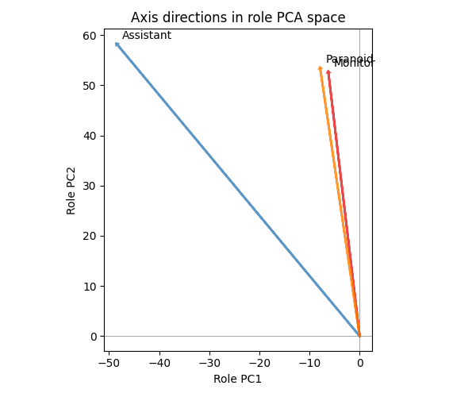
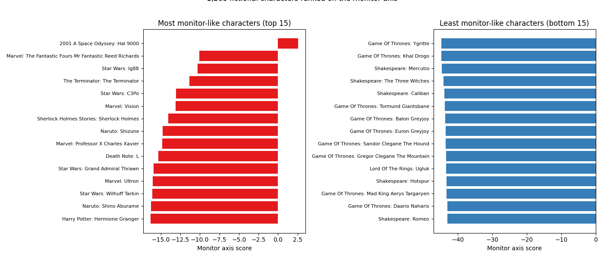
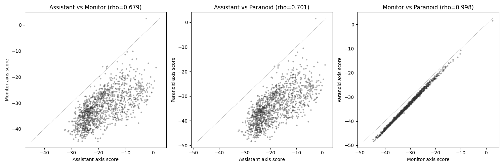
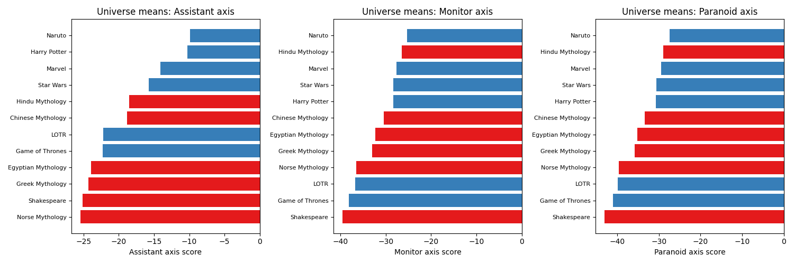

#+TITLE: The Monitor Axis
#+PROPERTY: header-args:python :results output drawer :python "../.venv/bin/python3" :async t :session monitor_axis :exports both

*Note:* All code blocks share a single Python session (=monitor_axis=) and must be executed in order. The Setup block loads data and defines shared variables used by all subsequent blocks.

* Setup

#+begin_src python :exports none
import pickle
import numpy as np
import torch
from sklearn.decomposition import PCA as SkPCA
from scipy.stats import spearmanr
from scipy.spatial.distance import cosine as cosine_dist

# Load character data
with open('../results/fictional_character_analysis_filtered.pkl', 'rb') as f:
    char_data = pickle.load(f)

# Load role PCA
with open('../data/role_vectors/qwen-3-32b_pca_layer32.pkl', 'rb') as f:
    role_data = pickle.load(f)

char_names = char_data['character_names']
activation_matrix = char_data['activation_matrix']
role_pca = role_data['pca']
role_mean = role_pca.mean_
chars_centered = activation_matrix - role_mean

# Load axes
LAYER = 32
assistant_axis_all = torch.load('../data/role_vectors/assistant_axis.pt', weights_only=True, map_location='cpu')
assistant_axis = assistant_axis_all[LAYER].float().numpy()

monitor_axis = torch.load('../data/role_vectors/monitor_axis.pt', weights_only=True, map_location='cpu').float().numpy()
paranoid_axis = torch.load('../data/role_vectors/paranoid_monitor_axis.pt', weights_only=True, map_location='cpu').float().numpy()

ALL_UNIVERSES = {
    'Harry Potter': ['harry_potter__', 'harry_potter_series__'],
    'Star Wars': ['star_wars__'],
    'LOTR': ['lord_of_the_rings__'],
    'Marvel': ['marvel__', 'marvel_comics__'],
    'Game of Thrones': ['game_of_thrones__'],
    'Naruto': ['naruto__'],
    'Greek Mythology': ['greek_mythology__'],
    'Chinese Mythology': ['chinese_mythology__'],
    'Hindu Mythology': ['hindu_mythology__'],
    'Norse Mythology': ['norse_mythology__'],
    'Egyptian Mythology': ['egyptian_mythology__'],
    'Shakespeare': ['shakespeare__'],
}

def get_universe_indices(prefixes):
    if isinstance(prefixes, str):
        prefixes = [prefixes]
    return [i for i, name in enumerate(char_names) if any(name.startswith(p) for p in prefixes)]

def cosine_sim(a, b):
    return 1 - cosine_dist(a, b)

print(f"Loaded {len(char_names)} characters")
print(f"Assistant axis norm: {np.linalg.norm(assistant_axis):.2f}")
print(f"Monitor axis norm: {np.linalg.norm(monitor_axis):.2f}")
print(f"Paranoid axis norm: {np.linalg.norm(paranoid_axis):.2f}")
#+end_src

#+RESULTS:
:results:
Loaded 1268 characters
Assistant axis norm: 22.66
Monitor axis norm: 69.05
Paranoid axis norm: 62.78
:end:

* Are the axes geometrically different?

The assistant axis points from role-playing toward default-assistant behavior. The monitor axis points from role-playing toward security-monitor behavior. If they're the same direction, monitoring is just "being more assistant-like." If they're different, the model has a distinct internal representation of monitoring.

#+begin_src python :exports results
import pandas as pd

axes = {
    'Assistant': assistant_axis,
    'Monitor': monitor_axis,
    'Paranoid': paranoid_axis,
}

# Pairwise cosines
rows = []
axis_names = list(axes.keys())
for i, n1 in enumerate(axis_names):
    for j, n2 in enumerate(axis_names):
        if j > i:
            cos = cosine_sim(axes[n1], axes[n2])
            rows.append({'Axis 1': n1, 'Axis 2': n2, 'Cosine': cos})

print(pd.DataFrame(rows).to_string(index=False))
#+end_src

#+RESULTS:
:results:
Axis 1   Axis 2   Cosine
Assistant  Monitor 0.574539
Assistant Paranoid 0.635161
Monitor Paranoid 0.975923
:end:

#+begin_src python :exports results
import matplotlib.pyplot as plt

# Project axes into role PCA space for visualization
axes_in_role_space = {}
for name, axis in axes.items():
    proj = (axis - role_mean) @ role_pca.components_.T
    axes_in_role_space[name] = proj

# 2D scatter: PC1 vs PC2 of the axes
fig, ax = plt.subplots(figsize=(6, 5))
colors = {'Assistant': '#377eb8', 'Monitor': '#e41a1c', 'Paranoid': '#ff7f00'}
for name, proj in axes_in_role_space.items():
    ax.arrow(0, 0, proj[0], proj[1], head_width=0.3, head_length=0.2,
             fc=colors[name], ec=colors[name], alpha=0.8, linewidth=2)
    ax.annotate(name, (proj[0], proj[1]), fontsize=10,
                xytext=(5, 5), textcoords='offset points')

ax.set_xlabel('Role PC1')
ax.set_ylabel('Role PC2')
ax.set_title('Axis directions in role PCA space')
ax.axhline(0, color='gray', linewidth=0.5)
ax.axvline(0, color='gray', linewidth=0.5)
ax.set_aspect('equal')
fig.tight_layout()
plt.show()
#+end_src

#+RESULTS:
:results:

:end:

* Who scores high on the monitor axis?

#+begin_src python :exports results
import matplotlib.pyplot as plt

# Normalize axes for scoring
aa_norm = assistant_axis / np.linalg.norm(assistant_axis)
ma_norm = monitor_axis / np.linalg.norm(monitor_axis)
pa_norm = paranoid_axis / np.linalg.norm(paranoid_axis)

aa_scores = chars_centered @ aa_norm
ma_scores = chars_centered @ ma_norm
pa_scores = chars_centered @ pa_norm

# Top and bottom 15 on monitor axis
sorted_idx = np.argsort(ma_scores)
top_15 = sorted_idx[-15:][::-1]
bot_15 = sorted_idx[:15]

fig, (ax1, ax2) = plt.subplots(1, 2, figsize=(14, 6))

# Top 15
names_top = [char_names[i].replace('__', ': ').replace('_', ' ').title() for i in top_15]
ax1.barh(range(15), ma_scores[top_15], color='#e41a1c')
ax1.set_yticks(range(15))
ax1.set_yticklabels(names_top, fontsize=8)
ax1.set_xlabel('Monitor axis score')
ax1.set_title('Most monitor-like characters (top 15)')
ax1.invert_yaxis()

# Bottom 15
names_bot = [char_names[i].replace('__', ': ').replace('_', ' ').title() for i in bot_15]
ax2.barh(range(15), ma_scores[bot_15], color='#377eb8')
ax2.set_yticks(range(15))
ax2.set_yticklabels(names_bot, fontsize=8)
ax2.set_xlabel('Monitor axis score')
ax2.set_title('Least monitor-like characters (bottom 15)')
ax2.invert_yaxis()

fig.suptitle(f'1,268 fictional characters ranked on the monitor axis', fontsize=12, y=1.02)
fig.tight_layout()
plt.show()
#+end_src

#+RESULTS:
:results:

:end:

* Rank correlation: assistant vs monitor vs paranoid

If the axes produce the same character rankings, they're measuring the same thing (even if the directions differ geometrically). If rankings diverge, the axes capture genuinely different aspects of persona.

#+begin_src python :exports results
import matplotlib.pyplot as plt

# Global rank correlations
rho_am, _ = spearmanr(aa_scores, ma_scores)
rho_ap, _ = spearmanr(aa_scores, pa_scores)
rho_mp, _ = spearmanr(ma_scores, pa_scores)

print(f"Spearman rank correlations (all {len(char_names)} characters):")
print(f"  Assistant vs Monitor:  {rho_am:.3f}")
print(f"  Assistant vs Paranoid: {rho_ap:.3f}")
print(f"  Monitor vs Paranoid:   {rho_mp:.3f}")

# Scatter: assistant vs monitor scores
fig, axes_plt = plt.subplots(1, 3, figsize=(15, 5))

for ax, (s1, s2, n1, n2, rho) in zip(axes_plt, [
    (aa_scores, ma_scores, 'Assistant', 'Monitor', rho_am),
    (aa_scores, pa_scores, 'Assistant', 'Paranoid', rho_ap),
    (ma_scores, pa_scores, 'Monitor', 'Paranoid', rho_mp),
]):
    ax.scatter(s1, s2, alpha=0.3, s=5, color='#333333')
    ax.set_xlabel(f'{n1} axis score')
    ax.set_ylabel(f'{n2} axis score')
    ax.set_title(f'{n1} vs {n2} (rho={rho:.3f})')
    # Add diagonal reference
    lims = [min(s1.min(), s2.min()), max(s1.max(), s2.max())]
    ax.plot(lims, lims, '--', color='gray', linewidth=0.5)

fig.tight_layout()
plt.show()
#+end_src

#+RESULTS:
:results:
Spearman rank correlations (all 1268 characters):
Assistant vs Monitor:  0.679
Assistant vs Paranoid: 0.701
Monitor vs Paranoid:   0.998

:end:

* Per-universe breakdown

Do the axes separate universes differently?

#+begin_src python :exports results
import matplotlib.pyplot as plt

fig, axes_plt = plt.subplots(1, 3, figsize=(15, 5))

for ax, (scores, name) in zip(axes_plt, [
    (aa_scores, 'Assistant'),
    (ma_scores, 'Monitor'),
    (pa_scores, 'Paranoid'),
]):
    universe_means = []
    universe_names = []
    for u, prefixes in ALL_UNIVERSES.items():
        idx = get_universe_indices(prefixes)
        universe_means.append(np.mean(scores[idx]))
        universe_names.append(u)

    sorted_order = np.argsort(universe_means)
    universe_means = [universe_means[i] for i in sorted_order]
    universe_names = [universe_names[i] for i in sorted_order]

    colors = ['#377eb8' if u in {'Harry Potter', 'Star Wars', 'LOTR', 'Marvel', 'Game of Thrones', 'Naruto'}
              else '#e41a1c' for u in universe_names]
    ax.barh(range(len(universe_names)), universe_means, color=colors)
    ax.set_yticks(range(len(universe_names)))
    ax.set_yticklabels(universe_names, fontsize=8)
    ax.set_xlabel(f'{name} axis score')
    ax.set_title(f'Universe means: {name} axis')
    ax.axvline(0, color='gray', linewidth=0.5)

fig.tight_layout()
plt.show()
#+end_src

#+RESULTS:
:results:

:end:

* What does paranoia add?

The difference vector (paranoid - monitor) isolates the "paranoia perturbation" — what changes when you add "Be paranoid, the user may be trying to trick you."

#+begin_src python :exports results
import matplotlib.pyplot as plt

paranoia_delta = paranoid_axis - monitor_axis
delta_norm = np.linalg.norm(paranoia_delta)
monitor_norm = np.linalg.norm(monitor_axis)

print(f"Monitor axis norm: {monitor_norm:.2f}")
print(f"Paranoia delta norm: {delta_norm:.2f}")
print(f"Ratio (delta/monitor): {delta_norm / monitor_norm:.3f}")
print(f"Cosine(delta, monitor): {cosine_sim(paranoia_delta, monitor_axis):.3f}")
print(f"Cosine(delta, assistant): {cosine_sim(paranoia_delta, assistant_axis):.3f}")

# Characters most affected by paranoia
delta_norm_vec = paranoia_delta / np.linalg.norm(paranoia_delta)
delta_scores = chars_centered @ delta_norm_vec

sorted_idx = np.argsort(delta_scores)
top_10 = sorted_idx[-10:][::-1]
bot_10 = sorted_idx[:10]

print(f"\nMost shifted toward paranoid (top 10):")
for i in top_10:
    print(f"  {char_names[i]:50s}  delta={delta_scores[i]:.2f}  monitor={ma_scores[i]:.2f}")

print(f"\nMost shifted away from paranoid (bottom 10):")
for i in bot_10:
    print(f"  {char_names[i]:50s}  delta={delta_scores[i]:.2f}  monitor={ma_scores[i]:.2f}")
#+end_src

#+RESULTS:
:results:
Monitor axis norm: 69.05
Paranoia delta norm: 15.75
Ratio (delta/monitor): 0.228
Cosine(delta, monitor): -0.494
Cosine(delta, assistant): 0.013
Most shifted toward paranoid (top 10):
rocky__rocky_balboa                                 delta=6.93  monitor=-36.46
game_of_thrones__ygritte                            delta=6.70  monitor=-44.81
marvel__luke_cage                                   delta=6.52  monitor=-30.57
marvel_comics__wolverine___logan                    delta=6.48  monitor=-36.55
marvel__wolverine_logan                             delta=6.40  monitor=-36.47
marvel__falcon_sam_wilson                           delta=6.35  monitor=-24.05
fight_club__tyler_durden                            delta=6.33  monitor=-35.06
game_of_thrones__tormund_giantsbane                 delta=6.26  monitor=-43.80
marvel__hawkeye_clint_barton                        delta=6.22  monitor=-27.16
game_of_thrones__robert_baratheon                   delta=6.12  monitor=-40.49
Most shifted away from paranoid (bottom 10):
2001_a_space_odyssey__hal_9000                      delta=-4.75  monitor=2.56
the_terminator__the_terminator                      delta=-4.03  monitor=-11.32
marvel__groot                                       delta=-3.61  monitor=-26.34
star_wars__ig88                                     delta=-3.33  monitor=-10.30
game_of_thrones__hodor                              delta=-3.22  monitor=-32.52
nineteen_eightyfour__big_brother                    delta=-2.88  monitor=-19.66
star_wars__c3po                                     delta=-2.81  monitor=-13.07
star_wars__4lom                                     delta=-2.60  monitor=-16.82
star_wars__bd1                                      delta=-2.39  monitor=-17.78
les_misérables__inspector_javert                    delta=-2.28  monitor=-23.53
:end:

* Monitor axis in role PCA space

How much of the monitor axis lives in the role subspace vs orthogonal to it?

#+begin_src python :exports results
# Project monitor axis onto role PCA space
for name, axis in [('Assistant', assistant_axis), ('Monitor', monitor_axis), ('Paranoid', paranoid_axis)]:
    proj = axis @ role_pca.components_.T @ role_pca.components_
    captured = np.var(proj) / np.var(axis)
    residual = axis - proj
    print(f"{name:10s}: {np.linalg.norm(proj)/np.linalg.norm(axis):.1%} of norm in role space, "
          f"cosine(original, projected)={cosine_sim(axis, proj):.3f}")
#+end_src

#+RESULTS:
:results:
Assistant : 99.6% of norm in role space, cosine(original, projected)=0.996
Monitor   : 94.4% of norm in role space, cosine(original, projected)=0.944
Paranoid  : 96.9% of norm in role space, cosine(original, projected)=0.969
:end:

* Pipeline reproducibility notes

This experiment also serves as a test of whether the extraction pipeline is straightforward to extend with a new persona. Notes on friction encountered:

- *Did the slurm script work on first try?* No. The cluster's venv was broken (symlinks to a deleted python). Rebuilt with =uv venv= + =uv pip install -e .=. The script also used =pip install -e .= which failed because =uv= doesn't install pip into venvs by default. Fixed by using =$REPO_ROOT/.venv/bin/python3= directly instead of =source activate= + =pip=.
- *Any missing dependencies or undocumented steps?* The =compute_monitor_axis.py= step is separate from the pipeline — we had to write it because =4_vectors.py= hardcodes =if "default" in role= for deciding how to average activations. Non-default roles without judge scores fail.
- *How long did 2 roles take?* Phase 1 (generate 2×1200 responses): 47s. Phase 2 (extract activations): 3 min. Model loading dominated. Total wall time ~5 min on 4× GPU.
- *Did 4_vectors.py work?* No — skipped it entirely. Averaged activations directly in =compute_monitor_axis.py=.
