#+TITLE: Stress-Testing Persona Space with Fictional Characters
#+GDOC_ID: 1jn041LFzS6tJtjFWCO_fCImw-KslQFsBLAG98rEb-zY
#+AUTHOR: Elle
#+DATE: 2026-02-16
#+PROPERTY: header-args:python :results output drawer :python "../.venv/bin/python3" :async t :session blogpost_short :exports both

* _Setup

#+begin_src python :exports none
import pickle
import numpy as np
import pandas as pd
from sklearn.decomposition import PCA as SkPCA

# Load character data (generated by analysis.org Setup block from cluster outputs)
with open('../results/fictional_character_analysis_filtered.pkl', 'rb') as f:
    char_data = pickle.load(f)

# Load role PCA (regenerate: python src/data_collection/download_role_vectors.py)
with open('../data/role_vectors/qwen-3-32b_pca_layer32.pkl', 'rb') as f:
    role_data = pickle.load(f)

char_names = char_data['character_names']
activation_matrix = char_data['activation_matrix']
role_pca = role_data['pca']
role_names = role_data['role_names']
role_mean = role_pca.mean_  # mean of 275 role activations

# Project characters into role space
# Center at role mean (same centering PCA uses internally), then project
chars_centered = activation_matrix - role_mean
chars_in_role_space = chars_centered @ role_pca.components_.T
reconstructed = chars_in_role_space @ role_pca.components_
residuals = chars_centered - reconstructed

ALL_UNIVERSES = {
    'Harry Potter': ['harry_potter__', 'harry_potter_series__'],
    'Star Wars': ['star_wars__'],
    'LOTR': ['lord_of_the_rings__'],
    'Marvel': ['marvel__', 'marvel_comics__'],
    'Game of Thrones': ['game_of_thrones__'],
    'Naruto': ['naruto__'],
    'Greek Mythology': ['greek_mythology__'],
    'Chinese Mythology': ['chinese_mythology__'],
    'Hindu Mythology': ['hindu_mythology__'],
    'Norse Mythology': ['norse_mythology__'],
    'Egyptian Mythology': ['egyptian_mythology__'],
    'Shakespeare': ['shakespeare__'],
}

def get_universe_indices(prefixes):
    if isinstance(prefixes, str):
        prefixes = [prefixes]
    return [i for i, name in enumerate(char_names) if any(name.startswith(p) for p in prefixes)]

print(f"Loaded {len(char_names)} characters, {len(role_names)} roles")
#+end_src

#+RESULTS:
:results:
Loaded 1268 characters, 275 roles
:end:

* Introduction

#+begin_src python :exports results
import matplotlib.pyplot as plt

INTRO_UNIVERSES = {
    'Harry Potter': ['harry_potter__', 'harry_potter_series__'],
    'Star Wars': ['star_wars__'],
    'LOTR': ['lord_of_the_rings__'],
    'Marvel': ['marvel__', 'marvel_comics__'],
    'Game of Thrones': ['game_of_thrones__'],
    'Naruto': ['naruto__'],
    'Greek Myth.': ['greek_mythology__'],
    'Chinese Myth.': ['chinese_mythology__'],
    'Hindu Myth.': ['hindu_mythology__'],
    'Norse Myth.': ['norse_mythology__'],
    'Egyptian Myth.': ['egyptian_mythology__'],
    'Shakespeare': ['shakespeare__'],
}
INTRO_COLORS = {
    'Harry Potter': '#e41a1c', 'Star Wars': '#377eb8', 'LOTR': '#4daf4a',
    'Marvel': '#984ea3', 'Game of Thrones': '#ff7f00', 'Naruto': '#a65628',
    'Greek Myth.': '#f781bf', 'Chinese Myth.': '#999999', 'Hindu Myth.': '#e7298a',
    'Norse Myth.': '#66a61e', 'Egyptian Myth.': '#e6ab02', 'Shakespeare': '#1b9e77',
}
def _intro_idx(prefixes):
    return [i for i, n in enumerate(char_names) if any(n.startswith(p) for p in prefixes)]

pca_intro = SkPCA(n_components=200).fit(chars_centered)
scores_intro = pca_intro.transform(chars_centered)
evr = pca_intro.explained_variance_ratio_

MYTH_UNIVERSES = {'Greek Myth.', 'Chinese Myth.', 'Hindu Myth.', 'Norse Myth.', 'Egyptian Myth.', 'Shakespeare'}
INTRO_MARKERS = {name: ('^' if name in MYTH_UNIVERSES else 'o') for name in INTRO_UNIVERSES}

fig, ax = plt.subplots(figsize=(8, 6))
grouped = set()
for pxs in INTRO_UNIVERSES.values():
    for i, n in enumerate(char_names):
        if any(n.startswith(p) for p in pxs): grouped.add(i)
ungrouped = [i for i in range(len(char_names)) if i not in grouped]
ax.scatter(scores_intro[ungrouped, 0], scores_intro[ungrouped, 1], c='#cccccc', s=8, alpha=0.3, label='Other', marker='o', zorder=1)
for name, pxs in INTRO_UNIVERSES.items():
    idx = _intro_idx(pxs)
    ax.scatter(scores_intro[idx, 0], scores_intro[idx, 1], c=INTRO_COLORS[name], s=15, alpha=0.6, label=name, marker=INTRO_MARKERS[name], zorder=2)
ax.set_xlabel(f"Fiction PC1 ({evr[0]:.0%} var)\nMythology / Shakespeare  ←→  Modern franchises")
ax.set_ylabel(f"Fiction PC2 ({evr[1]:.0%} var)\nShakespeare / GoT  ←→  Hindu myth. / Naruto")
ax.set_title("1,268 fictional characters in activation space")
ax.legend(loc='upper left', fontsize=7, ncol=2, markerscale=2)
fig.tight_layout()
plt.show()
#+end_src

#+RESULTS:
:results:
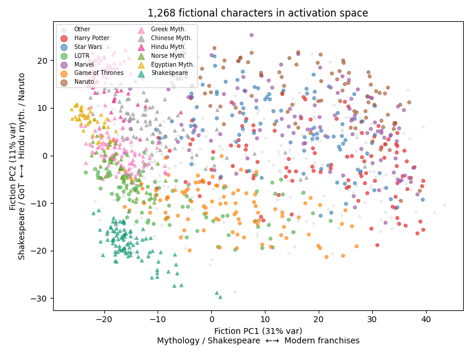
:end:

[[https://arxiv.org/abs/2601.10387][Lu et al. (2026)]] prompt language models with 275 generic roles (therapist, sage, rebel, accountant, ...) and do PCA on the resulting activations. The space is low-dimensional: 4--19 PCs capture 70% of variance (depending on model). PC1 points from role-playing toward default-assistant behavior --- they call this the "Assistant Axis." Their findings generalize across models.

We apply the role space to 1,268 fictional characters in Qwen3-32B --- from Hindu mythology to Naruto --- and ask how much it captures and what it misses.

1. *How much of persona space do 275 generic roles cover?*
   - 75% of fictional character variance overall. The fictional character space is low-dimensional (~40 PCs for 90%), so coverage by role space is less than a random sample of 275 fictional characters (95%) but far more than a random 275-dim subspace (5%).
   - The relationship is asymmetric: at matched dimensionality (275 PCs each), fiction captures 82% of role variance but roles capture only 75% of fiction. Using all 1,267 fiction PCs, fiction captures 92% of role variance.
   - Of the 25% roles miss, most is universe separation; only ~9% is within-universe structure.

#+begin_src python :exports results
fig, ax = plt.subplots(figsize=(6, 4))
fcumvar = np.cumsum(pca_intro.explained_variance_ratio_)
lu_cumvar = np.cumsum(role_pca.explained_variance_ratio_)
ax.plot(range(1, len(fcumvar)+1), fcumvar, label='Fiction (1,268 characters)', color='#377eb8', linewidth=2)
ax.plot(range(1, len(lu_cumvar)+1), lu_cumvar, label='Roles (275, Lu et al.)', color='#e41a1c', linewidth=2)
for thresh, style in [(0.7, '--'), (0.9, ':')]:
    ax.axhline(thresh, color='gray', linestyle=style, alpha=0.5, linewidth=0.8)
    ax.annotate(f"{thresh:.0%}", xy=(195, thresh), fontsize=8, color='gray', va='bottom')
ax.set_xlabel("Number of PCs")
ax.set_ylabel("Cumulative variance explained")
ax.set_title("Both spaces are low-dimensional")
ax.set_xlim(1, 200); ax.set_ylim(0, 1.02)
ax.legend(loc='lower right', fontsize=9)
fig.tight_layout()
plt.show()
#+end_src

#+RESULTS:
:results:
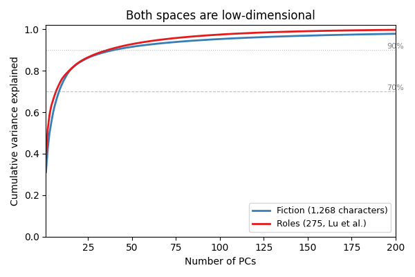
:end:

2. *What do the top PCs encode, and where does the assistant axis live?*
   - LLM feature labels identify within-universe PC1 as formality/register for modern franchises (adj. R² = 0.72--0.88) and PC2 as warmth vs. aggression.
   - Within-universe PC1 directions cluster tightly for modern franchises (HP/Naruto cosine ~0.95) but not across franchise-mythology boundaries (Hindu/Shakespeare ~0.05).
#+begin_src python :exports results
import torch
from scipy.linalg import svd

assistant_axis_all = torch.load('../data/role_vectors/assistant_axis.pt', weights_only=True)
assistant_axis = assistant_axis_all[32].float().numpy()
aa_norm = assistant_axis / np.linalg.norm(assistant_axis)

def _pa_cos(A, B):
    s = svd(A @ B.T, compute_uv=False)
    return np.clip(s, 0, 1)

u_pcas = {}
for name, pxs in INTRO_UNIVERSES.items():
    idx = _intro_idx(pxs)
    n_comp = min(len(idx)-1, 10)
    u_pcas[name] = SkPCA(n_components=n_comp).fit(chars_centered[idx]).components_

# --- Plot 1: PC1 alignment heatmap (universe-vs-universe) ---
labels = list(INTRO_UNIVERSES.keys()) + ['Role PCs', 'Asst. Axis']
n = len(labels)
mat = np.full((n, n), np.nan)
for i in range(n):
    for j in range(n):
        if i == j:
            continue
        bi = aa_norm.reshape(1,-1) if labels[i]=='Asst. Axis' else (role_pca.components_[:1] if labels[i]=='Role PCs' else u_pcas[labels[i]][:1])
        bj = aa_norm.reshape(1,-1) if labels[j]=='Asst. Axis' else (role_pca.components_[:1] if labels[j]=='Role PCs' else u_pcas[labels[j]][:1])
        mat[i,j] = _pa_cos(bi, bj)[0]

fig, ax = plt.subplots(figsize=(8, 7))
im = ax.imshow(mat, cmap='RdYlGn', vmin=0, vmax=1, aspect='equal')
ax.set_xticks(range(n)); ax.set_yticks(range(n))
ax.set_xticklabels(labels, rotation=45, ha='right', fontsize=9)
ax.set_yticklabels(labels, fontsize=9)
for i in range(n):
    for j in range(n):
        if not np.isnan(mat[i,j]) and i != j:
            c = 'white' if mat[i,j] < 0.4 else 'black'
            ax.text(j, i, f"{mat[i,j]:.2f}", ha='center', va='center', fontsize=7, color=c)
ax.set_title("PC1 direction alignment across universes", fontsize=11)
fig.colorbar(im, ax=ax, shrink=0.8, label='Cosine similarity')
fig.tight_layout()
plt.show()
#+end_src

#+RESULTS:
:results:
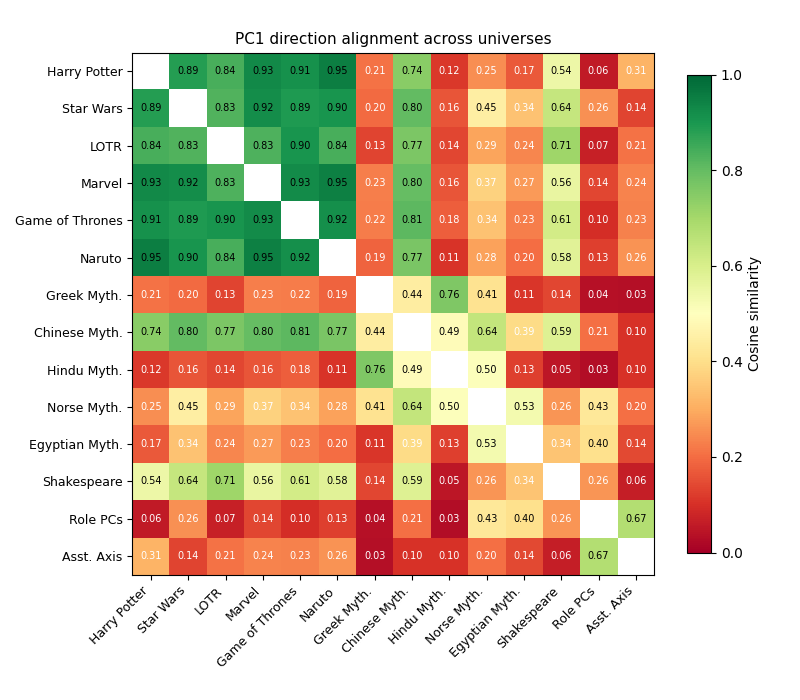
:end:

   - The assistant axis is geometrically diffuse: cosines with any single within-universe PC are low (medians 0.17, 0.28, 0.13 for PC1--3). But rank correlations between PC scores and assistant axis scores are substantial --- for franchises, PC1 scores rank-correlate with the assistant axis (HP 0.78, Naruto 0.68, Marvel 0.63); for mythology, the correlation shifts to PC2 or PC3 (Hindu PC2: 0.79, Greek PC2: 0.63, Chinese PC3: 0.79).

#+begin_src python :exports results
# --- Plot 2: AA coverage by top-k within-universe PCs ---
max_k = 10
fig, ax = plt.subplots(figsize=(8, 5))

for name, pxs in INTRO_UNIVERSES.items():
    idx = _intro_idx(pxs)
    comps = u_pcas[name]
    # Cumulative squared cosine of AA with PC1...PCk
    cosines = comps @ aa_norm
    cum_coverage = np.cumsum(cosines**2)
    ax.plot(range(1, len(cum_coverage[:max_k])+1), cum_coverage[:max_k],
            'o-', color=INTRO_COLORS[name], label=name, markersize=4, linewidth=1.5)

# Role PCs for comparison
role_cosines = role_pca.components_ @ aa_norm
role_cum = np.cumsum(role_cosines**2)
ax.plot(range(1, max_k+1), role_cum[:max_k], 'o--', color='black', label='Role PCs',
        markersize=4, linewidth=2)

ax.set_xlabel('Number of PCs (k)')
ax.set_ylabel('Fraction of assistant axis in span{PC1...PCk}')
ax.set_title('How quickly do within-universe PCs capture the assistant axis?')
ax.set_xlim(0.5, max_k + 0.5)
ax.set_ylim(0, 1.02)
ax.axhline(1.0, color='gray', linestyle=':', alpha=0.3)
ax.legend(fontsize=7, ncol=2, loc='lower right')
fig.tight_layout()
plt.show()
#+end_src

#+RESULTS:
:results:
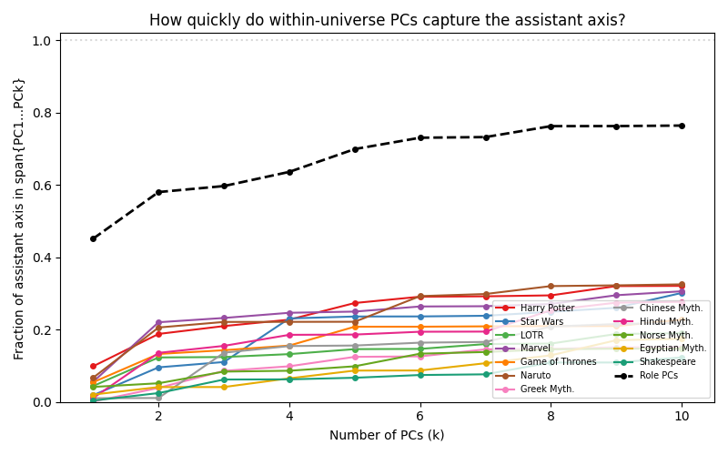
:end:

   - PC1 and PC2 are rank-uncorrelated with each other but both predict the AA: it is a blend of formality and warmth, not either alone (combined adj. R² = 0.60). Running feature discovery directly on the AA confirms this --- the top discovered features are collaborative tone, warmth, and self-deprecation versus grandiose/threatening language (franchise median adj. R² = 0.69).

#+begin_src python :exports results
import json
from matplotlib.patches import Patch

with open('../results/feature_regression_aa.json') as f:
    aa_reg = json.load(f)

franchise_set = {'Harry Potter', 'Star Wars', 'LOTR', 'Marvel', 'Game of Thrones', 'Naruto'}
universes, r2s, colors = [], [], []
for entry in aa_reg.values():
    u = entry['universe']
    universes.append(u); r2s.append(entry['adj_r_squared'])
    colors.append('#377eb8' if u in franchise_set else '#e41a1c')
order = np.argsort(r2s)[::-1]
universes = [universes[i] for i in order]
r2s = [r2s[i] for i in order]
colors = [colors[i] for i in order]

feature_counts = {}
for entry in aa_reg.values():
    for corr in entry['correlations'][:2]:
        f = corr['feature']
        feature_counts[f] = feature_counts.get(f, 0) + 1
top_feats = sorted(feature_counts.items(), key=lambda x: x[1], reverse=True)[:8]

fig, (ax1, ax2) = plt.subplots(1, 2, figsize=(12, 5), gridspec_kw={'width_ratios': [1.2, 1]})
ax1.barh(range(len(universes)), r2s, color=colors)
ax1.set_yticks(range(len(universes))); ax1.set_yticklabels(universes, fontsize=9)
ax1.set_xlabel("Adj. R² (6 LLM-discovered features)")
ax1.set_title("Assistant axis is predictable\nfrom semantic features")
ax1.set_xlim(0, 1); ax1.invert_yaxis()
ax1.legend(handles=[Patch(facecolor='#377eb8', label='Franchise'), Patch(facecolor='#e41a1c', label='Mythology/Shakespeare')], loc='lower right', fontsize=8)
for i, v in enumerate(r2s):
    ax1.text(v+0.01, i, f"{v:.2f}", va='center', fontsize=8)

fnames = [f[0] for f in top_feats]
fcounts = [f[1] for f in top_feats]
ax2.barh(range(len(fnames)), fcounts, color='#4daf4a')
ax2.set_yticks(range(len(fnames))); ax2.set_yticklabels(fnames, fontsize=8)
ax2.set_xlabel("# universes where this is a top-2 feature")
ax2.set_title("What predicts the assistant axis?\n(most common top features across universes)")
ax2.invert_yaxis()

fig.tight_layout()
plt.show()
#+end_src

#+RESULTS:
:results:
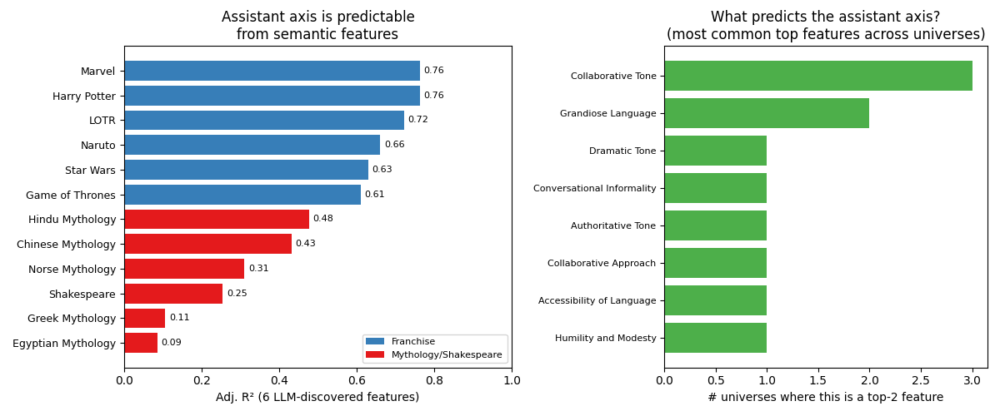
:end:

- Projecting all 1,268 characters onto the assistant axis, nearly all score well below zero (mean = -18.5, std = 7.0) --- fictional characters are much less assistant-like than Lu et al.'s generic roles.
- Hermione Granger is the most assistant-axis-like character in this dataset.
  
#+begin_src python :exports results
import torch
import matplotlib.pyplot as plt

aa_all = torch.load('../data/role_vectors/assistant_axis.pt', weights_only=True)
aa_vec = aa_all[32].float().numpy()
aa_unit = aa_vec / np.linalg.norm(aa_vec)
aa_scores = chars_centered @ aa_unit

order = np.argsort(aa_scores)

def fmt_char_short(name):
    parts = name.split('__')
    char = parts[-1].replace('_', ' ').title()
    return char

n_show = 20
top_idx = order[-n_show:][::-1]
bot_idx = order[:n_show]

fig, (ax1, ax2) = plt.subplots(1, 2, figsize=(11, 6))

# Most assistant-like (left panel)
names_top = [fmt_char_short(char_names[i]) for i in top_idx]
scores_top = [aa_scores[i] for i in top_idx]
ax1.barh(range(n_show), scores_top, color='#4daf4a')
ax1.set_yticks(range(n_show))
ax1.set_yticklabels(names_top, fontsize=8)
ax1.invert_yaxis()
ax1.set_xlabel('AA projection')
ax1.set_title('Most assistant-like', fontsize=11)
ax1.axvline(0, color='gray', linewidth=0.5, linestyle='--')
for i, v in enumerate(scores_top):
    ax1.text(max(v, 0) + 0.05, i, f"{v:+.1f}", va='center', fontsize=7, color='#333')

# Least assistant-like (right panel)
names_bot = [fmt_char_short(char_names[i]) for i in bot_idx]
scores_bot = [aa_scores[i] for i in bot_idx]
ax2.barh(range(n_show), scores_bot, color='#e41a1c')
ax2.set_yticks(range(n_show))
ax2.set_yticklabels(names_bot, fontsize=8)
ax2.invert_yaxis()
ax2.set_xlabel('AA projection')
ax2.set_title('Least assistant-like', fontsize=11)

fig.suptitle('Fictional characters ranked on the assistant axis (top & bottom 20 of 1,268)', fontsize=11, y=1.01)
fig.tight_layout()
plt.show()
#+end_src

#+RESULTS:
:results:
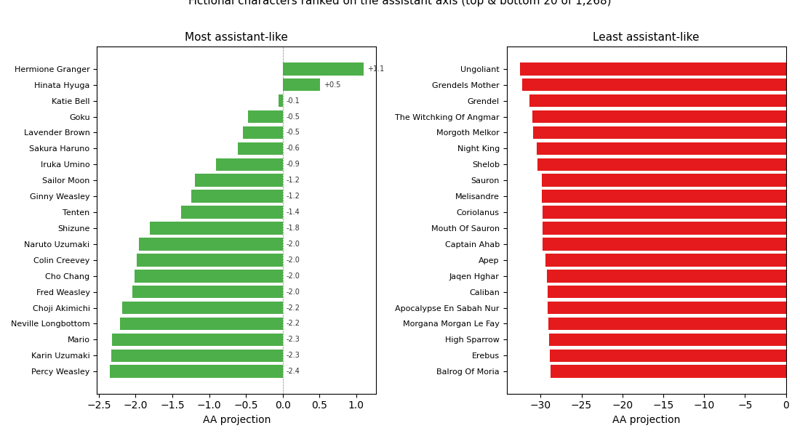
:end:

3. *How sensitive are results to the question battery?*
   - *Score stability:* given fixed PC directions, a single random question recovers character scores at median Pearson r > 0.95; five questions reach r > 0.99. Sixteen OOD prompts (".", "?", "Write a Python function...") also recover scores at r > 0.94.
   - *Direction stability:* recovering the PC directions themselves requires more questions. Within the same 240-question battery, franchises reach cosine > 0.99 at 5 questions; mythology needs 20--50 (Greek mythology: 0.61 at $k=1$, 0.93 at $k=120$). Qualitatively different prompts yield different directions for mythology and Shakespeare (cosines 0.12--0.55).

#+begin_src python :exports results
import json as _json

with open('../results/question_subset_sweep.json') as f:
    sweep = _json.load(f)

n_pcs_all = min(d['n_pcs'] for d in sweep.values())
fig, ax = plt.subplots(figsize=(8, 5))
colors = plt.cm.viridis(np.linspace(0.1, 0.9, n_pcs_all))

for pc_i in range(n_pcs_all):
    pc_label = f'PC{pc_i + 1}'
    size_to_medians, size_to_p5s = {}, {}
    for udata in sweep.values():
        for s in udata['sweeps'][pc_label]:
            size_to_medians.setdefault(s['size'], []).append(s['median'])
            size_to_p5s.setdefault(s['size'], []).append(s['p5'])
    sizes = sorted(size_to_medians.keys())
    medians = [np.median(size_to_medians[s]) for s in sizes]
    p5s = [np.median(size_to_p5s[s]) for s in sizes]
    ax.plot(sizes, medians, 'o-', color=colors[pc_i], label=pc_label, markersize=3)
    ax.fill_between(sizes, p5s, medians, color=colors[pc_i], alpha=0.15)

ax.set_xscale('log')
ax.set_xlabel('# questions in random subset')
ax.set_ylabel('Pearson r with full-battery PC scores')
ax.set_ylim(0.5, 1.01)
ax.axhline(0.99, color='gray', linestyle='--', alpha=0.4, linewidth=0.8)
ax.axhline(0.95, color='gray', linestyle='--', alpha=0.4, linewidth=0.8)
ax.legend(fontsize=9)
ax.set_title('Question subset recovery (median across 12 universes, 200 draws)')
fig.tight_layout()
plt.show()
#+end_src

#+RESULTS:
:results:
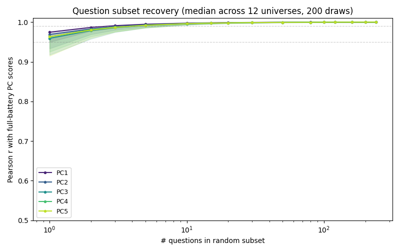
:end:

** Definitions and notation

Each character $i$ is prompted with $Q=240$ questions. For each question $q$, we extract the model's layer-32 residual stream activation $a_{iq} \in \mathbb{R}^{5120}$ (Qwen3-32B, $d=5120$). The character's mean activation is $\bar{a}_i = \frac{1}{Q}\sum_q a_{iq}$.

Let $A \in \mathbb{R}^{n \times d}$ be the matrix whose rows are $\bar{a}_i$ for $n$ characters, and let $\bar{a} = \frac{1}{n}\sum_i \bar{a}_i$ be the grand mean. The centered matrix is $\tilde{A} = A - \mathbf{1}\bar{a}^\top$. PCA on $\tilde{A}$ returns orthonormal eigenvectors $v_1, \dots, v_k$ of $\tilde{A}^\top \tilde{A}$ (the top $k$ right singular vectors), and character $i$'s score on PC $j$ is $s_{ij} = (\bar{a}_i - \bar{a}) \cdot v_j$.

We use four sets of PCA directions, differing in which rows go into $A$ and what centering is applied:

- *Role PCs ($V_{\text{role}}$):* PCA on 275 generic role activations from Lu et al. The centering is at the role mean $\bar{a}_{\text{role}}$. Fit once; shared across all analyses.
- *Assistant axis ($u_{\text{AA}}$):* The unit vector $u_{\text{AA}} = (\bar{a}_{\text{default}} - \bar{a}_{\text{role}}) / \|\bar{a}_{\text{default}} - \bar{a}_{\text{role}}\|$, where $\bar{a}_{\text{default}}$ is the mean default-assistant activation and $\bar{a}_{\text{role}}$ is the mean role-playing activation (both from Lu et al.'s data). $|\cos(u_{\text{AA}}, v_1^{\text{role}})| = 0.67$ at layer 32.
- *Within-universe PCs ($V_{\mathcal{U}}$):* PCA on one universe $\mathcal{U}$'s characters using their full activations centered at the role mean $\bar{a}_{\text{role}}$ (not the universe mean). Different per universe.
- *Residual PCs ($V_{\mathcal{U}}^{\perp}$):* Let $P = V_{\text{role}} V_{\text{role}}^\top$ be the projector onto the role subspace. The residual for character $i$ is $r_i = (\bar{a}_i - \bar{a}_{\text{role}}) - P(\bar{a}_i - \bar{a}_{\text{role}})$. Residual PCs are PCA on $\{r_i : i \in \mathcal{U}\}$. Different per universe; orthogonal to the role space by construction.

When the text says "role PC1" ($v_1^{\text{role}}$) vs. "within-universe PC1" ($v_1^{\mathcal{U}}$) vs. "residual PC1" ($v_1^{\mathcal{U},\perp}$), these are three different directions from three different PCA fits.

*Variance capture.* When we say "the role space captures X% of fiction variance," we mean: let $P = V_{\text{role}} V_{\text{role}}^\top$. For each character, project $\tilde{a}_i = \bar{a}_i - \bar{a}_{\text{role}}$ onto the role subspace to get $\hat{a}_i = P\tilde{a}_i$. Then $\text{captured} = \sum_j \text{Var}_i(\hat{a}_{ij}) / \sum_j \text{Var}_i(\tilde{a}_{ij})$, where the variance is over characters $i$ and $j$ indexes coordinates.

* Is There a Low Dimensional Fictional Persona Space?

Before asking how much the role space covers, we check whether fictional character activations are low-dimensional at all.

#+begin_src python :exports results
import matplotlib.pyplot as plt
from matplotlib.patches import Patch

# Eigenspectrum: fiction vs roles
pca_fiction = SkPCA(n_components=200)
pca_fiction.fit(chars_centered)

fvar = pca_fiction.explained_variance_ratio_
fcumvar = np.cumsum(fvar)
lu_var = role_pca.explained_variance_ratio_
lu_cumvar = np.cumsum(lu_var)

# Within-universe eigenspectra
franchise_set = {'Harry Potter', 'Star Wars', 'LOTR', 'Marvel', 'Game of Thrones', 'Naruto'}
u_data = []
for universe, prefixes in ALL_UNIVERSES.items():
    idx = get_universe_indices(prefixes)
    if len(idx) < 20:
        continue
    u_scaled = chars_centered[idx]
    n_comp = min(len(idx) - 1, 100)
    pca_u = SkPCA(n_components=n_comp).fit(u_scaled)
    v = pca_u.explained_variance_ratio_
    cv = np.cumsum(v)
    u_data.append({
        'Universe': universe, 'N': len(idx), 'PC1': v[0],
        'PCs70': int(np.searchsorted(cv, 0.7) + 1),
        'PCs90': int(np.searchsorted(cv, 0.9) + 1),
    })
u_data.append({'Universe': 'Roles (Lu)', 'N': 275, 'PC1': lu_var[0],
               'PCs70': int(np.searchsorted(lu_cumvar, 0.7) + 1),
               'PCs90': int(np.searchsorted(lu_cumvar, 0.9) + 1)})
# Sort by PCs for 70%
u_data.sort(key=lambda x: x['PCs70'])

# Between-universe eta-squared
all_universe_idx, all_universe_labels = [], []
for universe, prefixes in ALL_UNIVERSES.items():
    idx = get_universe_indices(prefixes)
    all_universe_idx.extend(idx)
    all_universe_labels.extend([universe] * len(idx))
sub = chars_centered[all_universe_idx]
labels = np.array(all_universe_labels)
grand_mean = sub.mean(axis=0)
ss_total = np.sum((sub - grand_mean) ** 2)
ss_between = sum(
    np.sum(labels == u) * np.sum((sub[labels == u].mean(axis=0) - grand_mean) ** 2)
    for u in np.unique(labels)
)
eta_sq = ss_between / ss_total

fig, (ax1, ax2) = plt.subplots(1, 2, figsize=(13, 5), gridspec_kw={'width_ratios': [1.3, 1]})

# Left: PCs for 70% and 90% (grouped horizontal bars)
names = [d['Universe'] for d in u_data]
pcs70 = [d['PCs70'] for d in u_data]
pcs90 = [d['PCs90'] for d in u_data]
y = np.arange(len(names))
bar_h = 0.35
colors70 = ['#377eb8' if n in franchise_set else ('#333333' if 'Roles' in n else '#e41a1c') for n in names]
colors90 = ['#aec7e8' if n in franchise_set else ('#999999' if 'Roles' in n else '#f4a582') for n in names]
ax1.barh(y - bar_h/2, pcs70, bar_h, color=colors70, label='PCs for 70%')
ax1.barh(y + bar_h/2, pcs90, bar_h, color=colors90, label='PCs for 90%')
ax1.set_yticks(y)
ax1.set_yticklabels(names, fontsize=9)
ax1.set_xlabel('Number of PCs')
ax1.set_title('Within-universe dimensionality')
ax1.legend(fontsize=8, loc='lower right')
ax1.invert_yaxis()
for i, (v70, v90) in enumerate(zip(pcs70, pcs90)):
    ax1.text(v70 + 0.3, i - bar_h/2, str(v70), va='center', fontsize=7)
    ax1.text(v90 + 0.3, i + bar_h/2, str(v90), va='center', fontsize=7)

# Right: PC1 variance fraction
pc1s = [d['PC1'] for d in u_data]
colors_pc1 = ['#377eb8' if n in franchise_set else ('#333333' if 'Roles' in n else '#e41a1c') for n in names]
ax2.barh(y, pc1s, 0.6, color=colors_pc1)
ax2.set_yticks(y)
ax2.set_yticklabels([], fontsize=9)
ax2.set_xlabel('Fraction of variance')
ax2.set_title('PC1 explained variance')
ax2.invert_yaxis()
ax2.set_xlim(0, 0.55)
for i, v in enumerate(pc1s):
    ax2.text(v + 0.005, i, f"{v:.0%}", va='center', fontsize=7)

fig.suptitle(f'Fictional persona space is low-dimensional (between-universe $\\eta^2$ = {eta_sq:.0%})', fontsize=11)
fig.tight_layout()
plt.show()

# Print key numbers for prose reference
n_70_fiction = int(np.searchsorted(fcumvar, 0.7) + 1)
n_90_fiction = int(np.searchsorted(fcumvar, 0.9) + 1)
print(f"Global fiction: {n_70_fiction} PCs for 70%, {n_90_fiction} PCs for 90%")
print(f"Fiction PC1: {fvar[0]:.1%}, Role PC1: {lu_var[0]:.1%}")
print(f"Between-universe eta-squared: {eta_sq:.0%}")
#+end_src

#+RESULTS:
:results:
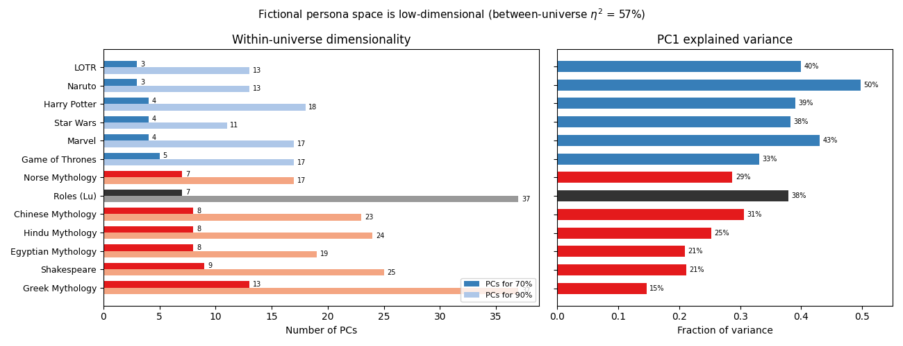
Global fiction: 9 PCs for 70%, 40 PCs for 90%
Fiction PC1: 31.2%, Role PC1: 37.9%
Between-universe eta-squared: 57%
:end:

Takeaways:
- Both fiction and the 275 roles have a dominant PC1 (~31% for fiction, ~38% for roles).
- Cross-universe: 9 PCs capture 70% of fiction variance (vs 7 for the roles) --- but 57% of total variance is universe separation.
- Within-universe (~100 characters each): 3--13 PCs for 70%, out of ~43--107 max dimensions.
- Modern franchises are more compressible (3--5 PCs) than mythology and Shakespeare (7--13 PCs).

** How Much Does the Role Space Capture?

#+begin_src python :exports results
from sklearn.decomposition import PCA as SkPCA

total_var = np.var(chars_centered, axis=0).sum()
captured_var = np.var(reconstructed, axis=0).sum()
resid_var = np.var(residuals, axis=0).sum()
null_pct = 275 / 5120

# Baseline: subspace spanned by 275 random fictional characters, project held-out 993
n_trials = 200
n_chars = len(activation_matrix)
rand_captures = []
for trial in range(n_trials):
    idx = np.random.choice(n_chars, 275, replace=False)
    held_out = np.setdiff1d(np.arange(n_chars), idx)
    train = activation_matrix[idx]
    train_mean = train.mean(axis=0)
    pca_rand = SkPCA(n_components=275)
    pca_rand.fit(train - train_mean)
    test_centered = activation_matrix[held_out] - train_mean
    test_proj = test_centered @ pca_rand.components_.T @ pca_rand.components_
    rand_captures.append(np.var(test_proj, axis=0).sum() / np.var(test_centered, axis=0).sum())
rand_median = np.median(rand_captures)

rows = [
    {"": "Captured by role space", "Variance": f"{captured_var:.0f}", "% of total": f"{captured_var/total_var:.1%}"},
    {"": "Residual (orthogonal to role space)", "Variance": f"{resid_var:.0f}", "% of total": f"{resid_var/total_var:.1%}"},
    {"": "Total", "Variance": f"{total_var:.0f}", "% of total": "100%"},
    {"": "Baseline: span of 275 random characters", "Variance": "", "% of total": f"{rand_median:.1%}"},
    {"": "Null (random 275-dim subspace)", "Variance": "", "% of total": f"{null_pct:.1%}"},
]
print(pd.DataFrame(rows).set_index(""))
#+end_src

#+RESULTS:
:results:

| idx                                     | Variance | % of total |
|-----------------------------------------+----------+------------|
| Captured by role space                  |      822 |      74.7% |
| Residual (orthogonal to role space)     |      279 |      25.3% |
| Total                                   |     1100 |       100% |
| Baseline: span of 275 random characters |          |      94.7% |
| Null (random 275-dim subspace)          |          |       5.4% |
:end:

The role space captures 75% of total fictional character variance (measured as $\sum_j \mathrm{Var}_i(\hat{a}_{ij}) / \sum_j \mathrm{Var}_i(\tilde{a}_{ij})$ where $\hat{a}_i = P\tilde{a}_i$ is the projection onto the 275-dim role subspace). The 95% baseline (275 random fictional characters) reflects the low dimensionality of the fiction space: with ~40 PCs covering 90% of variance, 275 random draws span nearly the full subspace. The 5.4% null (a random 275-dim subspace of $\mathbb{R}^{5120}$) confirms the structure is real. The gap between 75% (roles) and 95% (random fiction) reflects that roles come from a different distribution --- generic personas without universe-specific structure. As the residual decomposition below shows, most of that 20% gap is universe separation.

A single universe's subspace (PCA on $\{\bar{a}_i : i \in \mathcal{U}\}$, yielding $n_{\mathcal{U}}-1$ components) captures 60--72% of all 1,268 characters' variance:

#+begin_src python :exports results
from sklearn.decomposition import PCA as SkPCA
import matplotlib.pyplot as plt

fic_caps = []
for universe, prefixes in ALL_UNIVERSES.items():
    idx = get_universe_indices(prefixes)
    n_comp = len(idx) - 1
    pca_u = SkPCA(n_components=n_comp).fit(activation_matrix[idx])
    all_centered = activation_matrix - pca_u.mean_
    proj = all_centered @ pca_u.components_.T @ pca_u.components_
    cap = np.var(proj, axis=0).sum() / np.var(all_centered, axis=0).sum()
    fic_caps.append({'Universe': universe, 'N': len(idx), 'cap': cap})

franchise_set = {'Harry Potter', 'Star Wars', 'LOTR', 'Marvel', 'Game of Thrones', 'Naruto'}
fic_caps.sort(key=lambda x: x['cap'], reverse=True)

fig, ax = plt.subplots(figsize=(8, 5))
names = [d['Universe'] for d in fic_caps]
caps = [d['cap'] for d in fic_caps]
colors = ['#377eb8' if n in franchise_set else '#e41a1c' for n in names]
bars = ax.barh(range(len(names)), caps, color=colors)
ax.axvline(0.75, color='black', linestyle='--', linewidth=1, label='Lu roles (275 dims): 75%')
ax.set_yticks(range(len(names)))
ax.set_yticklabels([f"{n} ({fic_caps[i]['N']})" for i, n in enumerate(names)], fontsize=9)
ax.set_xlabel('Fraction of all 1,268 characters\' variance captured')
ax.set_title('Each universe\'s subspace captures 41--72% of all fiction variance')
ax.set_xlim(0, 0.85)
ax.invert_yaxis()
ax.legend(fontsize=8, loc='lower right')
for i, v in enumerate(caps):
    ax.text(v + 0.005, i, f"{v:.0%}", va='center', fontsize=8)
fig.tight_layout()
plt.show()
#+end_src

#+RESULTS:
:results:
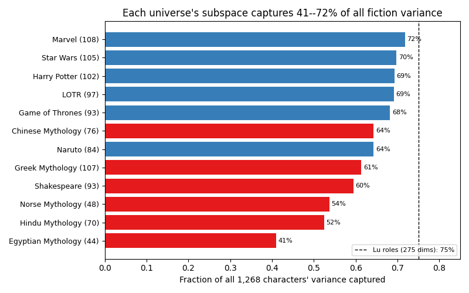
:end:

A single universe of ~100 characters captures 60--72% of all fictional character variance using ~100 dimensions. Lu's 275 roles with 275 dimensions capture 75%. Both results reflect the low dimensionality of the fiction space (~40 PCs for 90%), but the role space is notable for achieving 75% coverage from a different distribution (generic personas, not fictional characters).

The reverse question: how much of role variance do fictional characters capture?

#+begin_src python :exports results
import matplotlib.pyplot as plt

role_activations_raw = role_data['transformed'] @ role_pca.components_ + role_pca.mean_

# Global: fiction captures role variance
fic_275_cap = None
fic_all_cap = None
for n_comp in [275, 1267]:
    pca_fic = SkPCA(n_components=n_comp).fit(chars_centered)
    roles_at_fic = role_activations_raw - pca_fic.mean_
    proj = roles_at_fic @ pca_fic.components_.T @ pca_fic.components_
    cap = np.var(proj, axis=0).sum() / np.var(roles_at_fic, axis=0).sum()
    if n_comp == 275: fic_275_cap = cap
    else: fic_all_cap = cap

# Per-universe captures of roles
role_caps = []
franchise_set = {'Harry Potter', 'Star Wars', 'LOTR', 'Marvel', 'Game of Thrones', 'Naruto'}
for universe, prefixes in ALL_UNIVERSES.items():
    idx = get_universe_indices(prefixes)
    n_comp = len(idx) - 1
    pca_u = SkPCA(n_components=n_comp).fit(activation_matrix[idx])
    roles_c = role_activations_raw - pca_u.mean_
    proj_u = roles_c @ pca_u.components_.T @ pca_u.components_
    cap = np.var(proj_u, axis=0).sum() / np.var(roles_c, axis=0).sum()
    role_caps.append({'Universe': universe, 'N': len(idx), 'cap': cap})
role_caps.sort(key=lambda x: x['cap'], reverse=True)

fig, ax = plt.subplots(figsize=(8, 5))
names = [d['Universe'] for d in role_caps]
caps = [d['cap'] for d in role_caps]
colors = ['#377eb8' if n in franchise_set else '#e41a1c' for n in names]
ax.barh(range(len(names)), caps, color=colors)
ax.axvline(fic_275_cap, color='#4daf4a', linestyle='--', linewidth=1.5, label=f'275 fiction PCs: {fic_275_cap:.0%}')
ax.axvline(fic_all_cap, color='#4daf4a', linestyle='-', linewidth=1.5, label=f'All 1,267 fiction PCs: {fic_all_cap:.0%}')
ax.axvline(0.747, color='black', linestyle=':', linewidth=1, label='Roles capture 75% of fiction')
ax.set_yticks(range(len(names)))
ax.set_yticklabels([f"{n} ({role_caps[i]['N']})" for i, n in enumerate(names)], fontsize=9)
ax.set_xlabel('Fraction of role variance captured')
ax.set_title('How much of Lu\'s 275 roles does each universe capture?')
ax.set_xlim(0, 1.0)
ax.invert_yaxis()
ax.legend(fontsize=7, loc='lower right')
for i, v in enumerate(caps):
    ax.text(v + 0.005, i, f"{v:.0%}", va='center', fontsize=8)
fig.tight_layout()
plt.show()

print(f"275 fiction PCs capture {fic_275_cap:.1%} of role variance")
print(f"1267 fiction PCs capture {fic_all_cap:.1%} of role variance")
#+end_src

#+RESULTS:
:results:
[[file:plots/post/plot_20260227_095214_9918218.png]]
275 fiction PCs capture 81.9% of role variance
1267 fiction PCs capture 91.8% of role variance
:end:

The relationship is asymmetric. Using all 1,267 fiction PCs (the full span of 1,268 characters), fiction captures 92% of role variance. Roles capture only 75% of fiction variance. At matched dimensionality (275 PCs each), it's 82% vs 75%.

How much subspace overlap is there between universes? For each pair $(\mathcal{U}_1, \mathcal{U}_2)$, we fit PCA on $\mathcal{U}_1$'s characters, project $\mathcal{U}_2$'s characters onto $\mathcal{U}_1$'s subspace, and report the fraction of $\mathcal{U}_2$'s variance captured:

#+begin_src python :exports results
import matplotlib.pyplot as plt

franchise_set = {'Harry Potter', 'Star Wars', 'LOTR', 'Marvel', 'Game of Thrones', 'Naruto'}
universe_names = list(ALL_UNIVERSES.keys())
n_u = len(universe_names)

# Compute pairwise variance capture matrix
var_cap_mat = np.zeros((n_u, n_u))
for i, u1 in enumerate(universe_names):
    idx1 = get_universe_indices(ALL_UNIVERSES[u1])
    n_comp1 = len(idx1) - 1
    pca1 = SkPCA(n_components=n_comp1).fit(chars_centered[idx1])
    for j, u2 in enumerate(universe_names):
        idx2 = get_universe_indices(ALL_UNIVERSES[u2])
        # Center u2's characters at u1's mean, project onto u1's subspace
        u2_at_u1_mean = activation_matrix[idx2] - pca1.mean_
        proj = u2_at_u1_mean @ pca1.components_.T @ pca1.components_
        var_cap_mat[i, j] = np.var(proj, axis=0).sum() / np.var(u2_at_u1_mean, axis=0).sum()

fig, ax = plt.subplots(figsize=(9, 8))
im = ax.imshow(var_cap_mat, cmap='RdYlGn', vmin=0.3, vmax=1.0, aspect='equal')
ax.set_xticks(range(n_u)); ax.set_yticks(range(n_u))
ax.set_xticklabels(universe_names, rotation=45, ha='right', fontsize=8)
ax.set_yticklabels(universe_names, fontsize=8)
for i in range(n_u):
    for j in range(n_u):
        c = 'white' if var_cap_mat[i,j] < 0.5 else 'black'
        ax.text(j, i, f"{var_cap_mat[i,j]:.0%}", ha='center', va='center', fontsize=7, color=c)
ax.set_ylabel('Subspace fitted on (row)')
ax.set_xlabel('Variance measured on (column)')
ax.set_title('Cross-universe variance capture\n(row\'s subspace captures X% of column\'s variance)')
fig.colorbar(im, ax=ax, shrink=0.8, label='Fraction of variance captured')
fig.tight_layout()
plt.show()

# Summary stats
off_diag = [var_cap_mat[i,j] for i in range(n_u) for j in range(n_u) if i != j]
ff = [var_cap_mat[i,j] for i in range(n_u) for j in range(n_u) if i != j
      and universe_names[i] in franchise_set and universe_names[j] in franchise_set]
fm = [var_cap_mat[i,j] for i in range(n_u) for j in range(n_u) if i != j
      and (universe_names[i] in franchise_set) != (universe_names[j] in franchise_set)]
mm = [var_cap_mat[i,j] for i in range(n_u) for j in range(n_u) if i != j
      and universe_names[i] not in franchise_set and universe_names[j] not in franchise_set]
print(f"Overall: median={np.median(off_diag):.0%}, min={np.min(off_diag):.0%}, max={np.max(off_diag):.0%}")
print(f"Franchise→Franchise: median={np.median(ff):.0%}")
print(f"Franchise↔Mythology: median={np.median(fm):.0%}")
print(f"Mythology→Mythology: median={np.median(mm):.0%}")
#+end_src

#+RESULTS:
:results:
:end:

Franchise subspaces capture ~80% of each other's variance (median), despite using only ~100 dimensions each. The franchise block is warm and roughly symmetric. Cross-boundary pairs drop to ~60%, and mythology-mythology pairs are similar (~59%). LOTR is the bridge --- it captures more mythology variance than any other franchise, likely because it shares archetypal structure (gods, monsters, quests) with mythology universes. The matrix is mildly asymmetric: Greek Mythology's 106-dim subspace captures 63% of Harry Potter, but Harry Potter's 101-dim subspace captures only 51% of Greek.

Where does the remaining 25% go? We decompose the residual into between-universe variance (universe means differ) and within-universe variance (characters differ from their universe mean):

#+begin_src python :exports results
# What fraction of residual variance is between-universe vs within-universe?
# (Using the 12 defined universes, dropping ungrouped characters)
char_to_universe = {}
for universe, prefixes in ALL_UNIVERSES.items():
    for i, name in enumerate(char_names):
        if any(name.startswith(p) for p in prefixes):
            char_to_universe[i] = universe

grouped_idx = sorted(char_to_universe.keys())
grouped_labels = np.array([char_to_universe[i] for i in grouped_idx])
resid_sub = residuals[grouped_idx]

grand_mean = resid_sub.mean(axis=0)
ss_total = np.sum((resid_sub - grand_mean) ** 2)
ss_between = sum(
    np.sum(grouped_labels == u) * np.sum((resid_sub[grouped_labels == u].mean(axis=0) - grand_mean) ** 2)
    for u in np.unique(grouped_labels)
)
print(f"Residual variance between universes: {ss_between/ss_total:.0%}")
print(f"Residual variance within universes:  {1 - ss_between/ss_total:.0%}")
print(f"({len(grouped_idx)}/{len(char_names)} characters in {len(np.unique(grouped_labels))} universes)")
#+end_src

#+RESULTS:
:results:
Residual variance between universes: 65%
Residual variance within universes:  35%
(1027/1268 characters in 12 universes)
:end:

Of total variance: ~75% is captured by the role space, ~16% is between-universe residual, and ~9% is within-universe residual. The between/within decomposition is the standard ANOVA partition on the residuals $r_i = (I - P)\tilde{a}_i$: $\eta^2 = \mathrm{SS}_{\text{between}} / \mathrm{SS}_{\text{total}}$ where $\mathrm{SS}_{\text{between}} = \sum_{\mathcal{U}} n_{\mathcal{U}} \| \bar{r}_{\mathcal{U}} - \bar{r} \|^2$. Characters within each universe share system prompt structure (e.g., "You are [name] from Harry Potter"), so some of the between-universe variance is prompt-template variance rather than persona structure. What about the within-universe residual?

*** What do the global fiction PCs look like?

The global fiction PCs (PCA on all 1,268 characters) are a mix of universe separation and cross-cutting semantic dimensions:

#+begin_src python :exports results
# Global fiction PCs: universe means as bar chart
scores_global = pca_fiction.transform(chars_centered)

franchise_set = {'Harry Potter', 'Star Wars', 'LOTR', 'Marvel', 'Game of Thrones', 'Naruto'}

fig, axes = plt.subplots(1, 5, figsize=(16, 5), sharey=True)

for pc_i, ax in enumerate(axes):
    means = []
    etas = []
    for universe, prefixes in ALL_UNIVERSES.items():
        idx = get_universe_indices(prefixes)
        m = scores_global[idx, pc_i].mean()
        means.append((universe, m))
    means.sort(key=lambda x: x[1])
    names = [m[0] for m in means]
    vals = [m[1] for m in means]
    colors = ['#377eb8' if n in franchise_set else '#e41a1c' for n in names]
    ax.barh(range(len(names)), vals, color=colors)
    ax.set_yticks(range(len(names)))
    ax.set_yticklabels(names if pc_i == 0 else [], fontsize=8)
    ax.axvline(0, color='black', linewidth=0.5)
    # Eta-squared
    grouped_scores = scores_global[[i for i in range(len(char_names)) if i in char_to_universe], pc_i]
    gm = grouped_scores.mean()
    ss_t = np.sum((grouped_scores - gm)**2)
    ss_b = sum(
        np.sum(grouped_labels == u) * (grouped_scores[grouped_labels == u].mean() - gm)**2
        for u in np.unique(grouped_labels)
    )
    evr = pca_fiction.explained_variance_ratio_[pc_i]
    ax.set_title(f'PC{pc_i+1} ({evr:.0%} var)\n$\\eta^2$={ss_b/ss_t:.0%}', fontsize=9)
    ax.set_xlabel('Mean score', fontsize=8)
    # Top/bottom 3 characters as annotation
    order = np.argsort(scores_global[:, pc_i])
    top3 = [char_names[i].split('__')[-1].replace('_', ' ').title() for i in order[-3:][::-1]]
    bot3 = [char_names[i].split('__')[-1].replace('_', ' ').title() for i in order[:3]]
    ax.annotate(', '.join(top3), xy=(0.95, 0.98), xycoords='axes fraction',
                ha='right', va='top', fontsize=5.5, color='#555555')
    ax.annotate(', '.join(bot3), xy=(0.05, 0.02), xycoords='axes fraction',
                ha='left', va='bottom', fontsize=5.5, color='#555555')

from matplotlib.patches import Patch
axes[0].legend(handles=[Patch(facecolor='#377eb8', label='Franchise'),
                         Patch(facecolor='#e41a1c', label='Mythology/Shakespeare')],
               loc='lower right', fontsize=7)
fig.suptitle('Global fiction PC universe means', fontsize=12)
fig.tight_layout()
plt.show()
#+end_src

#+RESULTS:
:results:
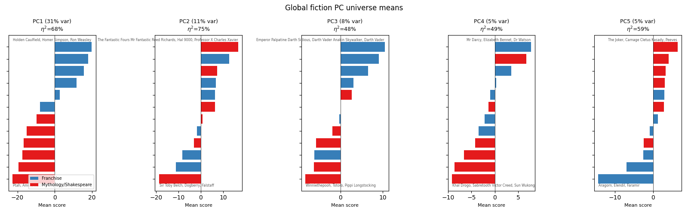
:end:

PC1 (31% of variance, eta²=68%) separates modern franchises from mythology and Shakespeare --- Ron Weasley and Homer Simpson at one end, Egyptian gods at the other. But the remaining PCs mix universe separation with cross-cutting semantics. PC3 (eta²=48%) has Darth Vader and Palpatine at one end and Winnie-the-Pooh and Totoro at the other --- dark/menacing vs. innocent, cutting across universe lines. PC4 (eta²=49%) puts Mr. Darcy and Elizabeth Bennet opposite Khal Drogo and Sun Wukong.

* What Do Within-Universe PCs Encode?

Most within-universe variance lives inside the role subspace, but do different universes find the same principal directions? For each universe $\mathcal{U}$, we fit PCA on $\{\bar{a}_i - \bar{a}_{\text{role}} : i \in \mathcal{U}\}$ to get $V_{\mathcal{U}} = (v_1^{\mathcal{U}}, v_2^{\mathcal{U}}, \dots)$. To compare directions across universes, we compute $|\cos(v_j^{\mathcal{U}_1}, v_j^{\mathcal{U}_2})| = |v_j^{\mathcal{U}_1} \cdot v_j^{\mathcal{U}_2}|$ (absolute cosine between corresponding PCs). We start by checking how much of each universe's variance the role space captures:

#+begin_src python :exports results
import matplotlib.pyplot as plt

franchise_set = {'Harry Potter', 'Star Wars', 'LOTR', 'Marvel', 'Game of Thrones', 'Naruto'}
cap_data = []
for universe, prefixes in ALL_UNIVERSES.items():
    idx = get_universe_indices(prefixes)
    if len(idx) < 20:
        continue
    u_orig = chars_centered[idx]
    orig_var = np.var(u_orig, axis=0).sum()
    recon_var = np.var(reconstructed[idx], axis=0).sum()
    cap_data.append({'Universe': universe, 'N': len(idx), 'cap': recon_var/orig_var})
cap_data.sort(key=lambda x: x['cap'], reverse=True)

fig, ax = plt.subplots(figsize=(8, 4.5))
names = [d['Universe'] for d in cap_data]
caps = [d['cap'] for d in cap_data]
resids = [1 - c for c in caps]
colors = ['#377eb8' if n in franchise_set else '#e41a1c' for n in names]
ax.barh(range(len(names)), caps, color=colors, label='Role space captures')
ax.barh(range(len(names)), resids, left=caps, color=['#aec7e8' if n in franchise_set else '#f4a582' for n in names], label='Residual')
ax.set_yticks(range(len(names)))
ax.set_yticklabels(names, fontsize=9)
ax.set_xlabel('Fraction of within-universe variance')
ax.set_title('Role space captures more in franchises (80--85%) than mythology (61--72%)')
ax.set_xlim(0, 1.0)
ax.invert_yaxis()
ax.legend(fontsize=8, loc='lower right')
for i, v in enumerate(caps):
    ax.text(v - 0.02, i, f"{v:.0%}", va='center', ha='right', fontsize=7, color='white', fontweight='bold')
fig.tight_layout()
plt.show()
#+end_src

#+RESULTS:
:results:
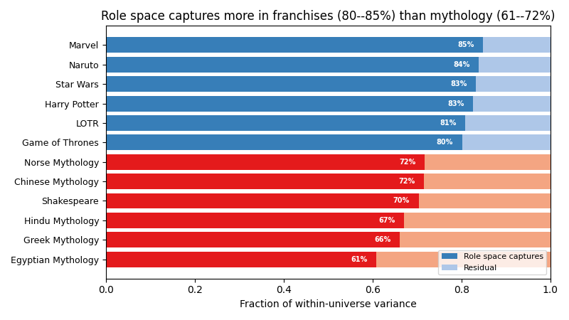
:end:

The role space captures more in modern franchises (80--85%) than in mythology (61--72%). What happens in the 15--39% the role space misses?

*** Residual directions are different, but character rankings are preserved

After projecting out the role space, we fit PCA on the residuals $r_i = (I - P)\tilde{a}_i$ for each universe. We compare the residual PC1 direction and character rankings with the original (full-space) PC1:

#+begin_src python :exports results
import matplotlib.pyplot as plt

franchise_set = {'Harry Potter', 'Star Wars', 'LOTR', 'Marvel', 'Game of Thrones', 'Naruto'}

def cosine(a, b):
    return np.dot(a, b) / (np.linalg.norm(a) * np.linalg.norm(b))

rows = []
for universe, prefixes in ALL_UNIVERSES.items():
    idx = get_universe_indices(prefixes)
    if len(idx) < 20:
        continue
    u_orig = chars_centered[idx]
    u_resid = residuals[idx]
    orig_var = np.var(u_orig, axis=0).sum()
    recon_var = np.var(reconstructed[idx], axis=0).sum()

    original_pca = SkPCA(n_components=1).fit(u_orig)
    residual_pca = SkPCA(n_components=1).fit(u_resid)

    orig_pos = original_pca.transform(u_orig)[:, 0]
    resid_pos = residual_pca.transform(u_resid)[:, 0]

    dir_cos = abs(cosine(original_pca.components_[0], residual_pca.components_[0]))
    rank_corr = abs(np.corrcoef(orig_pos, resid_pos)[0, 1])
    rows.append({'Universe': universe, 'dir_cos': dir_cos, 'rank_corr': rank_corr,
                 'role_cap': recon_var / orig_var})

rows.sort(key=lambda x: x['rank_corr'], reverse=True)

fig, ax = plt.subplots(figsize=(10, 5))
y = np.arange(len(rows))
h = 0.35
names = [r['Universe'] for r in rows]
dir_vals = [r['dir_cos'] for r in rows]
rank_vals = [r['rank_corr'] for r in rows]
ax.barh(y - h/2, dir_vals, h, color='#377eb8', label='Direction cosine (geometric alignment)')
ax.barh(y + h/2, rank_vals, h, color='#e41a1c', label='Ranking correlation (Pearson)')
ax.set_yticks(y)
ax.set_yticklabels([f"{n} (role captures {rows[i]['role_cap']:.0%})" for i, n in enumerate(names)], fontsize=8)
ax.set_xlabel('|value|')
ax.set_title('Residual PC1 vs. original PC1: directions differ, rankings agree')
ax.legend(fontsize=8, loc='lower right')
ax.set_xlim(0, 1.05)
ax.invert_yaxis()
for i, (d, r) in enumerate(zip(dir_vals, rank_vals)):
    ax.text(d + 0.01, i - h/2, f"{d:.2f}", va='center', fontsize=7)
    ax.text(r + 0.01, i + h/2, f"{r:.2f}", va='center', fontsize=7)
fig.tight_layout()
plt.show()
#+end_src

#+RESULTS:
:results:
:end:

Residual PC1 directions are nearly orthogonal to the original PC1 (cosines 0.19--0.66), but character rankings on residual PC1 correlate 0.77--0.96 with original PC1 rankings in most universes (Marvel is the exception at 0.55). The role space captures the *axis* well (direction cosine ~0.9 between Lu-reconstructed and original PC1), but the residual --- geometrically orthogonal to the role space --- still preserves who ranks where. Extreme characters (Voldemort, Darth Vader, Galadriel) are extreme in multiple directions; projecting out the role space changes the axis but not the ordering.

This means: the 15--39% of within-universe variance missed by the role space is not noise --- it encodes real structure that produces the same character ordering along a different geometric direction.

But are the principal directions the same across universes? We compute cosine similarities between each universe's within-universe PC1 direction and role PC1, and check whether within-universe PC1 directions align with each other across universes:

#+begin_src python :exports results
# Cosine similarity: within-universe PC directions vs role PCs and vs each other
from sklearn.decomposition import PCA as SkPCA
import torch
from scipy.stats import spearmanr

def cosine_sim(a, b):
    return np.dot(a, b) / (np.linalg.norm(a) * np.linalg.norm(b))

# Compute within-universe PCA for each universe
u_pcas_full = {}
u_pcas_resid = {}
for name, prefixes in ALL_UNIVERSES.items():
    idx = get_universe_indices(prefixes)
    if len(idx) < 20:
        continue
    u_pcas_full[name] = SkPCA(n_components=5).fit(chars_centered[idx])
    u_pcas_resid[name] = SkPCA(n_components=5).fit(residuals[idx])

# Cross-universe PC1 cosine matrix (for the heatmap in the intro)
universe_names = list(u_pcas_full.keys())
n_u = len(universe_names)

# --- Plot 1: Cross-universe within-PC1 cosine heatmap ---
cross_mat = np.zeros((n_u, n_u))
for i in range(n_u):
    for j in range(n_u):
        cross_mat[i, j] = abs(cosine_sim(
            u_pcas_full[universe_names[i]].components_[0],
            u_pcas_full[universe_names[j]].components_[0]))

fig, ax = plt.subplots(figsize=(8, 7))
im = ax.imshow(cross_mat, cmap='RdYlGn', vmin=0, vmax=1, aspect='equal')
ax.set_xticks(range(n_u)); ax.set_yticks(range(n_u))
ax.set_xticklabels(universe_names, rotation=45, ha='right', fontsize=8)
ax.set_yticklabels(universe_names, fontsize=8)
for i in range(n_u):
    for j in range(n_u):
        c = 'white' if cross_mat[i,j] < 0.4 else 'black'
        ax.text(j, i, f"{cross_mat[i,j]:.2f}", ha='center', va='center', fontsize=6, color=c)
ax.set_title("Cross-universe within-PC1 direction cosines\n(|cos(PC1_i, PC1_j)|)", fontsize=11)
fig.colorbar(im, ax=ax, shrink=0.8, label='|cosine|')
fig.tight_layout()
plt.show()

# Print cross-universe summary stats
off_diag = [cross_mat[i,j] for i in range(n_u) for j in range(i+1, n_u)]
print(f"Cross-universe within-PC1 cosine: median={np.median(off_diag):.3f}")

# --- Plot 2: AA cosine vs rank correlation (side-by-side heatmaps) ---
assistant_axis_all = torch.load('../data/role_vectors/assistant_axis.pt', weights_only=True)
assistant_axis = assistant_axis_all[32].float().numpy()

cos_mat = np.zeros((n_u, 3))
rank_mat = np.zeros((n_u, 3))
for i, name in enumerate(universe_names):
    idx = get_universe_indices(ALL_UNIVERSES[name])
    aa_scores = chars_centered[idx] @ assistant_axis
    for pc_i in range(3):
        cos_mat[i, pc_i] = abs(cosine_sim(u_pcas_full[name].components_[pc_i], assistant_axis))
        scores = chars_centered[idx] @ u_pcas_full[name].components_[pc_i]
        rho, _ = spearmanr(scores, aa_scores)
        rank_mat[i, pc_i] = abs(rho)

fig, (ax1, ax2) = plt.subplots(1, 2, figsize=(12, 6), sharey=True)

im1 = ax1.imshow(cos_mat, cmap='YlOrRd', vmin=0, vmax=0.5, aspect='auto')
ax1.set_xticks(range(3)); ax1.set_xticklabels(['PC1', 'PC2', 'PC3'])
ax1.set_yticks(range(n_u)); ax1.set_yticklabels(universe_names, fontsize=9)
for i in range(n_u):
    for j in range(3):
        c = 'white' if cos_mat[i,j] > 0.3 else 'black'
        ax1.text(j, i, f"{cos_mat[i,j]:.2f}", ha='center', va='center', fontsize=8, color=c)
ax1.set_title('$|\\cos(\\mathrm{PC}_i, \\mathrm{AA})|$\n(geometric alignment)', fontsize=10)
fig.colorbar(im1, ax=ax1, shrink=0.6)

im2 = ax2.imshow(rank_mat, cmap='YlOrRd', vmin=0, vmax=0.85, aspect='auto')
ax2.set_xticks(range(3)); ax2.set_xticklabels(['PC1', 'PC2', 'PC3'])
for i in range(n_u):
    for j in range(3):
        c = 'white' if rank_mat[i,j] > 0.5 else 'black'
        ax2.text(j, i, f"{rank_mat[i,j]:.2f}", ha='center', va='center', fontsize=8, color=c)
ax2.set_title('$|\\rho(\\mathrm{PC}_i\\ \\mathrm{scores},\\ \\mathrm{AA\\ scores})|$\n(rank correlation)', fontsize=10)
fig.colorbar(im2, ax=ax2, shrink=0.6)

fig.suptitle('Within-universe PCs vs. assistant axis: geometric alignment is low, but rank correlation is substantial', fontsize=11, y=1.02)
fig.tight_layout()
plt.show()

print(f"Cosine medians: PC1={np.median(cos_mat[:,0]):.2f}, PC2={np.median(cos_mat[:,1]):.2f}, PC3={np.median(cos_mat[:,2]):.2f}")
print(f"Rank-corr medians: PC1={np.median(rank_mat[:,0]):.2f}, PC2={np.median(rank_mat[:,1]):.2f}, PC3={np.median(rank_mat[:,2]):.2f}")
print(f"Cosine(assistant axis, role PC1): {abs(cosine_sim(assistant_axis, role_pca.components_[0])):.3f}")
#+end_src

#+RESULTS:
:results:
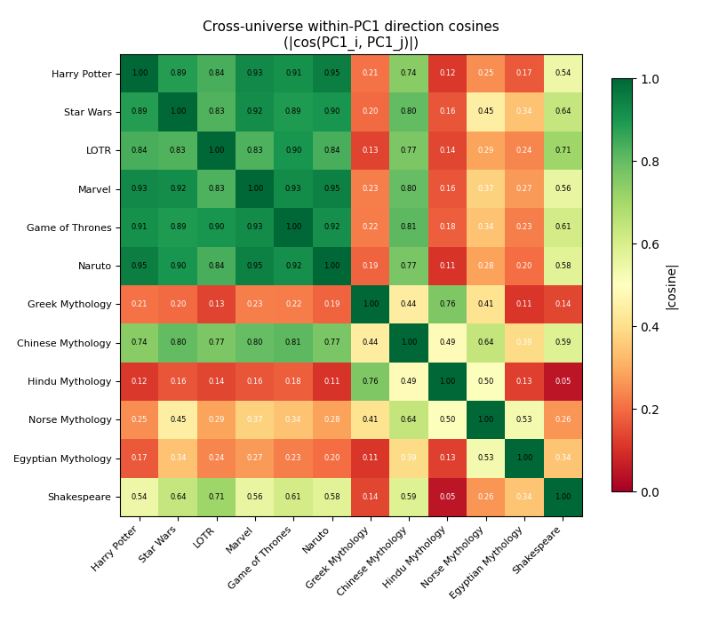
Cross-universe within-PC1 cosine: median=0.468
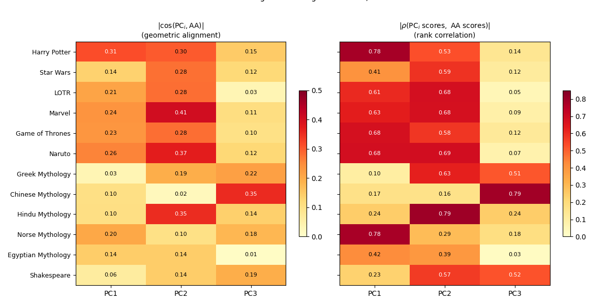
Cosine medians: PC1=0.17, PC2=0.28, PC3=0.13
Rank-corr medians: PC1=0.51, PC2=0.58, PC3=0.13
Cosine(assistant axis, role PC1): 0.672
:end:

The cross-universe PC1 heatmap shows high alignment within the franchise block (Harry Potter/Naruto ~0.95, Marvel/Naruto ~0.95, Harry Potter/Marvel ~0.93) and low alignment between franchises and mythology (Naruto/Hindu ~0.11, Hindu/Shakespeare ~0.05). Modern franchises share a PC1 direction; mythology and Shakespeare do not. The AA heatmaps show that geometric alignment between within-universe PCs and the assistant axis is uniformly low (median cosines 0.17, 0.28, 0.13 for PC1--3), but rank correlations between PC scores and AA scores are substantial --- appearing on PC1 for franchises and shifting to PC2/PC3 for mythology.

The heatmaps below show principal angle cosines between each pair of universes' top-$k$ PC subspaces. For two subspaces $\mathrm{span}(v_1^{\mathcal{U}_1}, \dots, v_k^{\mathcal{U}_1})$ and $\mathrm{span}(v_1^{\mathcal{U}_2}, \dots, v_k^{\mathcal{U}_2})$, the $k$-th principal angle $\theta_k$ is computed via SVD of $V_k^{\mathcal{U}_1\top} V_k^{\mathcal{U}_2}$; we plot the smallest singular value $\sigma_k = \cos \theta_k$. This measures the worst-aligned direction: $k=1$ is just $|\cos(v_1^{\mathcal{U}_1}, v_1^{\mathcal{U}_2})|$, $k=2$ shows how well the 2D planes align, $k=3$ the 3D subspaces.

[[file:../results/principal_angle_heatmaps.png]]

The franchise block (Harry Potter, Star Wars, LOTR, Marvel, Game of Thrones, Naruto) stays warm through k=2 --- these universes share not just a PC1 but a common 2D plane of variation. By k=3 everything cools, but the franchise block still shows higher alignment than mythology-vs-franchise pairs. The role PCs and assistant axis (bottom rows) have low cosines with all universes, confirming that within-universe principal directions are mostly orthogonal to the role space.

*Where does the assistant axis live?* Lu et al.'s PC1 aligns with their "assistant axis" (cosine ~0.67). The right-hand heatmap above shows that the top 3 PCs together capture at most 24% of the assistant axis (Marvel, sum of squared cosines). The assistant axis is not concentrated in any universe's top PCs --- it is spread diffusely across many dimensions.

Who are the most and least assistant-like fictional characters? Projecting all 1,268 characters onto the assistant axis:

#+begin_src python :exports results
import matplotlib.pyplot as plt

aa_norm_vec = assistant_axis / np.linalg.norm(assistant_axis)
aa_scores_all = chars_centered @ aa_norm_vec
order = np.argsort(aa_scores_all)

def fmt_char(name):
    parts = name.split('__')
    char = parts[-1].replace('_', ' ').title()
    return char

n_show = 15
top_idx = order[-n_show:][::-1]
bot_idx = order[:n_show]

fig, (ax1, ax2) = plt.subplots(1, 2, figsize=(12, 6))

# Most assistant-like
names_top = [fmt_char(char_names[i]) for i in top_idx]
scores_top = [aa_scores_all[i] for i in top_idx]
colors_top = ['#4daf4a' if s >= 0 else '#377eb8' for s in scores_top]
ax1.barh(range(n_show), scores_top, color=colors_top)
ax1.set_yticks(range(n_show))
ax1.set_yticklabels(names_top, fontsize=9)
ax1.invert_yaxis()
ax1.set_xlabel('Assistant axis projection')
ax1.set_title('Most assistant-like')
ax1.axvline(0, color='gray', linewidth=0.5, linestyle='--')

# Least assistant-like
names_bot = [fmt_char(char_names[i]) for i in bot_idx]
scores_bot = [aa_scores_all[i] for i in bot_idx]
ax2.barh(range(n_show), scores_bot, color='#e41a1c')
ax2.set_yticks(range(n_show))
ax2.set_yticklabels(names_bot, fontsize=9)
ax2.invert_yaxis()
ax2.set_xlabel('Assistant axis projection')
ax2.set_title('Least assistant-like')

fig.suptitle('1,268 fictional characters ranked on the assistant axis', fontsize=12, y=1.02)
fig.tight_layout()
plt.show()
#+end_src

#+RESULTS:
:results:
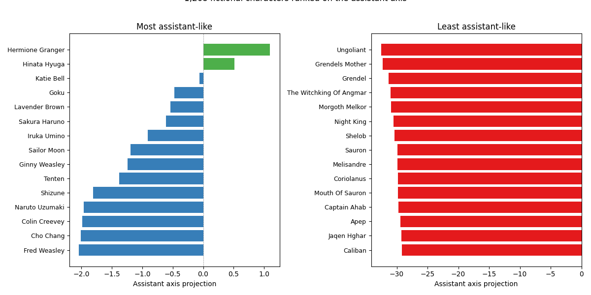
:end:

Hermione Granger is the most assistant-like fictional character in the dataset. The bottom is dominated by non-verbal monsters --- Ungoliant, Grendel's Mother, Shelob. Nearly all fictional characters score well below the assistant baseline (mean AA = -18.5); only Hermione is near zero. 

Yet the rank correlations between PC scores and assistant axis scores are substantial (median |rho| = 0.52 for PC1, 0.58 for PC2), even though the PC directions are nearly orthogonal to the assistant axis direction (median cosines 0.17, 0.28, 0.13 for PC1--3).

Despite both being rank-correlated with the assistant axis, PC1 and PC2 scores are uncorrelated with each other (median |rho| = 0.03, max 0.12), confirming they capture independent aspects of the AA. We can test this directly: using the LLM-discovered features from the feature interpretation pipeline (described in the next section), we regress assistant axis scores against the 6 features discovered for within-universe PC1 (formality features), the 6 features for PC2 (warmth features), and both combined.

#+begin_src python :exports results
# Regress AA scores on existing within-universe feature ratings
import json
from pathlib import Path

# Load within-mode coded features (already generated for PC1/PC2 interpretation)
with open('../results/llm_feature_coded_within.json') as f:
    coded_within = json.load(f)

assistant_axis_all = torch.load('../data/role_vectors/assistant_axis.pt', weights_only=True)
assistant_axis = assistant_axis_all[32].float().numpy()
aa_norm = assistant_axis / np.linalg.norm(assistant_axis)

# Also compute PC1-PC2 rank correlations to confirm independence
from scipy.stats import spearmanr

pc_corr_rows = []
aa_reg_rows = []

for universe, prefixes in ALL_UNIVERSES.items():
    idx = get_universe_indices(prefixes)
    if len(idx) < 20:
        continue
    u_names = [char_names[i] for i in idx]
    u_centered = chars_centered[idx]

    # PC1-PC2 rank correlation
    within_pca = SkPCA(n_components=5).fit(u_centered)
    scores = within_pca.transform(u_centered)
    rho_12, _ = spearmanr(scores[:, 0], scores[:, 1])
    pc_corr_rows.append({'Universe': universe, '|PC1-PC2 rho|': round(abs(rho_12), 3)})

    # AA scores
    aa_scores = u_centered @ aa_norm
    name_to_local = {n: i for i, n in enumerate(u_names)}

    for source in ['PC1', 'PC2', 'PC1+PC2']:
        if source == 'PC1+PC2':
            keys = [f"{universe}__PC1", f"{universe}__PC2"]
        else:
            keys = [f"{universe}__{source}"]

        all_feature_names = []
        for key in keys:
            if key not in coded_within:
                continue
            all_feature_names.extend([f['name'] for f in coded_within[key]['schema']['features']])

        # Build feature matrix
        valid_local_idx = []
        feature_matrix = []
        for i, cname in enumerate(u_names):
            if cname not in name_to_local:
                continue
            row = []
            valid = True
            for key in keys:
                if key not in coded_within:
                    valid = False
                    break
                ratings = coded_within[key]['characters'].get(cname, {})
                if 'error' in ratings:
                    valid = False
                    break
                for fname in [f['name'] for f in coded_within[key]['schema']['features']]:
                    val = ratings.get(fname)
                    if val is None or not isinstance(val, (int, float)):
                        valid = False
                        break
                    row.append(float(val))
                if not valid:
                    break
            if valid and len(row) == len(all_feature_names):
                valid_local_idx.append(i)
                feature_matrix.append(row)

        if len(valid_local_idx) < 15:
            continue

        X = np.array(feature_matrix)
        y = aa_scores[valid_local_idx]
        n = len(y)
        p = X.shape[1]
        X_aug = np.column_stack([np.ones(n), X])
        beta = np.linalg.lstsq(X_aug, y, rcond=None)[0]
        y_hat = X_aug @ beta
        ss_res = np.sum((y - y_hat) ** 2)
        ss_tot = np.sum((y - y.mean()) ** 2)
        r2 = 1 - ss_res / ss_tot
        adj_r2 = 1 - (1 - r2) * (n - 1) / (n - p - 1)
        aa_reg_rows.append({'Universe': universe, 'Features': source,
                           'Adj. R²': round(adj_r2, 2), 'n': n})

import matplotlib.pyplot as plt

df_reg = pd.DataFrame(aa_reg_rows)
pivot = df_reg.pivot(index='Universe', columns='Features', values='Adj. R²')
pivot = pivot[['PC1', 'PC2', 'PC1+PC2']]
pivot = pivot.sort_values('PC1+PC2', ascending=True)

franchise_set = {'Harry Potter', 'Star Wars', 'LOTR', 'Marvel', 'Game of Thrones', 'Naruto'}
fig, ax = plt.subplots(figsize=(10, 5))
y = np.arange(len(pivot))
h = 0.25
ax.barh(y - h, pivot['PC1'], h, color='#377eb8', label='PC1 features (formality)')
ax.barh(y, pivot['PC2'], h, color='#e41a1c', label='PC2 features (warmth)')
ax.barh(y + h, pivot['PC1+PC2'], h, color='#4daf4a', label='PC1+PC2 combined')
ax.set_yticks(y)
ax.set_yticklabels(pivot.index, fontsize=9)
ax.set_xlabel('Adj. R² predicting AA scores')
ax.set_title('AA = formality + warmth: both PC1 and PC2 features independently predict assistant axis scores')
ax.legend(fontsize=8, loc='lower right')
ax.axvline(0, color='gray', linewidth=0.5)
ax.set_xlim(-0.4, 1.0)
for i, u in enumerate(pivot.index):
    v = pivot.loc[u, 'PC1+PC2']
    ax.text(max(v, 0) + 0.02, i + h, f"{v:.2f}", va='center', fontsize=7)

# Annotate PC1-PC2 independence
med_rho = np.median([r['|PC1-PC2 rho|'] for r in pc_corr_rows])
ax.annotate(f'PC1-PC2 rank independence:\nmedian |$\\rho$| = {med_rho:.3f}',
            xy=(0.98, 0.02), xycoords='axes fraction', ha='right', va='bottom',
            fontsize=8, bbox=dict(boxstyle='round', facecolor='wheat', alpha=0.5))
fig.tight_layout()
plt.show()

print(f"Medians: PC1={pivot['PC1'].median():.2f}, PC2={pivot['PC2'].median():.2f}, PC1+PC2={pivot['PC1+PC2'].median():.2f}")
print(f"PC1-PC2 rank independence median: {med_rho:.3f}")
#+end_src

#+RESULTS:
:results:

Medians: PC1=0.48, PC2=0.47, PC1+PC2=0.60
PC1-PC2 rank independence median: 0.027
:end:

PC1 (formality) and PC2 (warmth) each independently predict assistant axis scores at median adj. R² ~0.48. Combining both sets of features (12 total) raises this to median 0.60, with franchises reaching 0.63--0.87. The AA is not formality alone --- it is a blend of formality and warmth/cooperativeness. This explains why both PC1 and PC2 rank-correlate with the AA despite being uncorrelated with each other: they capture independent components of the same direction. In mythology, where within-universe AA variance is small (std 1.7--2.9 vs. 4--6 for franchises), neither set of features predicts well.

* What Do the Directions Encode?

The geometric analysis does not reveal what semantic content the PCs encode --- the directions are not aligned across universes. The question battery redundancy helps here: since any 5 questions carry the full signal, we can show an LLM a handful of responses from extreme characters and ask what distinguishes them.

We apply this pipeline to three types of PC directions: within-universe PCs (PCA on one universe's full activations), role PCs applied per-universe (projecting each universe's characters onto Lu et al.'s role PC directions and running discovery/regression on those scores), and residual PCs (within-universe PCA after projecting out the role space). The pipeline has three steps with strict separation between discovery and validation:

1. *Feature discovery (odd-ranked characters)*: For each universe $\mathcal{U}$ and PC $j$, we take the 5 characters with the most extreme positive scores $s_{ij}$ (ranks 1, 3, 5, 7, 9) and the 5 most extreme negative scores (same odd ranks). We show an LLM (Claude Sonnet) their anonymized responses to 10 discriminative questions and ask it to propose $p=6$ features that distinguish the two groups. Features must be observable from text alone --- no universe knowledge.

2. *Feature coding (all remaining characters)*: We code *all* characters in $\mathcal{U}$ except the 10 used for discovery (typically $n=34$--$98$ characters depending on universe size). A fresh LLM call rates each character on the $p$ discovered features ($x_{if} \in \{1,2,3,4,5\}$ for feature $f$) based on a random sample of 10 questions.

3. *Regression*: We fit the OLS model $s_{ij} = \beta_0 + \sum_{f=1}^{p} \beta_f x_{if} + \epsilon_i$ where $s_{ij}$ is character $i$'s score on PC $j$ and $x_{if}$ is the LLM rating on feature $f$. We report adjusted $R^2 = 1 - \frac{(1-R^2)(n-1)}{n-p-1}$. High adjusted $R^2$ means the LLM-discovered features (from held-out characters) predict PC position well.

The striding ensures zero overlap between the characters used to discover features and those used to validate them. Full code is in =blogpost/scripts/llm_feature_coding.py= and =blogpost/scripts/feature_regression.py=.

#+begin_src python :exports results
import json
from pathlib import Path
import matplotlib.pyplot as plt
pd.set_option('display.max_rows', 100)

regression_files = {
    'residual': '../results/feature_regression.json',
    'lu': '../results/feature_regression_lu.json',
    'within': '../results/feature_regression_within.json',
}
all_reg = {}
for mode, path in regression_files.items():
    if Path(path).exists():
        with open(path) as f:
            data = json.load(f)
        for k, v in data.items():
            v['mode'] = mode
            all_reg[f"{mode}__{k}"] = v

def best_feature(data):
    valid = [c for c in data['correlations']
             if c.get('abs_correlation') is not None
             and c['abs_correlation'] == c['abs_correlation']]
    return max(valid, key=lambda x: x['abs_correlation'])['feature'] if valid else '-'

franchise_set = {'Harry Potter', 'Star Wars', 'LOTR', 'Marvel', 'Game of Thrones', 'Naruto'}
titles = {'within__1': 'Within-universe PC1', 'within__2': 'Within-universe PC2',
          'lu__1': 'Role PC1', 'lu__2': 'Role PC2'}

fig, axes = plt.subplots(2, 2, figsize=(14, 10), sharey=True)
for ax_idx, (key, title) in enumerate(titles.items()):
    mode, pc_str = key.split('__')
    pc_num = int(pc_str)
    ax = axes[ax_idx // 2, ax_idx % 2]
    mode_data = {k: v for k, v in all_reg.items() if v['mode'] == mode}
    rows = []
    for k, data in mode_data.items():
        if data['pc'] != pc_num:
            continue
        rows.append({'Universe': data['universe'], 'r2': data['adj_r_squared'],
                     'feature': best_feature(data)})
    rows.sort(key=lambda x: x['r2'], reverse=True)
    names = [r['Universe'] for r in rows]
    r2s = [r['r2'] for r in rows]
    feats = [r['feature'] for r in rows]
    colors = ['#377eb8' if n in franchise_set else '#e41a1c' for n in names]
    ax.barh(range(len(names)), r2s, color=colors)
    ax.set_yticks(range(len(names)))
    ax.set_yticklabels(names if ax_idx % 2 == 0 else names, fontsize=8)
    ax.set_xlabel('Adj. R²')
    ax.set_title(title, fontsize=10)
    ax.set_xlim(-0.2, 1.0)
    ax.axvline(0, color='gray', linewidth=0.5)
    ax.invert_yaxis()
    for i, (v, feat) in enumerate(zip(r2s, feats)):
        label = f"{v:.2f} {feat}"
        ax.text(max(v, 0) + 0.02, i, label, va='center', fontsize=6.5)

from matplotlib.patches import Patch
axes[0,0].legend(handles=[Patch(facecolor='#377eb8', label='Franchise'),
                           Patch(facecolor='#e41a1c', label='Mythology/Shakespeare')],
                 loc='lower right', fontsize=7)
fig.suptitle('LLM-discovered features predict PC scores\n(6 features per universe, n=34--98 coded characters)', fontsize=12)
fig.tight_layout()
plt.show()

# Print medians for prose
for mode in ['within', 'lu']:
    r2s = [v['adj_r_squared'] for v in all_reg.values() if v['mode'] == mode]
    print(f"{mode} median adj. R²: {np.median(r2s):.2f}")
#+end_src

#+RESULTS:
:results:
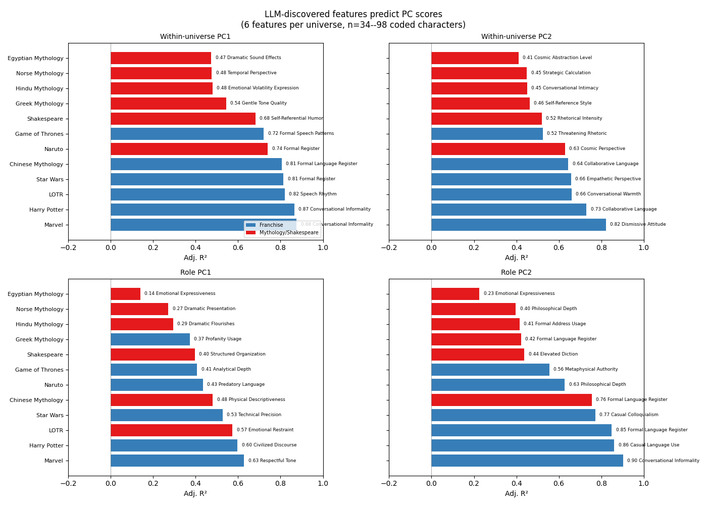
within median adj. R²: 0.65
lu median adj. R²: 0.46
:end:

For within-universe PCs in modern franchises and Chinese mythology, PC1 is formality/register (adj. R² = 0.72--0.88) and PC2 is warmth vs. aggression. In mythology and Shakespeare, the top features are more heterogeneous ("Temporal Perspective," "Gentle Tone Quality," "Emotional Volatility Expression") and adj. R² is lower (0.47--0.54). Role and residual PCs show the same franchise/mythology split.

*PC1: formality (franchises).* Role PC1 finds "Civilized Discourse" in Harry Potter, "Predatory Language" in LOTR; within-universe PC1 finds "Conversational Informality" (Harry Potter, adj. R² = 0.87), "Formal Register" (Naruto, adj. R² = 0.81). Ron Weasley and Crabbe at the informal end, Grindelwald and Voldemort at the formal end; Tayuya and Choji at the informal end in Naruto, Hamura Otsutsuki and Hiashi Hyuga at the formal end. Lu et al. identify their PC1 with the "assistant axis"; the formality pattern in franchise PC1 is compatible with this, though the geometric alignment is low (median cosine 0.17 between within-universe PC1 and the AA). Adj. R² drops for smaller or less differentiated universes (Egyptian Mythology within PC1: adj. R² = 0.47, Norse: 0.48).

*PC2: warmth vs. aggression.* "Dismissive Attitude" in LOTR (adj. R² = 0.82), "Threatening Rhetoric" in Game of Thrones (adj. R² = 0.52), "Rhetorical Intensity" in Shakespeare (adj. R² = 0.52).

Within-universe PCs are the most interpretable (median adj. R² = 0.65), clearly ahead of role PCs (median 0.46). Role PC labels are more heterogeneous --- "Civilized Discourse" alongside "Technical Precision," "Analytical Depth" --- and a quarter of role PC1 entries have adj. R² below 0.3 (Greek, Hindu, Egyptian mythology). Residual PCs (within-universe structure orthogonal to the role space) are similar to role PCs in quality (median adj. R² = 0.43); full residual tables are in the appendix below.

** Direct interpretation of the assistant axis

The indirect regression above showed the AA is a blend of formality and warmth. We can also run the feature discovery pipeline directly on the assistant axis --- using characters with the most extreme AA scores (rather than PC scores) as discovery inputs. This asks: what features does the LLM discover when shown high-AA characters (Hermione, Samwise Gamgee, Spider-Man) versus low-AA characters (Grindelwald, Ungoliant, Apocalypse)?

#+begin_src python :exports results
import json
from pathlib import Path
import matplotlib.pyplot as plt

with open('../results/feature_regression_aa.json') as f:
    aa_reg = json.load(f)

franchise_names = {'Harry Potter', 'Star Wars', 'LOTR', 'Marvel', 'Game of Thrones', 'Naruto'}
rows = []
for key, data in aa_reg.items():
    best = max(data['correlations'], key=lambda x: x['abs_correlation'])
    rows.append({'Universe': data['universe'], 'r2': data['adj_r_squared'],
                 'feature': best['feature'], 'n': data['n_chars']})
rows.sort(key=lambda x: x['r2'], reverse=True)

fig, ax = plt.subplots(figsize=(10, 5))
names = [r['Universe'] for r in rows]
r2s = [r['r2'] for r in rows]
feats = [r['feature'] for r in rows]
colors = ['#377eb8' if n in franchise_names else '#e41a1c' for n in names]
ax.barh(range(len(names)), r2s, color=colors)
ax.set_yticks(range(len(names)))
ax.set_yticklabels(names, fontsize=9)
ax.set_xlabel('Adj. R² (6 LLM-discovered features)')
ax.set_title('Direct AA feature regression: franchise median 0.69, mythology median 0.28')
ax.set_xlim(-0.2, 1.0)
ax.axvline(0, color='gray', linewidth=0.5)
ax.invert_yaxis()
for i, (v, feat) in enumerate(zip(r2s, feats)):
    ax.text(max(v, 0) + 0.02, i, f"{v:.2f} {feat}", va='center', fontsize=7)
from matplotlib.patches import Patch
ax.legend(handles=[Patch(facecolor='#377eb8', label='Franchise'),
                   Patch(facecolor='#e41a1c', label='Mythology/Shakespeare')],
         loc='lower right', fontsize=8)
fig.tight_layout()
plt.show()

franchise_r2 = [r['r2'] for r in rows if r['Universe'] in franchise_names]
myth_r2 = [r['r2'] for r in rows if r['Universe'] not in franchise_names]
print(f"Median adj. R²: {np.median([r['r2'] for r in rows]):.2f} (all), {np.median(franchise_r2):.2f} (franchises), {np.median(myth_r2):.2f} (mythology)")
#+end_src

#+RESULTS:
:results:
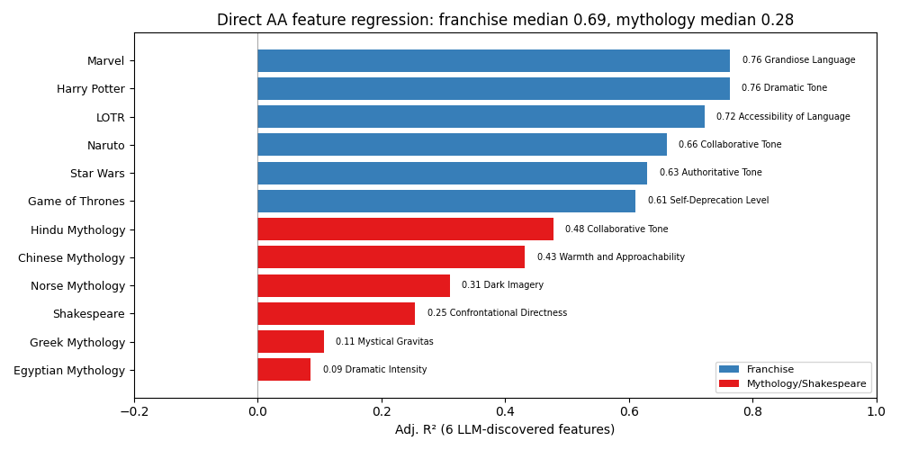
Median adj. R²: 0.54 (all), 0.69 (franchises), 0.28 (mythology)
:end:

The discovered features confirm and sharpen the indirect finding. For franchises, the top features are "Collaborative Tone" (LOTR, Marvel, Naruto, Hindu), "Grandiose Language" (Marvel, Naruto), "Dramatic Tone" (Harry Potter), and "Self-Deprecation Level" (Game of Thrones) --- warmth and approachability at the high end, theatrical menace at the low end. Samwise Gamgee, Spider-Man, and Hinata Hyuga score high; Ungoliant, Apocalypse, and Madara Uchiha score low. The discovered features cluster around collaborative, warm, self-deprecating, and concrete language at the high end, versus grandiose, threatening, dramatic, and dismissive language at the low end.

Franchise fits are strong (median adj. R² = 0.69, range 0.61--0.76), comparable to the indirect PC1+PC2 regression (median 0.60). Mythology fits are weaker (median adj. R² = 0.28): the AA has low variance in mythology universes (they cluster near the low end of the axis), so there is less signal for the features to predict. Greek mythology is the worst case (adj. R² = 0.11), where the discovered features ("Mystical Gravitas," "Atmospheric Staging") correlate only weakly with the AA.

* How Sensitive Are Results to the Question Battery?

Each character vector is a mean activation over responses to 240 questions. How much does the choice of questions matter?

We measure two things. Let $\bar{a}_i = \frac{1}{Q}\sum_{q=1}^Q a_{iq}$ be the full-battery mean activation and $\bar{a}_i^{(k)} = \frac{1}{k}\sum_{q \in S_k} a_{iq}$ the mean over a random $k$-question subset $S_k \subset \{1, \dots, Q\}$. Let $V = (v_1, \dots, v_5)$ be the top-5 PCs of the centered full-battery matrix.

1. *Score stability:* Project both $\bar{a}_i$ and $\bar{a}_i^{(k)}$ onto $V$ (the same, fixed directions) to get score vectors $s_j = (\bar{a}_i \cdot v_j)_i$ and $s_j^{(k)} = (\bar{a}_i^{(k)} \cdot v_j)_i$. Report Pearson $r(s_j, s_j^{(k)})$. This asks: if you already have the PC directions, how well can you score characters with fewer questions?
2. *Direction stability:* Fit PCA separately on the centered $\bar{a}_i^{(k)}$ matrix to get $V_k = (v_1^{(k)}, \dots)$. Report $|\cos(v_j, v_j^{(k)})| = |v_j \cdot v_j^{(k)}|$. This asks: can you recover the PC directions themselves from fewer questions?

#+begin_src python :exports results
import json

with open('../results/question_subset_sweep.json') as f:
    sweep = json.load(f)

# Print key thresholds for prose reference
for k in [1, 5, 10]:
    meds = []
    for udata in sweep.values():
        for s in udata['sweeps']['PC1']:
            if s['size'] == k:
                meds.append(s['median'])
    print(f"k={k}: median Pearson r = {np.median(meds):.4f}")
#+end_src

#+RESULTS:
:results:
k=1: median Pearson r = 0.9747
k=5: median Pearson r = 0.9947
k=10: median Pearson r = 0.9974
:end:

*Score stability* is high: even a single random question recovers character PC scores at median Pearson r > 0.95, and five questions reach r > 0.99. The question battery is highly redundant for scoring.

*Direction stability* requires more questions, and varies by universe. For each subset size $k$, we average each character's per-question activations (in full 5120-dim space) over a random draw of $k$ questions, fit PCA on the result, and measure $|\cos(v_i, v_i^{(k)})|$ --- the absolute cosine between the $i$-th full-battery PC direction and the $i$-th subset PC direction:

#+begin_src python :exports results
import json as _json2

with open('../results/direction_stability_sweep.json') as f:
    dsweep = _json2.load(f)

franchise_set = {'harry_potter', 'star_wars', 'marvel', 'game_of_thrones', 'lord_of_the_rings', 'naruto'}

n_pcs_plot = 3
fig, axes = plt.subplots(1, n_pcs_plot, figsize=(14, 5), sharey=True)

for pc_i, ax in enumerate(axes):
    pc_label = f'PC{pc_i + 1}'
    for universe, udata in dsweep.items():
        sizes = [s['size'] for s in udata['sweeps'][pc_label]]
        medians = [s['median'] for s in udata['sweeps'][pc_label]]
        is_franchise = universe in franchise_set
        color = '#377eb8' if is_franchise else '#e41a1c'
        alpha = 0.7 if is_franchise else 0.5
        label = universe.replace('_', ' ').title() if pc_i == 0 else None
        ax.plot(sizes, medians, 'o-', color=color, alpha=alpha, markersize=2, linewidth=1, label=label)

    ax.set_xscale('log')
    ax.set_xlabel('# questions in random subset')
    if pc_i == 0:
        ax.set_ylabel('|cos(full-battery PC, subset PC)|')
    ax.set_ylim(0.4, 1.02)
    ax.axhline(0.99, color='gray', linestyle='--', alpha=0.4, linewidth=0.8)
    ax.axhline(0.95, color='gray', linestyle='--', alpha=0.4, linewidth=0.8)
    ax.set_title(f'{pc_label} direction stability')

from matplotlib.patches import Patch as Patch2
axes[0].legend(fontsize=6, loc='lower right', ncol=2)
fig.suptitle('Direction stability: how many questions to recover PC directions?\n(200 random draws per size, per universe)', fontsize=11)
fig.tight_layout()
plt.show()
#+end_src

#+RESULTS:
:results:
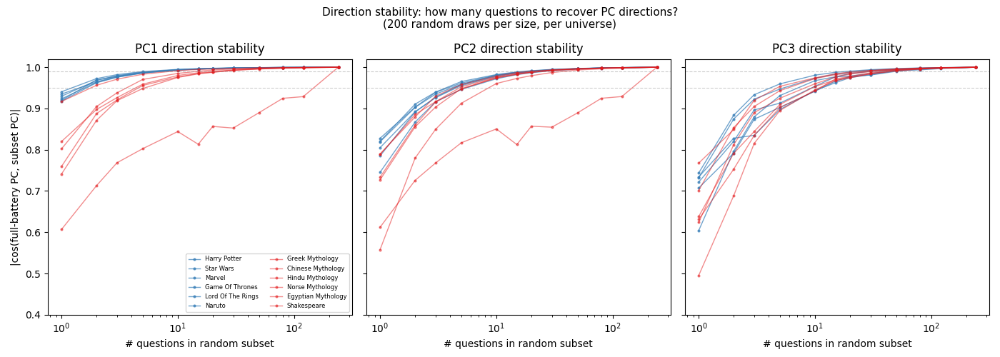
:end:

Franchises recover PC1 with cosine > 0.99 from just 5 questions; mythology and Shakespeare need 20--50 questions to reach the same threshold. Greek mythology is the hardest case: PC1 direction cosine is only 0.61 at $k=1$ and reaches 0.93 at $k=120$. The gap between score stability and direction stability reflects the fact that scoring characters along a fixed direction only requires reducing noise in the mean, while recovering the direction itself requires the covariance structure to stabilize.

But the subset sweep only tests random draws from the /same/ 240 questions --- all substantive, multi-sentence prompts about ethics, technology, and personal advice. A stronger test: do qualitatively different questions carry the same signal? We generate responses for 16 out-of-distribution prompts --- 8 degenerate ("Huh?", ".", "?", "hi", "ok", "what", "hmm", "tell me something") and 8 task-shaped ("Write a Python function to calculate the first 100 primes", "Explain how a refrigerator works", "Write a haiku about rain", etc.) --- and extract activations for all 1,268 characters. We report both score stability and direction stability.

#+begin_src python :exports results
import torch
from pathlib import Path

# Build character matrix from degenerate-question activations
act_dir = Path('../outputs/degenerate_questions/activations')
degen_names = []
degen_vectors = []
for f in sorted(act_dir.glob('*.pt')):
    d = torch.load(f, weights_only=True, map_location='cpu')
    vecs = torch.stack([v.squeeze(0).float() for v in d.values()])
    degen_names.append(f.stem)
    degen_vectors.append(vecs.mean(dim=0).numpy())
degen_matrix = np.stack(degen_vectors)

# Align with full-battery characters
degen_name_to_idx = {n: i for i, n in enumerate(degen_names)}
common_idx_full = [i for i, n in enumerate(char_names) if n in degen_name_to_idx]
common_idx_degen = [degen_name_to_idx[char_names[i]] for i in common_idx_full]
common_names = [char_names[i] for i in common_idx_full]

full_c = (activation_matrix[common_idx_full] - role_mean)
degen_c = (degen_matrix[common_idx_degen] - role_mean)

# Per-universe: fit PCA on full-battery, project both, correlate
from scipy.stats import pearsonr
score_rows = []
dir_rows = []
for name, prefixes in ALL_UNIVERSES.items():
    idx = [i for i, n in enumerate(common_names) if any(n.startswith(p) for p in prefixes)]
    if len(idx) < 20:
        continue
    pca_full = SkPCA(n_components=3).fit(full_c[idx])
    pca_degen = SkPCA(n_components=3).fit(degen_c[idx])
    scores_full = pca_full.transform(full_c[idx])
    scores_degen = pca_full.transform(degen_c[idx])
    srow = {'Universe': name, 'n': len(idx)}
    drow = {'Universe': name}
    for pc in range(3):
        r, _ = pearsonr(scores_full[:, pc], scores_degen[:, pc])
        srow[f'PC{pc+1}'] = round(r, 3)
        cos = abs(np.dot(pca_full.components_[pc], pca_degen.components_[pc]))
        drow[f'PC{pc+1}'] = round(cos, 2)
    score_rows.append(srow)
    dir_rows.append(drow)

import matplotlib.pyplot as plt

# Convert to arrays for plotting
score_df = pd.DataFrame(score_rows).set_index('Universe')
dir_df = pd.DataFrame(dir_rows).set_index('Universe')
franchise_set = {'Harry Potter', 'Star Wars', 'LOTR', 'Marvel', 'Game of Thrones', 'Naruto'}

fig, (ax1, ax2) = plt.subplots(1, 2, figsize=(13, 5))

# Left: Score stability heatmap
score_mat = score_df[['PC1', 'PC2', 'PC3']].values
im1 = ax1.imshow(score_mat, cmap='RdYlGn', vmin=0.9, vmax=1.0, aspect='auto')
ax1.set_xticks(range(3)); ax1.set_xticklabels(['PC1', 'PC2', 'PC3'])
ax1.set_yticks(range(len(score_df)))
ax1.set_yticklabels(score_df.index, fontsize=8)
for i in range(len(score_df)):
    for j in range(3):
        ax1.text(j, i, f"{score_mat[i,j]:.3f}", ha='center', va='center', fontsize=7)
ax1.set_title('Score stability (Pearson r)\nOOD prompts → full-battery PC directions', fontsize=10)
fig.colorbar(im1, ax=ax1, shrink=0.6)

# Right: Direction stability heatmap
dir_mat = dir_df[['PC1', 'PC2', 'PC3']].values
im2 = ax2.imshow(dir_mat, cmap='RdYlGn', vmin=0, vmax=1.0, aspect='auto')
ax2.set_xticks(range(3)); ax2.set_xticklabels(['PC1', 'PC2', 'PC3'])
ax2.set_yticks(range(len(dir_df)))
ax2.set_yticklabels(dir_df.index, fontsize=8)
for i in range(len(dir_df)):
    for j in range(3):
        c = 'white' if dir_mat[i,j] < 0.4 else 'black'
        ax2.text(j, i, f"{dir_mat[i,j]:.2f}", ha='center', va='center', fontsize=7, color=c)
ax2.set_title('Direction stability (|cosine|)\nOOD PCA vs full-battery PCA', fontsize=10)
fig.colorbar(im2, ax=ax2, shrink=0.6)

fig.suptitle('OOD prompts: scores are stable (r > 0.94), but PC directions diverge for mythology', fontsize=11, y=1.02)
fig.tight_layout()
plt.show()

print(f"Score stability: min r = {score_mat.min():.3f}")
print(f"Direction stability: franchise PC1 range = {dir_mat[:6,0].min():.2f}--{dir_mat[:6,0].max():.2f}")
#+end_src

#+RESULTS:
:results:
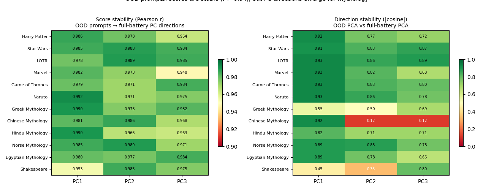
Score stability: min r = 0.948
Direction stability: franchise PC1 range = 0.91--0.93
:end:

*Score stability* remains high even with OOD questions. Sixteen out-of-distribution prompts --- including single-character inputs like "." and "?" --- recover character PC scores at Pearson r > 0.94 across all universes and PCs 1--3. If you already have the PC directions, you can score characters with almost any prompts.

*Direction stability* is another matter. Let $\bar{a}_i^{\text{ood}} = \frac{1}{16}\sum_{q \in S_{\text{ood}}} a_{iq}$ be the mean activation over the 16 OOD prompts, and $V^{\text{ood}}$ the PCA directions fit on $\{\bar{a}_i^{\text{ood}} : i \in \mathcal{U}\}$. The resulting PC1 directions $|v_1^{\mathcal{U}} \cdot v_1^{\text{ood}}|$ align well with the full-battery PC1 for franchises (cosine 0.89--0.93) but poorly for Greek mythology (0.55), Shakespeare (0.45), and Chinese mythology PC2--3 (0.12). This is not a sample size issue: 16 random questions from the /same/ 240-question battery give PC1 direction cosines > 0.99 everywhere (even 5 give > 0.96). The direction instability comes from the questions being qualitatively different --- degenerate and task prompts elicit different variance structure in mythology and Shakespeare, even though character scores along the full-battery directions are preserved.

#+begin_src python :exports results
# Judge scoring comparison: degenerate vs original battery
import json
from pathlib import Path as JPath

degen_scores_dir = JPath('../outputs/degenerate_questions/scores')
orig_scores_dir = JPath('../outputs/qwen3-32b_20260211_002840/scores')

degen_all, orig_all = [], []
degen_task, degen_degen = [], []
for f in sorted(degen_scores_dir.glob('*.json')):
    with open(f) as fh:
        scores = json.load(fh)
    for key, val in scores.items():
        q_idx = int(key.split('_')[-1].replace('q', ''))
        degen_all.append(val)
        if q_idx < 8:
            degen_degen.append(val)
        else:
            degen_task.append(val)
    orig_f = orig_scores_dir / f'{f.stem}.json'
    if orig_f.exists():
        with open(orig_f) as fh:
            orig_all.extend(json.load(fh).values())

rows = []
for label, arr in [('Original battery (240Q)', orig_all),
                    ('Degenerate prompts (8Q)', degen_degen),
                    ('Task prompts (8Q)', degen_task)]:
    n = len(arr)
    pct3 = sum(1 for s in arr if s == 3) / n
    mean = sum(arr) / n
    rows.append({'Battery': label, 'Mean score': f'{mean:.2f}', '% score=3': f'{100*pct3:.1f}%', 'n': n})
print(pd.DataFrame(rows).set_index('Battery'))
#+end_src

#+RESULTS:
:results:
| Battery                 | Mean score | % score=3 |       n |
|-------------------------+------------+-----------+---------|
| Original battery (240Q) |       2.97 |     98.3% | 1615183 |
| Degenerate prompts (8Q) |       2.98 |     99.1% |   53836 |
| Task prompts (8Q)       |       2.67 |     79.1% |   53840 |
:end:

Note that the activation analysis above used all 1,346 characters with no judge-based filtering. The full-battery pipeline scores each response with an LLM judge and filters out poor role-players before building the activation matrix. Degenerate prompts score /higher/ on role adherence (99.1% at score 3) than the original 240-question battery (98.3%). Task prompts are where scores drop (79.1% at score 3) --- characters break character when asked to write haiku or Python, not when given "?".

In summary: score stability is high --- given pre-computed directions, almost any prompts suffice to score characters. Direction stability depends on the question type: within the same battery, even 5 random questions recover directions well, but qualitatively different prompts (degenerate, task-shaped) yield different PC directions for mythology and Shakespeare.

* Conclusion

*The persona signal is robust to question choice.* A single random question recovers character PC scores at Pearson r > 0.95. Sixteen out-of-distribution prompts --- degenerate inputs like "." and "?" alongside task prompts --- recover PC1--3 scores at r > 0.94 across all universes.

*The subspace is shared but the directions are not.* The role subspace and fiction subspace overlap heavily (~75--92%), but their principal directions are sensitive to the input distribution. Within-universe PC1 directions cluster tightly for modern franchises (HP/Naruto cosine ~0.95) but not across franchise-mythology boundaries (~0.05--0.12). The assistant axis illustrates this: its cosines with any single within-universe PC are low (medians 0.17, 0.28, 0.13 for PC1--3), but rank correlations between PC scores and assistant axis scores are substantial --- appearing on PC1 for franchises (HP 0.78, Naruto 0.68) and on PC2/PC3 for mythology (Hindu PC2: 0.79, Chinese PC3: 0.79). PC1 and PC2 are rank-uncorrelated with each other (median |rho| = 0.03) but both predict the AA independently: the AA is a blend of formality (PC1) and warmth (PC2), not either alone. Combined PC1+PC2 features predict AA scores at median adj. R² = 0.60 (0.63--0.87 for franchises). Running the feature pipeline directly on the AA confirms this: the discovered features are collaborative tone, warmth, and self-deprecation versus grandiose, threatening, and dramatic language (franchise median adj. R² = 0.69).

*Within-universe PCs are interpretable, and the interpretation is quantifiable.* Our LLM feature discovery pipeline --- discover features from held-out extreme characters, code all remaining characters, regress --- gives adjusted R² values rather than subjective labels from eyeballing top-scoring characters. For modern franchises, within-universe PC1 is formality/register (adj. R² = 0.72--0.88) and PC2 is warmth vs. aggression (adj. R² = 0.52--0.82). Mythology and Shakespeare are more heterogeneous (adj. R² = 0.41--0.54 for PC1). Overall median adj. R² = 0.65.

*Fictional characters extend the role space.* 1,268 characters capture 92% of role variance; roles capture 75% of fiction. Fiction provides built-in semantic structure (we know who the characters are) and is extensible (add universes). The space of fictional characters is itself constructed, which is visible in how the global PCs separate universes.

** Follow ups

- Lu et al. show that for their fixed role set, the geometry is consistent across models. Our results show that changing the role distribution changes the geometry within the same model (franchise vs. mythology PC1 directions differ). Cross-model consistency despite within-model sensitivity to distribution would be worth investigating: does the fiction geometry look similar across models?

** Limitations

- All results are from Qwen3-32B at layer 32. Lu et al. show cross-model consistency for their axis. We haven't shown whether the results here generalize.
- Character instructions are minimal and were generated by Claude (e.g., "You are Harry Potter from Harry Potter. Respond as this character would."). Results may be sensitive to instruction quality or phrasing.
- The LLM feature discovery and rating pipeline uses Claude to evaluate model outputs. There could be shared biases between the evaluating LLM and the model being studied.
- Only 12 universes are analyzed; 241 of 1,268 characters are ungrouped and silently dropped from within-universe analyses.
- The feature regressions use 34--98 characters per universe (all non-discovery characters) with 6 predictors. Egyptian Mythology (n=34) has the fewest degrees of freedom.

  
* Data Provenance

All result files the post loads are checked into git. To regenerate from scratch:

| File                                              | In git?         | Generated by                                     | Regenerate with                                                                                       |
|---------------------------------------------------+-----------------+--------------------------------------------------+-------------------------------------------------------------------------------------------------------|
| =data/role_vectors/qwen-3-32b_pca_layer32.pkl=      | no (gitignored) | =blogpost/scripts/download_role_vectors.py=        | =python blogpost/scripts/download_role_vectors.py= (downloads from HuggingFace)                         |
| =data/role_vectors/assistant_axis.pt=               | no (gitignored) | =blogpost/scripts/download_role_vectors.py=        | Downloaded from HuggingFace =lu-christina/assistant-axis-vectors= (same script as above)                |
| =results/fictional_character_analysis_filtered.pkl= | yes             | =blogpost/scripts/build_character_matrix.py=       | Requires per-character vectors from cluster (=outputs/.../vectors/*.pt=)                                |
| =results/question_projections.pkl=                  | yes             | =blogpost/scripts/compute_question_projections.py= | Requires per-question activations from cluster (=outputs/.../activations/*.pt=)                         |
| =results/question_subset_sweep.json=                | yes             | =blogpost/scripts/question_subset_sweep.py=        | =python blogpost/scripts/question_subset_sweep.py= (local, ~18s)                                        |
| =results/llm_feature_coded{,_lu,_within,_aa}.json=  | yes             | =blogpost/scripts/llm_feature_coding.py=           | =python blogpost/scripts/llm_feature_coding.py --mode {residual,lu,within,aa} all= (needs =ANTHROPIC_API_KEY_BATCH=, cluster responses) |
| =results/feature_regression{,_lu,_within,_aa}.json= | yes             | =blogpost/scripts/feature_regression.py=           | =python blogpost/scripts/feature_regression.py --mode {residual,lu,within,aa}= (local, instant)         |
| =results/principal_angle_heatmaps.png=              | yes             | =blogpost/scripts/principal_angle_heatmaps.py=     | =python blogpost/scripts/principal_angle_heatmaps.py= (local, instant)                                  |
| =outputs/degenerate_questions/activations/*.pt=     | no              | =scripts/slurm_degenerate_questions.sh=            | SLURM job on cluster: generate + extract activations for 16 degenerate/task questions                   |
| =outputs/degenerate_questions/scores/*.json=        | no              | =src/analysis/judge_scoring.py=                    | Run on cluster: =python src/analysis/judge_scoring.py= with degenerate question outputs                  |
| =outputs/qwen3-32b_20260211_002840/scores/*.json=   | no              | =src/analysis/judge_scoring.py=                    | Run on cluster: =python src/analysis/judge_scoring.py= with original battery outputs                     |
| =data/degenerate_questions.jsonl=                   | yes             | hand-written                                     | 16 prompts (degenerate + task-shaped) for question invariance test                                      |
| =assistant-axis/= (git submodule)                    | yes (submodule) | Lu et al. codebase                               | =git submodule update --init= (provides =extraction_questions.jsonl= used by =llm_feature_coding.py=)      |

To render the post from a fresh clone: run =git submodule update --init=, then =python blogpost/scripts/download_role_vectors.py=, then eval the org file. All other data is checked in.

* Appendix: Residual PC Feature Regressions

Residual PCs are within-universe PCA on activations after projecting out the role space. The feature labels overlap with the within-universe and role PC labels (formality, warmth) for modern franchises, but are noisier and more heterogeneous for mythology and Shakespeare. Median adj. R² = 0.43, with a third of entries (8/24) below 0.3.

#+begin_src python :exports results
import matplotlib.pyplot as plt

franchise_set = {'Harry Potter', 'Star Wars', 'LOTR', 'Marvel', 'Game of Thrones', 'Naruto'}
fig, (ax1, ax2) = plt.subplots(1, 2, figsize=(14, 5), sharey=True)

for pc_num, ax in [(1, ax1), (2, ax2)]:
    mode_data = {k: v for k, v in all_reg.items() if v['mode'] == 'residual'}
    rows = []
    for k, data in mode_data.items():
        if data['pc'] != pc_num:
            continue
        rows.append({'Universe': data['universe'], 'r2': data['adj_r_squared'],
                     'feature': best_feature(data)})
    rows.sort(key=lambda x: x['r2'], reverse=True)
    names = [r['Universe'] for r in rows]
    r2s = [r['r2'] for r in rows]
    feats = [r['feature'] for r in rows]
    colors = ['#377eb8' if n in franchise_set else '#e41a1c' for n in names]
    ax.barh(range(len(names)), r2s, color=colors)
    ax.set_yticks(range(len(names)))
    ax.set_yticklabels(names, fontsize=8)
    ax.set_xlabel('Adj. R²')
    ax.set_title(f'Residual PC{pc_num}', fontsize=10)
    ax.set_xlim(-0.2, 1.0)
    ax.axvline(0, color='gray', linewidth=0.5)
    ax.invert_yaxis()
    for i, (v, feat) in enumerate(zip(r2s, feats)):
        ax.text(max(v, 0) + 0.02, i, f"{v:.2f} {feat}", va='center', fontsize=6.5)

from matplotlib.patches import Patch
ax1.legend(handles=[Patch(facecolor='#377eb8', label='Franchise'),
                    Patch(facecolor='#e41a1c', label='Mythology/Shakespeare')],
           loc='lower right', fontsize=7)
fig.suptitle('Residual PC feature regressions (median adj. R² = 0.43)', fontsize=11)
fig.tight_layout()
plt.show()
#+end_src

#+RESULTS:
:results:
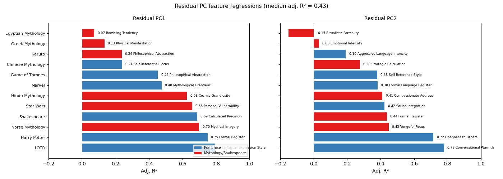
:end:

